

  
  <h1>Satellite Imagery Deep Learning</h1>
  
<strong>A comprehensive repository of deep learning architectures, models, and algorithms suited for Earth observation, classification, segmentation, and object detection.</strong>

   

## About

Deep learning has revolutionized the analysis and interpretation of satellite and aerial imagery, addressing unique challenges such as vast image sizes and a wide array of object classes. This repository provides an exhaustive overview of deep learning techniques specifically tailored for satellite and aerial image processing. It covers a range of architectures, models, and algorithms suited for key tasks like classification, segmentation, and object detection.

**How to use this repository:** use `Command + F` (Mac) or `CTRL + F` (Windows) to search this page for e.g. 'SAM'

## Contributing & Code of Conduct

We welcome contributions from the community! If you have a project, tool, or resource that belongs here, please read our [Contribution Guidelines](CONTRIBUTING.md) to get started. 

To ensure our community remains approachable and respectable, all contributors are expected to abide by our [Code of Conduct](CODE_OF_CONDUCT.md).

## Content Index

- **[Core Vision & Semantic Tasks](#core-vision--semantic-tasks)**

  - **[Classification](#classification)**

  - **[Segmentation](#segmentation)**

  - **[Segmentation Land Use & Land Cover](#segmentation---land-use--land-cover)**

  - **[Segmentation Vegetation, Deforestation, Crops & Field Boundaries](#segmentation---vegetation-deforestation-crops--field-boundaries)**

  - **[Segmentation Water, Coastlines, Rivers & Floods](#segmentation---water-coastlines-rivers--floods)**

  - **[Segmentation Fire, Smoke & Burn Areas](#segmentation---fire-smoke--burn-areas)**

  - **[Segmentation Landslides](#segmentation---landslides)**

  - **[Segmentation Glaciers](#segmentation---glaciers)**

  - **[Segmentation Methane](#segmentation---methane)**

  - **[Segmentation Other Environmental](#segmentation---other-environmental)**

  - **[Segmentation Roads & Sidewalks](#segmentation---roads--sidewalks)**

  - **[Segmentation Buildings & Rooftops](#segmentation---buildings--rooftops)**

  - **[Segmentation Solar Panels](#segmentation---solar-panels)**

  - **[Segmentation Ships & Vessels](#segmentation---ships--vessels)**

  - **[Segmentation Other Manmade](#segmentation---other-manmade)**

  - **[Panoptic Segmentation](#panoptic-segmentation)**

  - **[Segmentation Miscellaneous](#segmentation---miscellaneous)**

  - **[Instance Segmentation](#instance-segmentation)**

  - **[Object Detection](#object-detection)**

  - **[Object Tracking In Videos](#object-tracking-in-videos)**

  - **[Object Detection With Rotated Bounding Boxes](#object-detection-with-rotated-bounding-boxes)**

  - **[Object Detection Enhanced By Super Resolution](#object-detection-enhanced-by-super-resolution)**

  - **[Salient Object Detection](#salient-object-detection)**

  - **[Object Detection Buildings, Rooftops & Solar Panels](#object-detection---buildings-rooftops--solar-panels)**

  - **[Object Detection Ships, Boats, Vessels & Wake](#object-detection---ships-boats-vessels--wake)**

  - **[Object Detection Cars, Vehicles & Trains](#object-detection---cars-vehicles--trains)**

  - **[Object Detection Planes & Aircraft](#object-detection---planes--aircraft)**

  - **[Object Detection Infrastructure & Utilities](#object-detection---infrastructure--utilities)**

  - **[Object Detection Oil Storage Tank Detection](#object-detection---oil-storage-tank-detection)**

  - **[Object Detection Animals](#object-detection---animals)**

  - **[Object Detection Miscellaneous](#object-detection---miscellaneous)**

  - **[Object Counting](#object-counting)**

  - **[Regression](#regression)**

  - **[Image Retrieval](#image-retrieval)**

  - **[Image Captioning](#image-captioning)**

  - **[Visual Question Answering](#visual-question-answering)**

- **[Advanced Architectures & Methodologies](#advanced-architectures--methodologies)**

  - **[Super Resolution](#super-resolution)**

  - **[Multi Image Super Resolution (misr)](#multi-image-super-resolution-misr)**

  - **[Single Image Super Resolution (sisr)](#single-image-super-resolution-sisr)**

  - **[Super Resolution Miscellaneous](#super-resolution---miscellaneous)**

  - **[Pansharpening](#pansharpening)**

  - **[Image To Image Translation](#image-to-image-translation)**

  - **[Data Fusion](#data-fusion)**

  - **[Generative Networks](#generative-networks)**

  - **[Autoencoders, Dimensionality Reduction, Image Embeddings & Similarity Search](#autoencoders-dimensionality-reduction-image-embeddings--similarity-search)**

  - **[Anomaly Detection](#anomaly-detection)**

  - **[Mixed Data Learning](#mixed-data-learning)**

  - **[Few & Zero Shot Learning](#few--zero-shot-learning)**

  - **[Self Supervised, Unsupervised & Contrastive Learning](#self-supervised-unsupervised--contrastive-learning)**

  - **[Weakly & Semi Supervised Learning](#weakly--semi-supervised-learning)**

  - **[Active Learning](#active-learning)**

  - **[Federated Learning](#federated-learning)**

  - **[Adversarial Ml](#adversarial-ml)**

  - **[Large Vision & Language Models (llms & Lvms)](#large-vision--language-models-llms--lvms)**

  - **[Foundational Models](#foundational-models)**

- **[Earth Observation & Application Domains](#earth-observation--application-domains)**

  - **[Cloud Detection & Removal](#cloud-detection--removal)**

  - **[Change Detection](#change-detection)**

  - **[Time Series](#time-series)**

  - **[Crop Classification](#crop-classification)**

  - **[Crop Yield & Vegetation Forecasting](#crop-yield--vegetation-forecasting)**

  - **[Wealth And Economic Activity](#wealth-and-economic-activity)**

  - **[Disaster Response](#disaster-response)**

  - **[Image Registration](#image-registration)**

  - **[Terrain Mapping, Disparity Estimation, Lidar, Dems & Nerf](#terrain-mapping-disparity-estimation-lidar-dems--nerf)**

  - **[Thermal Infrared](#thermal-infrared)**

  - **[Sar](#sar)**

  - **[Ndvi Vegetation Index](#ndvi---vegetation-index)**

  - **[General Image Quality](#general-image-quality)**

  - **[Synthetic Data](#synthetic-data)**

  - **[Explainable Ai (xai)](#explainable-ai-xai)**

---

## Core Vision & Semantic Tasks

> At the heart of satellite imagery analysis lie core computer vision tasks adapted for Earth Observation (EO). These include pixel-wise semantic segmentation, object detection for small and dense objects (like vehicles and buildings), and image-level classification. Challenges such as vast spatial scales, varying resolutions, and multi-spectral bands require specialized architectures (e.g., U-Nets for segmentation, YOLO/Faster-RCNN variants for detection). Recent advancements have shifted towards handling rotational bounding boxes and tackling class imbalance in land-cover mapping.

### Classification

  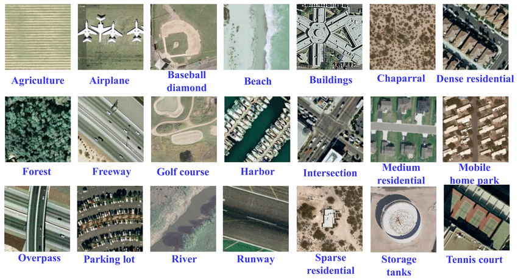
   
  <b>The UC merced dataset is a well known classification dataset.</b>

Classification is a fundamental task in remote sensing data analysis, where the goal is to assign a semantic label to each image, such as 'urban', 'forest', 'agricultural land', etc. The process of assigning labels to an image is known as image-level classification. However, in some cases, a single image might contain multiple different land cover types, such as a forest with a river running through it, or a city with both residential and commercial areas. In these cases, image-level classification becomes more complex and involves assigning multiple labels to a single image. This can be accomplished using a combination of feature extraction and machine learning algorithms to accurately identify the different land cover types. It is important to note that image-level classification should not be confused with pixel-level classification, also known as semantic segmentation. While image-level classification assigns a single label to an entire image, semantic segmentation assigns a label to each individual pixel in an image, resulting in a highly detailed and accurate representation of the land cover types in an image. Read [A brief introduction to satellite image classification with neural networks](https://medium.com/@robmarkcole/a-brief-introduction-to-satellite-image-classification-with-neural-networks-3ce28be15683)

- **[Eurosat Satellite Cnn And Resnet](https://github.com/Rumeysakeskin/EuroSat-Satellite-CNN-and-ResNet)** — *Classifying custom image datasets by creating Convolutional Neural Networks and Residual Networks from scratch with PyTorch.*

- **[Land Cover Classification Using Sentinel 2 Dataset](https://github.com/raoofnaushad/Land-Cover-Classification-using-Sentinel-2-Dataset)** — *[well written Medium article](https://raoofnaushad7.medium.com/applying-deep-learning-on-satellite-imagery-classification-5f2588b932c1) accompanying this repo but using the EuroSAT dataset.*

- **[Slums Mapping From Pretrained Cnn Network](https://github.com/deepankverma/slums_detection)** — *On VHR (Pleiades: 0.5m) and MR (Sentinel: 10m) imagery.*

- **[Comparing Urban Environments Using Satellite Imagery And Convolutional Neural Networks](https://github.com/adrianalbert/urban-environments)** — *Includes interesting study of the image embedding features extracted for each image on the Urban Atlas dataset.*

- **[Rsi Cb](https://github.com/lehaifeng/RSI-CB)** — *A Large Scale Remote Sensing Image Classification Benchmark via Crowdsource Data. See also [Remote-sensing-image-classification](https://github.com/aashishrai3799/Remote-sensing-image-classification).*

- **[Waternet](https://github.com/treigerm/WaterNet)** — *A CNN that identifies water in satellite images.*

- **[Road Network Classification](https://github.com/ualsg/Road-Network-Classification)** — *Road network classification model using ResNet-34, road classes organic, gridiron, radial and no pattern.*

- **[Sstn](https://github.com/zilongzhong/SSTN)** — *Spectral-Spatial Transformer Network for Hyperspectral Image Classification: A FAS Framework.*

- **[Satellitepollutioncnn](https://github.com/arnavbansal1/SatellitePollutionCNN)** — *A novel algorithm to predict air pollution levels with state-of-the-art accuracy using deep learning and GoogleMaps satellite images.*

- **[Propertyclassification](https://github.com/Sardhendu/PropertyClassification)** — *Classifying the type of property given Real Estate, satellite and Street view Images.*

- **[Remote Sense Quickstart](https://github.com/CarryHJR/remote-sense-quickstart)** — *Classification on a number of datasets, including with attention visualization.*

- **[Igarss2020 Bwms](https://github.com/jiankang1991/IGARSS2020_BWMS)** — *Band-Wise Multi-Scale CNN Architecture for Remote Sensing Image Scene Classification with a novel CNN architecture for the feature embedding of high-dimensional RS images.*

- **[Image.classification.on.eurosat](https://github.com/canturan10/image.classification.on.EuroSAT)** — *Solution in pure pytorch.*

- **[Hurricane Damage](https://github.com/allankapoor/hurricane_damage)** — *Post-hurricane structure damage assessment based on aerial imagery.*

- **[Isprs S2fl](https://github.com/danfenghong/ISPRS_S2FL)** — *Multimodal Remote Sensing Benchmark Datasets for Land Cover Classification with A Shared and Specific Feature Learning Model.*

- **[Ensemble Lclu](https://github.com/burakekim/ensemble_LCLU)** — *Deep neural network ensembles for remote sensing land cover and land use classification.*

- **[Urban Analysis Using Satellite Imagery](https://github.com/mominali12/Urban-Analysis-Using-Satellite-Imagery)** — *Classify urban area as planned or unplanned using a combination of segmentation and classification.*

- **[Mining Discovery With Deep Learning](https://github.com/remis/mining-discovery-with-deep-learning)** — *Mining and Tailings Dam Detection in Satellite Imagery Using Deep Learning.*

- **[Sentinel2 Deep Learning](https://github.com/d-smit/sentinel2-deep-learning)** — *Novel Training Methodologies for Land Classification of Sentinel-2 Imagery.*

- **[Pay More Attention](https://github.com/williamzhao95/Pay-More-Attention)** — *Remote Sensing Image Scene Classification Based on an Enhanced Attention Module.*

- **[Remote Sensing Image Classification Via Improved Cross Entropy Loss And Transfer Learning Strategy Based On Deep Convolutional Neural Networks](https://github.com/AliBahri94/Remote-Sensing-Image-Classification-via-Improved-Cross-Entropy-Loss-and-Transfer-Learning-Strategy)**

- **[Skal](https://github.com/hw2hwei/SKAL)** — *Looking Closer at the Scene: Multiscale Representation Learning for Remote Sensing Image Scene Classification.*

- **[Saff](https://github.com/zh-hike/SAFF)** — *Self-Attention-Based Deep Feature Fusion for Remote Sensing Scene Classification.*

- **[Glnet](https://github.com/wuchangsheng951/GLNET)** — *Convolutional Neural Networks Based Remote Sensing Scene Classification under Clear and Cloudy Environments.*

- **[Remote Sensing Image Classification](https://github.com/hiteshK03/Remote-sensing-image-classification)** — *Transfer learning using pytorch to classify remote sensing data into three classes: aircrafts, ships, none.*

- **[Remote Sensing Pretrained Models](https://github.com/lsh1994/remote_sensing_pretrained_models)** — *As an alternative to fine tuning on models pretrained on ImageNet, here some CNN are pretrained on the RSD46-WHU & AID datasets.*

- **[Obic Gcn](https://github.com/CVEO/OBIC-GCN)** — *Object-based Classification Framework of Remote Sensing Images with Graph Convolutional Networks.*

- **[Aitlas Arena](https://github.com/biasvariancelabs/aitlas-arena)** — *An open-source benchmark framework for evaluating state-of-the-art deep learning approaches for image classification in Earth Observation (EO).*

- **[Droughtwatch](https://github.com/wandb/droughtwatch)** — *Satellite-based Prediction of Forage Conditions for Livestock in Northern Kenya.*

- **[Jstars 2020 Dpn Hra](https://github.com/B-Xi/JSTARS_2020_DPN-HRA)** — *Deep Prototypical Networks With Hybrid Residual Attention for Hyperspectral Image Classification.*

- **[Signa](https://github.com/kyle-one/SIGNA)** — *Semantic Interleaving Global Channel Attention for Multilabel Remote Sensing Image Classification.*

- **[Pbdl](https://github.com/Usman1021/PBDL)** — *Patch-Based Discriminative Learning for Remote Sensing Scene Classification.*

- **[Emergencynet](https://github.com/ckyrkou/EmergencyNet)** — *Identify fire and other emergencies from a drone.*

- **[Satellite Deforestation](https://github.com/drewhibbard/satellite-deforestation)** — *Using Satellite Imagery to Identify the Leading Indicators of Deforestation, applied to the Kaggle Challenge Understanding the Amazon from Space.*

- **[Rsmlc](https://github.com/marjanstoimchev/RSMLC)** — *Deep Network Architectures as Feature Extractors for Multi-Label Classification of Remote Sensing Images.*

- **[Firerisk](https://github.com/CharmonyShen/FireRisk)** — *A Remote Sensing Dataset for Fire Risk Assessment with Benchmarks Using Supervised and Self-supervised Learning.*

- **[Flood Susceptibility Mapping](https://github.com/omarseleem92/flood_susceptibility_mapping)** — *Towards urban flood susceptibility mapping using data-driven models in Berlin, Germany.*

- **[Building Detection And Roof Type Recognition](https://github.com/loosgagnet/Building-detection-and-roof-type-recognition)** — *A CNN-Based Approach for Automatic Building Detection and Recognition of Roof Types Using a Single Aerial Image.*

- **[Snn4space](https://github.com/AndrzejKucik/SNN4Space)** — *Project which investigates the feasibility of deploying spiking neural networks (SNN) in land cover and land use classification tasks.*

- **[Vessel Classification](https://github.com/GlobalFishingWatch/vessel-classification)** — *Classify vessels and identify fishing behavior based on AIS data.*

- **[Rsmamba](https://github.com/KyanChen/RSMamba)** — *Remote Sensing Image Classification with State Space Model.*

- **[Birdsat](https://github.com/mvrl/BirdSAT)** — *Cross-View Contrastive Masked Autoencoders for Bird Species Classification and Mapping.*

- **[Egnna Wnd](https://github.com/stevinc/EGNNA_WND)** — *Estimating the presence of the West Nile Disease employing Graph Neural network.*

- **[Cyfi](https://github.com/drivendataorg/cyfi)** — *Estimate cyanobacteria density based on Sentinel-2 satellite imagery.*

- **[3dgan Vit](https://github.com/aj1365/3DGAN-ViT)** — *A deep learning framework based on generative adversarial networks and vision transformer for complex wetland classification.*

- **[Automatic Solar Pv Detection](https://github.com/KennSmithDS/automatic_solar_pv_detection)** — *Automatic Solar PV Panel Image Classification with Deep Neural Network Transfer Learning.*

- **[U Netr](https://github.com/JonathanVSV/U-netR)** — *Land Use Land Cover Classification with U-Net: Advantages of Combining Sentinel-1 and Sentinel-2 Imagery [paper](https://doi.org/10.3390/rs13183600).*

- **[Nshaud/deepnetsforeo](https://github.com/nshaud/DeepNetsForEO)** — *Deep networks for Earth Observation with PyTorch implementations of state-of-the-art architectures for remote sensing image classification.*

- **[Sentinel Landslide Cls](https://github.com/IoannisNasios/sentinel-landslide-cls)** — *Classification for Landslide Detection, using Sentinel-1 and Sentinel-2 data.*

#

---

### Segmentation

  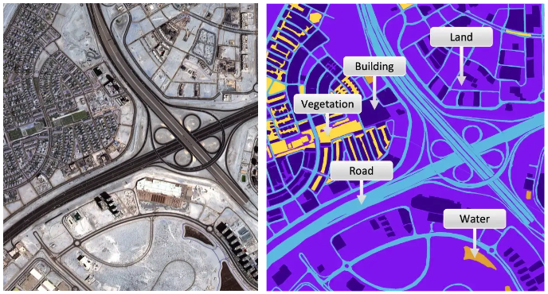
   
  <b>(left) a satellite image and (right) the semantic classes in the image.</b>

Image segmentation is a crucial step in image analysis and computer vision, with the goal of dividing an image into semantically meaningful segments or regions. The process of image segmentation assigns a class label to each pixel in an image, effectively transforming an image from a 2D grid of pixels into a 2D grid of pixels with assigned class labels. One common application of image segmentation is road or building segmentation, where the goal is to identify and separate roads and buildings from other features within an image. To accomplish this task, single class models are often trained to differentiate between roads and background, or buildings and background. These models are designed to recognize specific features, such as color, texture, and shape, that are characteristic of roads or buildings, and use this information to assign class labels to the pixels in an image. Another common application of image segmentation is land use or crop type classification, where the goal is to identify and map different land cover types within an image. In this case, multi-class models are typically used to recognize and differentiate between multiple classes within an image, such as forests, urban areas, and agricultural land. These models are capable of recognizing complex relationships between different land cover types, allowing for a more comprehensive understanding of the image content. Read [A brief introduction to satellite image segmentation with neural networks](https://medium.com/@robmarkcole/a-brief-introduction-to-satellite-image-segmentation-with-neural-networks-33ea732d5bce). **Note** that many articles which refer to 'hyperspectral land classification' are often actually describing semantic segmentation.

---

### Segmentation - Land use & land cover

- **[Automatic Detection Of Landfill Using Deep Learning](https://github.com/AnupamaRajkumar/LandfillDetection_SemanticSegmentation)**

- **[Cdl Segmentation](https://github.com/asimniazi63/CDL-Segmentation)** — *Deep Learning Based Land Cover and Crop Type Classification: A Comparative Study. Compares UNet, SegNet & DeepLabv3+.*

- **[Loveda](https://github.com/Junjue-Wang/LoveDA)** — *A Remote Sensing Land-Cover Dataset for Domain Adaptive Semantic Segmentation.*

- **[Deepglobe Land Cover Classification Challenge Solution](https://github.com/GeneralLi95/deepglobe_land_cover_classification_with_deeplabv3plus)**

- **[Cnn Enhanced Gcn](https://github.com/qichaoliu/CNN_Enhanced_GCN)** — *CNN-Enhanced Graph Convolutional Network With Pixel- and Superpixel-Level Feature Fusion for Hyperspectral Image Classification.*

- **[Lulcmapping Wv3images Corine Dlmethods](https://github.com/esertel/LULCMapping-WV3images-CORINE-DLMethods)** — *Land Use and Land Cover Mapping Using Deep Learning Based Segmentation Approaches and VHR Worldview-3 Images.*

- **[Mcanet](https://github.com/yisun98/SOLC)** — *A joint semantic segmentation framework of optical and SAR images for land use classification. Uses [WHU-OPT-SAR-dataset](https://github.com/AmberHen/WHU-OPT-SAR-dataset).*

- **[Land Cover](https://github.com/lucashu1/land-cover)** — *Model Generalization in Deep Learning Applications for Land Cover Mapping.*

- **[Generalizablersc](https://github.com/dgominski/generalizablersc)** — *Cross-dataset Learning for Generalizable Land Use Scene Classification.*

- **[Ssltransformerrs](https://github.com/HSG-AIML/SSLTransformerRS)** — *Self-supervised Vision Transformers for Land-cover Segmentation and.*
  Classification

- **[Lulcmapping Wv3images Corine Dlmethods](https://github.com/burakekim/LULCMapping-WV3images-CORINE-DLMethods)** — *Land Use and Land Cover Mapping Using Deep Learning Based Segmentation Approaches and VHR Worldview-3 Images.*

- **[Dcsa Net](https://github.com/Julia90/DCSA-Net)** — *Dynamic Convolution Self-Attention Network for Land-Cover Classification in VHR Remote-Sensing Images.*

- **[Chegcn Cnn Enhanced Heterogeneous Graph](https://github.com/Liuzhizhiooo/CHeGCN-CNN_enhanced_Heterogeneous_Graph)** — *CNN-Enhanced Heterogeneous Graph Convolutional Network: Inferring Land Use from Land Cover with a Case Study of Park Segmentation.*

- **[Tcsvt 2022 Dgssc](https://github.com/B-Xi/TCSVT_2022_DGSSC)** — *DGSSC: A Deep Generative Spectral-Spatial Classifier for Imbalanced Hyperspectral Imagery.*

- **[Deepforest Wetland Paper](https://github.com/aj1365/DeepForest-Wetland-Paper)** — *Deep Forest classifier for wetland mapping using the combination of Sentinel-1 and Sentinel-2 data, GIScience & Remote Sensing.*

- **[Wetland Unet](https://github.com/conservation-innovation-center/Wetland_UNet)** — *UNet models that can delineate wetlands using remote sensing data input including bands from Sentinel-2 LiDAR and geomorphons. By the Conservation Innovation Center of Chesapeake Conservancy and Defenders of Wildlife.*

- **[Dpa](https://github.com/x-ytong/DPA)** — *DPA is an unsupervised domain adaptation (UDA) method applied to different satellite images for large-scale land cover mapping.*

- **[Dynamicworld](https://github.com/google/dynamicworld)** — *Dynamic World, global 10 m land use land cover mapping from Google. [dynamic_world_pytorch](https://github.com/calebrob6/dynamic_world_pytorch) is a pytorch implementation.*

- **[Spada](https://github.com/links-ads/spada)** — *Land Cover Segmentation with Sparse Annotations from Sentinel-2 Imagery.*

- **[M3spada](https://github.com/ecapliez/M3SPADA)** — *Multi-Sensor Temporal Unsupervised Domain Adaptation for Land Cover Mapping with spatial pseudo labelling and adversarial learning.*

- **[Glnet](https://github.com/VITA-Group/GLNet)** — *Collaborative Global-Local Networks for Memory-Efficient Segmentation of Ultra-High Resolution Images.*

- **[Lovenas](https://github.com/Junjue-Wang/LoveNAS)** — *LoveNAS: Towards Multi-Scene Land-Cover Mapping via Hierarchical Searching Adaptive Network.*

- **[Flair 2 Challenge](https://github.com/IGNF/FLAIR-2)** — *Semantic segmentation and domain adaptation challenge proposed by the French National Institute of Geographical and Forest Information (IGN).*

- **[Flair 2 8th Place Solution](https://github.com/association-rosia/flair-2)**

- **[Igarss Spada](https://github.com/links-ads/spada)** — *Dataset and code for the paper Land Cover Segmentation with Sparse Annotations from Sentinel-2 Imagery [IGARSS 2023](https://arxiv.org/abs/2306.16252).*

- **[Cnn Land Cover Eco](https://github.com/DGalexander/cnn-land-cover-eco)** — *Multi-stage semantic segmentation of land cover in the Peak District using high-resolution RGB aerial imagery.*

- **[Lale](https://github.com/caglarmert/LALE)** — *A lightweight hybrid ConvMixer-transformer architecture for efficient land-cover segmentation in remote sensing imagery.*

---

### Segmentation - Vegetation, deforestation, crops & field boundaries

Note that deforestation detection may be treated as a segmentation task or a change detection task

- **[Detectree](https://github.com/martibosch/detectree)** — *Tree detection from aerial imagery in Python, a LightGBM classifier of tree/non-tree pixels from aerial imagery.*

- **[Kenya Crop Mask](https://github.com/nasaharvest/kenya-crop-mask)** — *Annual and in-season crop mapping in Kenya - LSTM classifier to classify pixels as containing crop or not, and a multi-spectral forecaster that provides a 12 month time series given a partial input. Dataset downloaded from GEE and pytorch lightning used for training.*

- **[Tree Species Classification From From Airborne Lidar And Hyperspectral Data Using 3d Convolutional Neural Networks](https://github.com/jaeeolma/tree-detection-evo)**

- **[Find Sports Fields Using Mask R Cnn And Overlay On Open Street Map](https://github.com/jremillard/images-to-osm)**

- **[An Lstm To Generate A Crop Mask For Togo](https://github.com/nasaharvest/togo-crop-mask)**

- **[Deepsatmodels](https://github.com/michaeltrs/DeepSatModels)** — *Context-self contrastive pretraining for crop type semantic segmentation.*

- **[Deeptreeattention](https://github.com/weecology/DeepTreeAttention)** — *Implementation of Hang et al. 2020 "Hyperspectral Image Classification with Attention Aided CNNs" for tree species prediction.*

- **[Crop Classification](https://github.com/bhavesh907/Crop-Classification)** — *Crop classification using multi temporal satellite images.*

- **[Crop Mask](https://github.com/nasaharvest/crop-mask)** — *End-to-end workflow for generating high resolution cropland maps, uses GEE & LSTM model.*

- **[Deepcropmapping](https://github.com/Lab-IDEAS/DeepCropMapping)** — *A multi-temporal deep learning approach with improved spatial generalizability for dynamic corn and soybean mapping, uses LSTM.*

- **[Resunet A](https://github.com/Akhilesh64/ResUnet-a)** — *A deep learning framework for semantic segmentation of remotely sensed data.*

- **[Dsd Paper 2020](https://github.com/JacobJeppesen/DSD_paper_2020)** — *Crop Type Classification based on Machine Learning with Multitemporal Sentinel-1 Data.*

- **[Mr Dnn](https://github.com/yasir2afaq/Multi-resolution-deep-neural-network)** — *Extract rice field from Landsat 8 satellite imagery.*

- **[Deep Learning Forest Monitoring](https://github.com/waldeland/deep_learning_forest_monitoring)** — *Forest mapping and monitoring of the African continent using Sentinel-2 data and deep learning.*

- **[Global Cropland Mapping](https://github.com/Charly-tian/global-cropland-mapping)** — *Global multi-temporal cropland mapping.*

- **[Landuse Dl](https://github.com/yghlc/Landuse_DL)** — *Delineate landforms due to the thawing of ice-rich permafrost.*

- **[Canopy](https://github.com/jonathanventura/canopy)** — *A Convolutional Neural Network Classifier Identifies Tree Species in Mixed-Conifer Forest from Hyperspectral Imagery.*

- **[Forest Change Detection](https://github.com/QuantuMobileSoftware/forest_change_detection)** — *Forest change segmentation with time-dependent models, including Siamese, UNet-LSTM, UNet-diff, UNet3D models.*

- **[Cultionet](https://github.com/jgrss/cultionet)** — *Segmentation of cultivated land, built on PyTorch Geometric and PyTorch Lightning.*

- **[Sentinel Tree Cover](https://github.com/wri/sentinel-tree-cover)** — *A global method to identify trees outside of closed-canopy forests with medium-resolution satellite imagery.*

- **[Crop Type Detection Iclr 2020](https://github.com/RadiantMLHub/crop-type-detection-ICLR-2020)** — *Winning Solutions from Crop Type Detection Competition at CV4A workshop, ICLR 2020.*

- **[S4a Models](https://github.com/Orion-AI-Lab/S4A-Models)** — *Various experiments on the Sen4AgriNet dataset.*

- **[Attention Mechanism Unet](https://github.com/davej23/attention-mechanism-unet)** — *An attention-based U-Net for detecting deforestation within satellite sensor imagery.*

- **[Summercrop Deeplearning](https://github.com/AgriRS/SummerCrop_Deeplearning)** — *A Transferable Learning Classification Model and Carbon Sequestration Estimation of Crops in Farmland Ecosystem.*

- **[Deepforest](https://deepforest.readthedocs.io/en/latest/index.html)** — *Is a python package for training and predicting individual tree crowns from airborne RGB imagery.*

- **[Official Repository For The "identifying Trees On Satellite Images" Challenge From Omdena](https://github.com/cienciaydatos/ai-challenge-trees)**

- **[Ptdm](https://github.com/hr8yhtzb/PTDM)** — *Pomelo Tree Detection Method Based on Attention Mechanism and Cross-Layer Feature Fusion.*

- **[Urban Tree Detection](https://github.com/jonathanventura/urban-tree-detection)** — *Individual Tree Detection in Large-Scale Urban Environments using High-Resolution Multispectral Imagery. With [dataset](https://github.com/jonathanventura/urban-tree-detection-data).*

- **[Biomassters Baseline](https://github.com/fnands/BioMassters_baseline)** — *A basic pytorch lightning baseline using a UNet for getting started with the [BioMassters challenge](https://www.drivendata.org/competitions/99/biomass-estimation/) (biomass estimation).*

- **[Biomassters Winners](https://github.com/drivendataorg/the-biomassters)** — *Top 3 solutions.*

- **[Kbrodt Biomassters Solution](https://github.com/kbrodt/biomassters)** — *1st place solution.*

- **[Biomass Estimation](https://github.com/azavea/biomass-estimation)** — *From Azavea, applied to Sentinel 1 & 2.*

- **[3dunetgsformer](https://github.com/aj1365/3DUNetGSFormer)** — *A deep learning pipeline for complex wetland mapping using generative adversarial networks and Swin transformer.*

- **[Seanet Torch](https://github.com/long123524/SEANet_torch)** — *Using a semantic edge-aware multi-task neural network to delineate agricultural parcels from remote sensing images.*

- **[Arborizer](https://github.com/RaffiBienz/arborizer)** — *Tree crowns segmentation and classification.*

- **[Reuse](https://github.com/priamus-lab/ReUse)** — *REgressive Unet for Carbon Storage and Above-Ground Biomass Estimation.*

- **[Unet Sentinel](https://github.com/eliasqueirogavieira/unet-sentinel)** — *UNet to handle Sentinel-1 SAR images to identify deforestation.*

- **[Maskedsst](https://github.com/HSG-AIML/MaskedSST)** — *Masked Vision Transformers for Hyperspectral Image Classification.*

- **[Unet Defmapping](https://github.com/bragagnololu/UNet-defmapping)** — *Master's thesis using UNet to map deforestation using Sentinel-2 Level 2A images, applied to Amazon and Atlantic Rainforest dataset.*

- **[Cvpr Multiearth Deforestation Segmentation](https://github.com/h2oai/cvpr-multiearth-deforestation-segmentation)** — *Multimodal Unet entry to the CVPR Multiearth 2023 deforestation challenge.*

- **[Transunetplus2](https://github.com/aj1365/TransUNetplus2)** — *TransU-Net++: Rethinking attention gated TransU-Net for deforestation mapping. Uses the Amazon and Atlantic forest dataset.*

- **[A High Resolution Canopy Height Model Of The Earth](https://github.com/langnico/global-canopy-height-model#a-high-resolution-canopy-height-model-of-the-earth)** — *A high-resolution canopy height model of the Earth.*

- **[Radiant Earth Spot The Crop Challenge](https://github.com/radiantearth/spot-the-crop-challenge)** — *Winning models from the Radiant Earth Spot the Crop Challenge, uses a time-series of Sentinel-2 multispectral data to classify crops in the Western Cape of South Africa. [Another solution](https://github.com/DariusTheGeek/Radiant-Earth-Spot-the-Crop-XL-Challenge).*

- **[Transfer Field Delineation](https://github.com/kerner-lab/transfer-field-delineation)** — *Multi-Region Transfer Learning for Segmentation of Crop Field Boundaries in Satellite Images with Limited Labels.*

- **[Crop Field Segmentation Ukan](https://github.com/DarthReca/crop-field-segmentation-ukan)** — *KANs and Sentinel for Effective and Explainable Crop Field Segmentation.*

- **[Mowing Detection](https://github.com/lucas-batier/mowing-detection)** — *Automatic detection of mowing and grazing from Sentinel images.*

- **[Ptavit3d And Ptavit3dca](https://github.com/feevos/tfcl)** — *Tackling fluffy clouds: field boundaries detection using time series of S2 and/or S1 imagery.*

- **[Ai4boundaries](https://github.com/waldnerf/ai4boundaries)** — *A Python package that facilitates download of the AI4boundaries data set.*

- **[Nasa Harvest Field Boundary Competition](https://github.com/radiantearth/Nasa_harvest_field_boundary_competition)** — *Nasa Harvest Rwanda Field Boundary Detection Challenge Tutorial.*

- **[Utb Codes](https://github.com/zhu-xlab/UTB_codes)** — *The Urban Tree Canopy Cover in Brazil [article](https://nkszjx.github.io/projects/UTB.html).*

- **[Nasa Harvest Boundary Detection Challenge](https://github.com/geoaigroup/nasa_harvest_boundary_detection_challenge)** — *The 4th place solution for NASA Harvest Field Boundary Detection Challenge on Zindi.*

- **[Rainforest Segmentation](https://github.com/jcblsn/rainforest-segmentation)** — *Identifying and tracking deforestation in the Amazon Rainforest using state-of-the-art deep learning models and multispectral satellite imagery.*

- **[Delineate Anything: Resolution Agnostic Field Boundary Delineation On Satellite Imagery](https://github.com/Lavreniuk/Delineate-Anything)**

- **[Semantic Segmentation For Lcluc](https://github.com/waterdmd/Semantic_segmentation_for_LCLUC)** — *Semantic Segmentation for Simultaneous Crop and Land Cover Land Use Classification Using Multi-Temporal Landsat Imagery.*

- **[Boundary Sam](https://github.com/awadbahaa/boundary-sam)** — *Parcel boundary delineation using SAM, image embeddings and detail enhancement filters.*

- **[Tofmapper](https://github.com/Moerizzy/TOFMapper)** — *A semantic segmentation tool for mapping and classifying Trees outside Forest in high resolution aerial images.*

- **[Mask Pstin](https://github.com/BruceKai/Mask-PSTIN)** — *Improving crop type mapping by integrating LSTM with temporal random masking and pixel-set spatial information.*

- **[Paddy Identification](https://github.com/kayathri4/paddy_identification)** — *Paddy Field Instance Segmentation using Multi-Temporal SAR Time Series.*

- **[Cropsight](https://github.com/rssiuiuc/CropSight)** — *Towards a large-scale operational framework for object-based crop type ground truth retrieval using street view and PlanetScope satellite imagery.*

- **[Ftw Prue](https://github.com/fieldsoftheworld/ftw-prue)** — *PRUE: A Practical Recipe for Field Boundary Segmentation at Scale.*

- **[Agribound](https://github.com/montimaj/agribound)** — *An AI-powered field boundary delineation toolkit combining satellite foundation models, embeddings, and global training data for accurate agricultural parcel/field boundary mapping.*

- **[S2 Forest Browning Monitoring](https://github.com/SamanthaBiegel/s2-forest-browning-monitoring)** — *Monitoring forest browning using Sentinel-2 imagery.*

- **[Lacunalabels](https://github.com/agroimpacts/lacunalabels)** — *A region-wide, multi-year set of crop field boundary labels for Africa.*

- **[Pseudo Fields](https://github.com/philipperufin/pseudo-fields/)** — *Generating pseudo labels for satellite-based crop field delineatio.*

---

### Segmentation - Water, coastlines, rivers & floods

- **[Sat Water](https://github.com/busayojee/sat-water)** — *Semantic segmentation of water bodies in satellite imagery, producing pixel-wise water masks from remote sensing images using a U-Net–style deep learning pipeline (data preparation, training, inference, and evaluation).*

- **[Houston Flooding](https://github.com/Lichtphyz/Houston_flooding)** — *Labeling each pixel as either flooded or not using data from Hurricane Harvey. Dataset consisted of pre and post flood images, and a ground truth floodwater mask was created using unsupervised clustering (with DBScan) of image pixels with human cluster verification/adjustment.*

- **[Ml4floods](https://github.com/spaceml-org/ml4floods)** — *An ecosystem of data, models and code pipelines to tackle flooding with ML.*

- **[Floodmaps](https://github.com/davdma/floodmaps)** — *An end-to-end pipeline and segmentation models for flood-water detection using Sentinel-1 SAR and Sentinel-2 multispectral imagery.*

- **[1st Place Solution For Stac Overflow: Map Floodwater From Radar Imagery Hosted By Microsoft Ai For Earth](https://github.com/sweetlhare/STAC-Overflow)** — *Combines Unet with Catboostclassifier, taking their maxima, not the average.*

- **[Hydra Floods](https://github.com/Servir-Mekong/hydra-floods)** — *An open source Python application for downloading, processing, and delivering surface water maps derived from remote sensing data.*

- **[Coastsat](https://github.com/kvos/CoastSat)** — *Tool for mapping coastlines which has an extension [CoastSeg](https://github.com/dbuscombe-usgs/CoastSeg) using segmentation models.*

- **[Deepwatermap](https://github.com/isikdogan/deepwatermap)** — *A deep model that segments water on multispectral images.*

- **[Rivamap](https://github.com/isikdogan/rivamap)** — *An automated river analysis and mapping engine.*

- **[Deep Water](https://github.com/maxbeber/deep-water)** — *Track changes in water level.*

- **[Watnet](https://github.com/xinluo2018/WatNet)** — *A deep ConvNet for surface water mapping based on Sentinel-2 image, uses the [Earth Surface Water Dataset](https://zenodo.org/record/5205674#.YoMjyZPMK3I).*

- **[A U Net For Flood Extent Mapping](https://github.com/jorgemspereira/A-U-Net-for-Flood-Extent-Mapping)**

- **[Floatingobjects](https://github.com/ESA-PhiLab/floatingobjects)** — *TOWARDS DETECTING FLOATING OBJECTS ON A GLOBAL SCALE WITHLEARNED SPATIAL FEATURES USING SENTINEL 2. Uses U-Net & pytorch.*

- **[Spacenet8](https://github.com/SpaceNetChallenge/SpaceNet8)** — *Baseline Unet solution to detect flooded roads and buildings.*

- **[Dlsim](https://github.com/nyokoya/dlsim)** — *Breaking the Limits of Remote Sensing by Simulation and Deep Learning for Flood and Debris Flow Mapping.*

- **[Water Hrnet](https://github.com/faye0078/Water-Extraction)** — *HRNet trained on Sentinel 2.*

- **[Semantic Segmentation Model To Identify Newly Developed Or Flooded Land](https://github.com/Azure/pixel_level_land_classification)** — *Using NAIP imagery provided by the Chesapeake Conservancy, training on MS Azure.*

- **[Bandnet](https://github.com/IamShubhamGupto/BandNet)** — *Analysis and application of multispectral data for water segmentation using machine learning. Uses Sentinel-2 data.*

- **[Mmflood](https://github.com/edornd/mmflood)** — *MMFlood: A Multimodal Dataset for Flood Delineation From Satellite Imagery (Sentinel 1 SAR).*

- **[Urban Flooding](https://github.com/omarseleem92/Urban_flooding)** — *Towards transferable data-driven models to predict urban pluvial flood water depth in Berlin, Germany.*

- **[Mecnet](https://github.com/zhilyzhang/MECNet)** — *Rich CNN features for water-body segmentation from very high resolution aerial and satellite imagery.*

- **[Swrnet](https://github.com/trongan93/swrnet)** — *A Deep Learning Approach for Small Surface Water Area Recognition Onboard Satellite.*

- **[Elwha Segmentation](https://github.com/StefanTodoran/elwha-segmentation)** — *Fine-tuning Meta's Segment Anything (SAM) for bird's eye view river pixel segmentation.*

- **[Riversnap](https://github.com/ArminMoghimi/RiverSnap)** — *Code for paper: A Comparative Performance Analysis of Popular Deep Learning Models and Segment Anything Model (SAM) for River Water Segmentation in Close-Range Remote Sensing Imagery.*

- **[Sar Water Segmentation](https://github.com/myeungun/SAR-water-segmentation)** — *Deep Learning based Water Segmentation Using KOMPSAT-5 SAR Images.*

- **[Terramind Flood](https://github.com/R1-AK/terramind-flood)** — *DEM-Enhanced Flood Detection with Physics-Aware Learning, applied to Sen1Flood11.*

- **[Prithvi Cafe](https://github.com/Sk-2103/Prithvi-CAFE)** — *Transformer-based global reasoning (Prithvi-EO-2.0) with CNN-based local spatial sensitivity, enabling high-resolution, reliable flood inundation mapping across multi-channel/sensor inputs, applied to Sen1Flood11.*

- **[Smagnet](https://github.com/ASUcicilab/SMAGNet)** — *A Spatially Masked Adaptive Gated Network for Multimodal Post-Flood Water Extent Mapping using SAR and Incomplete Multispectral Data. Uses c2smsfloods dataset.*

- **[Ibm Bluesky Challenge Zeroflood](https://github.com/oroikono/IBM-BlueSky-Challenge-ZeroFlood)**

- **[Omniwatermask Training](https://github.com/DPIRD-DMA/OmniWaterMask-training)** — *Training code for the deep learning model used in [OmniWaterMask](https://github.com/DPIRD-DMA/OmniWaterMask) - a Python library for detecting water bodies in satellite and aerial imagery.*

- **[Utae Water Segmentation](https://github.com/khlaifiabilel/utae-water-segmentation)** — *UTAE-PAPS model for water/land segmentation using Sentinel-1 and Sentinel-2 data with IBM Granite flood detection dataset.*

---

### Segmentation - Fire, smoke & burn areas

- **[Satellitevu Aws Disaster Response Hackathon](https://github.com/SatelliteVu/SatelliteVu-AWS-Disaster-Response-Hackathon)** — *Fire spread prediction using classical ML & deep learning.*

- **[A Practical Method For High Resolution Burned Area Monitoring Using Sentinel 2 And Viirs](https://github.com/mnpinto/FireHR)**

- **[Industrialsmokeplumedetection](https://github.com/HSG-AIML/IndustrialSmokePlumeDetection)** — *Using Sentinel-2 & a modified ResNet-50.*

- **[Burned Area Detection](https://github.com/dymaxionlabs/burned-area-detection)** — *Uses Sentinel-2.*

- **[Rescue](https://github.com/dbdmg/rescue)** — *Attention to fires: multi-channel deep-learning models for wildfire severity prediction.*

- **[Smoke Segmentation](https://github.com/jeffwen/smoke_segmentation)** — *Segmenting smoke plumes and predicting density from GOES imagery.*

- **[Wildfire Detection](https://github.com/amanbasu/wildfire-detection)** — *Using Vision Transformers for enhanced wildfire detection in satellite images.*

- **[Burned Area Detection](https://github.com/prhuppertz/Burned_Area_Detection)** — *Detecting Burned Areas with Sentinel-2 data.*

- **[Burned Area Baseline](https://github.com/lccol/burned-area-baseline)** — *Baseline unet model accompanying the Satellite Burned Area Dataset (Sentinel 1 & 2).*

- **[Burned Area Seg](https://github.com/links-ads/burned-area-seg)** — *Burned area segmentation from Sentinel-2 using multi-task learning.*

- **[Chabud2023](https://github.com/developmentseed/chabud2023)** — *Change detection for Burned area Delineation (ChaBuD) ECML/PKDD 2023 challenge.*

- **[Post Wildfire Burnt Up Detection Using Siamese Unet](https://github.com/kavyagupta/chabud)** — *On Chadbud dataset.*

- **[Vit Burned Detection](https://github.com/DarthReca/vit-burned-detection)** — *Vision transformers in burned area delineation.*

- **[Ai4good25 Wildfire](https://github.com/VSainteuf/ai4good25-wildfire)** — *AI4GOOD Class Fall 2025 : Wildfire spread prediction project.*

- **[Wildfire Lora Gfm](https://github.com/alishibli97/wildfire-lora-gfm)** — *Adapting large Earth-Observation foundation models.*
(Prithvi-v2, TerraMind, DINOv3) using LoRA, to detect wildfire burned areas from bi-temporal (pre-fire / post-fire) Sentinel-2 imagery.

---

### Segmentation - Landslides

- **[Landslide Sar Unet](https://github.com/iprapas/landslide-sar-unet)** — *Deep Learning for Rapid Landslide Detection using Synthetic Aperture Radar (SAR) Datacubes.*

- **[Landslide Mapping With Cnn](https://github.com/nprksh/landslide-mapping-with-cnn)** — *A new strategy to map landslides with a generalized convolutional neural network.*

- **[Landslide Mapping On Sar Data By Attention U Net](https://github.com/lorenzonava96/Landslide-mapping-on-SAR-data-by-Attention-U-Net)** — *Rapid Mapping of landslide on SAR data by Attention U-net.*

- **[Sar Landslide Detection Pretraining](https://github.com/VMBoehm/SAR-landslide-detection-pretraining)** — *SAR-based landslide classification pretraining leads to better segmentation.*

- **[Landslide Mapping From Sentinel 2 Imagery Through Change Detection](https://github.com/links-ads/igarss-landslide-delineation)**

- **[Landslide4sense Solution](https://github.com/iamtekson/landslide4sense-solution)** — *Solution of Tek Kshetri.*

- **[Digate Unet Landslide Segmentation](https://github.com/mishaown/DiGATe-UNet-LandSlide-Segmentation)** — *Lightweight Dual-Stream Framework for Landslide Segmentation.*

- **[Erosion Detection](https://github.com/Andrii-Radyhin/Erosion-detection)** — *Using Sentinel-2 to detect erosion.*

---

### Segmentation - Glaciers

- **[Hed Unet](https://github.com/khdlr/HED-UNet)** — *A model for simultaneous semantic segmentation and edge detection, examples provided are glacier fronts and building footprints using the Inria Aerial Image Labeling dataset.*

- **[Glacier Mapping](https://github.com/krisrs1128/glacier_mapping)** — *Mapping glaciers in the Hindu Kush Himalaya, Landsat 7 images, Shapefile labels of the glaciers, Unet with dropout.*

- **[Glaciersemanticsegmentation](https://github.com/n9Mtq4/GlacierSemanticSegmentation)**

- **[Antarctic Fracture Detection](https://github.com/chingyaolai/Antarctic-fracture-detection)** — *Uses UNet with the MODIS Mosaic of Antarctica to detect surface fractures.*

- **[Sentinel Lakeice](https://github.com/prs-eth/sentinel_lakeice)** — *Lake Ice Detection from Sentinel-1 SAR with Deep Learning.*

- **[Mcd Net](https://github.com/Lyra-alpha/MCD-Net)** — *A lightweight deep learning framework for optical-only moraine segmentation.*

- **[Landslides Segmentation](https://github.com/Eb3ls/landslides_segmentation)** — *Super-resolution and segmentation of multispectral Sentinel-2 satellite imagery, applied to landslide monitoring in Italian municipalities.*

- **[Glaciercastai](https://github.com/Arun-K-Ram/GlacierCastAI)** — *Forecasts glacier boundary retreat from Landsat time series, ERA5 climate data and Copernicus DEM terrain features using a multimodal ConvLSTM model.*

---

### Segmentation - methane

- **[Methane Detection From Hyperspectral Imagery](https://github.com/satish1901/Methane-detection-from-hyperspectral-imagery)** — *Deep Remote Sensing Methods for Methane Detection in Overhead Hyperspectral Imagery.*

- **[Methane Emission Project](https://github.com/stlbnmaria/methane-emission-project)** — *Classification CNNs was combined in an ensemble approach with traditional methods on tabular data.*

- **[Ch4net](https://github.com/annavaughan/CH4Net)** — *A fast, simple model for detection of methane plumes using sentinel-2.*

- **[Starcop: Semantic Segmentation Of Methane Plumes With Hyperspectral Machine Learning Models](https://github.com/spaceml-org/STARCOP)**

- **[Project Eucalyptus](https://github.com/Orbio-Earth/Project-Eucalyptus)** — *Pipelines for satellite-based methane detection. Includes trained segmentation models, a synthetic plume generator, and benchmarking tools for Sentinel-2, Landsat 8/9, and EMIT.*

- **[Plume Hunter: Towards Methane Detection On Board Satellites](https://github.com/spaceml-org/plume-hunter)**

---

### Segmentation - Other environmental

- **[Detection Of Open Landfills](https://github.com/dymaxionlabs/basurales)** — *Uses Sentinel-2 to detect large changes in the Normalized Burn Ratio (NBR).*

- **[Sea Ice Remote Sensing](https://github.com/sum1lim/sea_ice_remote_sensing)** — *Sea Ice Concentration classification.*

- **[Eddynet](https://github.com/redouanelg/EddyNet)** — *A Deep Neural Network For Pixel-Wise Classification of Oceanic Eddies.*

- **[Schisto Vegetation](https://github.com/deleo-lab/schisto-vegetation)** — *Deep Learning Segmentation of Satellite Imagery Identifies Aquatic Vegetation Associated with Snail Intermediate Hosts of Schistosomiasis in Senegal, Africa.*

- **[Earthformer](https://github.com/amazon-science/earth-forecasting-transformer)** — *Exploring space-time transformers for earth system forecasting.*

- **[Weather4cast 2022](https://github.com/iarai/weather4cast-2022)** — *Unet-3D baseline model for Weather4cast Rain Movie Prediction competition.*

- **[Weatherfusionnet](https://github.com/Datalab-FIT-CTU/weather4cast-2022)** — *Predicting Precipitation from Satellite Data. weather4cast-2022 1st place solution.*

- **[Marinedebrisdetector](https://github.com/MarcCoru/marinedebrisdetector)** — *Large-scale Detection of Marine Debris in Coastal Areas with Sentinel-2.*

- **[Kaggle Identify Contrails 4th](https://github.com/selimsef/kaggle-identify-contrails-4th)** — *4th place Solution, Google Research - Identify Contrails to Reduce Global Warming.*

- **[Minesegsat](https://github.com/macdonaldezra/MineSegSAT)** — *An automated system to evaluate mining disturbed area extents from Sentinel-2 imagery.*

- **[Asos](https://gitlab.jsc.fz-juelich.de/kiste/asos)** — *Recognizing protected and anthropogenic patterns in landscapes using interpretable machine learning and satellite imagery.*

- **[Sinksam](https://github.com/osherr1996/SinkSAM)** — *Knowledge-Driven Self-Supervised Sinkhole Segmentation Using Topographic Priors and Segment Anything Model.*

- **[Sense](https://github.com/kailaisun/GenAI4Urban-Energy/)** — *Satellite-based ENergy Synthesis for Sustainable Environment.*

---

### Segmentation - Roads & sidewalks

Extracting roads is challenging due to the occlusions caused by other objects and the complex traffic environment

- **[Chesapeakersc](https://github.com/isaaccorley/ChesapeakeRSC)** — *Segmentation to extract roads from the background but are additionally evaluated by how they perform on the "Tree Canopy Over Road" class.*

- **[Ml Epfl Project 2](https://github.com/LucasBrazCappelo/ML_EPFL_Project_2)** — *U-Net in Pytorch to perform semantic segmentation of roads on satellite images.*

- **[Winning Solutions From Spacenet Road Detection And Routing Challenge](https://github.com/SpaceNetChallenge/RoadDetector)**

- **[Awesome Deep Map](https://github.com/antran89/awesome-deep-map)** — *A curated list of resources dedicated to deep learning / computer vision algorithms for mapping. The mapping problems include road network inference, building footprint extraction, etc.*

- **[Roadtracer: Automatic Extraction Of Road Networks From Aerial Images](https://github.com/mitroadmaps/roadtracer)** — *Uses an iterative search process guided by a CNN-based decision function to derive the road network graph directly from the output of the CNN.*

- **[Road Detection Mtl](https://github.com/ntelo007/road_detection_mtl)** — *Road Detection using a multi-task Learning technique to improve the performance of the road detection task by incorporating prior knowledge constraints, uses the SpaceNet Roads Dataset.*

- **[Road Connectivity](https://github.com/anilbatra2185/road_connectivity)** — *Improved Road Connectivity by Joint Learning of Orientation and Segmentation (CVPR2019).*

- **[Spin Roadmapper](https://github.com/wgcban/SPIN_RoadMapper)** — *Extracting Roads from Aerial Images via Spatial and Interaction Space Graph Reasoning for Autonomous Driving.*

- **[Road Extraction Remote Sensing](https://github.com/jiankang1991/road_extraction_remote_sensing)** — *Pytorch implementation, CVPR2018 DeepGlobe Road Extraction Challenge submission. See also [DeepGlobe-Road-Extraction-Challenge](https://github.com/zlckanata/DeepGlobe-Road-Extraction-Challenge).*

- **[Roaddetections Dataset By Microsoft](https://github.com/microsoft/RoadDetections)**

- **[Coanet](https://github.com/mj129/CoANet)** — *Connectivity Attention Network for Road Extraction From Satellite Imagery. The CoA module incorporates graphical information to ensure the connectivity of roads are better preserved.*

- **[Satellite Imagery Road Segmentation](https://medium.com/@nithishmailme/satellite-imagery-road-segmentation-ad2964dc3812)** — *Intro article on Medium using the kaggle [Massachusetts Roads Dataset](https://www.kaggle.com/datasets/balraj98/massachusetts-roads-dataset).*

- **[Label Pixels](https://github.com/venkanna37/Label-Pixels)** — *For semantic segmentation of roads and other features.*

- **[Satellite Image Road Extraction](https://github.com/amanhari-projects/Satellite-image-road-extraction)** — *Road Extraction by Deep Residual U-Net.*

- **[Road Building Extraction](https://github.com/jeffwen/road_building_extraction)** — *Pytorch implementation of U-Net architecture for road and building extraction.*

- **[Rcfsnet](https://github.com/CVer-Yang/RCFSNet)** — *Road Extraction From Satellite Imagery by Road Context and Full-Stage Feature.*

- **[Sgcn](https://github.com/tist0bsc/SGCN)** — *Split Depth-Wise Separable Graph-Convolution Network for Road Extraction in Complex Environments From High-Resolution Remote-Sensing Images.*

- **[Aspn](https://github.com/pshams55/ASPN)** — *Road Segmentation for Remote Sensing Images using Adversarial Spatial Pyramid Networks.*

- **[Cresi](https://github.com/avanetten/cresi)** — *Road network extraction from satellite imagery, with speed and travel time estimates.*

- **[D Linknet](https://github.com/NekoApocalypse/road-extraction-d-linknet)** — *LinkNet with Pretrained Encoder and Dilated Convolution for High Resolution Satellite Imagery Road Extraction.*

- **[Sat2graph](https://github.com/songtaohe/Sat2Graph)** — *Road Graph Extraction through Graph-Tensor Encoding.*

- **[Roadtracer M](https://github.com/astro-ck/RoadTracer-M)** — *Road Network Extraction from Satellite Images Using CNN Based Segmentation and Tracing.*

- **[Scroadextractor](https://github.com/weiyao1996/ScRoadExtractor)** — *Scribble-based Weakly Supervised Deep Learning for Road Surface Extraction from Remote Sensing Images.*

- **[Roadda](https://github.com/LANMNG/RoadDA)** — *Stagewise Unsupervised Domain Adaptation with Adversarial Self-Training for Road Segmentation of Remote Sensing Images.*

- **[Deepsegmentor](https://github.com/yhlleo/DeepSegmentor)** — *A Pytorch implementation of DeepCrack and RoadNet projects.*

- **[Cascaded Residual Attention Enhanced Road Extraction From Remote Sensing Images](https://github.com/liaochengcsu/Cascade_Residual_Attention_Enhanced_for_Refinement_Road_Extraction)**

- **[Nl Linknet](https://github.com/SIAnalytics/nia-road-baseline)** — *Toward Lighter but More Accurate Road Extraction with Non-Local Operations.*

- **[Irsr Net](https://github.com/yangzhen1252/IRSR-net)** — *Lightweight Remote Sensing Road Detection Network.*

- **[Hironex](https://github.com/johannesuhl/hironex)** — *A python tool for automatic, fully unsupervised extraction of historical road networks from historical maps.*

- **[Road Detection Model](https://github.com/JonasImazon/Road_detection_model)** — *Mapping Roads in the Brazilian Amazon with Artificial Intelligence and Sentinel-2.*

- **[Dtnet](https://github.com/huzican695/DTnet)** — *Road detection via a dual-task network based on cross-layer graph fusion modules.*

- **[Automatic Road Extraction From Historical Maps Using Deep Learning Techniques](https://github.com/UrbanOccupationsOETR/Automatic-Road-Extraction-from-Historical-Maps-using-Deep-Learning-Techniques)** — *Automatic Road Extraction from Historical Maps using Deep Learning Techniques.*

- **[Istanbul Dataset](https://github.com/TolgaBkm/Istanbul_Dataset)** — *Segmentation on the Istanbul, Inria and Massachusetts datasets.*

- **[D Linknet](https://github.com/ShenweiXie/D-LinkNet)** — *1st place solution in DeepGlobe Road Extraction Challenge.*

- **[Park Detect](https://github.com/ShenweiXie/PaRK-Detect)** — *PaRK-Detect: Towards Efficient Multi-Task Satellite Imagery Road Extraction via Patch-Wise Keypoints Detection.*

- **[Tile2net](https://github.com/VIDA-NYU/tile2net)** — *Mapping the walk: A scalable computer vision approach for generating sidewalk network datasets from aerial imagery.*

- **[Sam Road](https://github.com/htcr/sam_road)** — *Segment Anything Model (SAM) for large-scale, vectorized road network extraction from aerial imagery.*

- **[Lrdnet](https://github.com/dyl96/LRDNet)** — *A Lightweight Road Detection Algorithm Based on Multiscale Convolutional Attention Network and Coupled Decoder Head.*

- **[Fine–grained Extraction Of Road Networks Via Joint Learning Of Connectivity And Segmentation](https://github.com/YXu556/RoadExtraction)** — *Uses SpaceNet 3 dataset.*

- **[Satellite Image Road Segmentation](https://github.com/aavek/Satellite-Image-Road-Segmentation)** — *Graph Reasoned Multi-Scale Road Segmentation in Remote Sensing Imagery.*

- **[Pathfinder](https://github.com/Oraegbuayomide10/PathFinder)** — *A Foundation Model for Road Mapping in Support of United Nations Humanitarian Affairs.*

---

### Segmentation - Buildings & rooftops

- **[Road And Building Semantic Segmentation In Satellite Imagery](https://github.com/Paulymorphous/Road-Segmentation)** — *Uses U-Net on the Massachusetts Roads Dataset & keras.*

- **[Find Unauthorized Constructions Using Aerial Photography](https://medium.com/towards-artificial-intelligence/find-unauthorized-constructions-using-aerial-photography-and-deep-learning-with-code-part-2-b56ca80c8c99)** — *[Dataset creation](https://pub.towardsai.net/find-unauthorized-constructions-using-aerial-photography-and-deep-learning-with-code-part-1-6d3ca7ff6fa0).*

- **[Srbuildseg](https://github.com/xian1234/SRBuildSeg)** — *Making low-resolution satellite images reborn: a deep learning approach for super-resolution building extraction.*

- **[Automated Building Detection](https://github.com/rodekruis/automated-building-detection)** — *Input: very-high-resolution (<= 0.5 m/pixel) RGB satellite images. Output: buildings in vector format (geojson), to be used in digital map products. Built on top of robosat and robosat.pink.*

- **[Jointnet A Common Neural Network For Road And Building Extraction](https://github.com/ThomasWangWeiHong/JointNet-A-Common-Neural-Network-for-Road-and-Building-Extraction)**

- **[Mapping Africa’s Buildings With Satellite Imagery: Google Ai Blog Post](https://ai.googleblog.com/2021/07/mapping-africas-buildings-with.html)** — *. See the [open-buildings](https://sites.research.google/open-buildings/) dataset.*

- **[Nz Convnet](https://github.com/weiji14/nz_convnet)** — *A U-net based ConvNet for New Zealand imagery to classify building outlines.*

- **[Polycnn](https://github.com/Lydorn/polycnn)** — *End-to-End Learning of Polygons for Remote Sensing Image Classification.*

- **[Spacenet Building Detection](https://github.com/motokimura/spacenet_building_detection)** — *Solution by [motokimura](https://github.com/motokimura) using Unet.*

- **[Semantic Segmentation Repo By Fuweifu Vtoo](https://github.com/fuweifu-vtoo/Semantic-segmentation)** — *Uses pytorch and the [Massachusetts Buildings & Roads Datasets](https://www.cs.toronto.edu/~vmnih/data/).*

- **[Extracting Buildings And Roads From Aws Open Data Using Amazon Sagemaker](https://aws.amazon.com/blogs/machine-learning/extracting-buildings-and-roads-from-aws-open-data-using-amazon-sagemaker/)** — *With [repo](https://github.com/aws-samples/aws-open-data-satellite-lidar-tutorial).*

- **[Tf Segnet](https://github.com/mathildor/TF-SegNet)** — *AirNet is a segmentation network based on SegNet, but with some modifications.*

- **[Rgb Footprint Extract](https://github.com/aatifjiwani/rgb-footprint-extract)** — *A Semantic Segmentation Network for Urban-Scale Building Footprint Extraction Using RGB Satellite Imagery, DeepLavV3+ module with a Dilated ResNet C42 backbone.*

- **[Spacenetexploration](https://github.com/yangsiyu007/SpaceNetExploration)** — *A sample project demonstrating how to extract building footprints from satellite images using a semantic segmentation model. Data from the SpaceNet Challenge.*

- **[Rooftop Instance Segmentation](https://github.com/MasterSkepticista/Rooftop-Instance-Segmentation)** — *VGG-16, Instance Segmentation, uses the Airs dataset.*

- **[Solar Farms Mapping](https://github.com/microsoft/solar-farms-mapping)** — *An Artificial Intelligence Dataset for Solar Energy Locations in India.*

- **[Poultry Cafos](https://github.com/microsoft/poultry-cafos)** — *This repo contains code for detecting poultry barns from high-resolution aerial imagery and an accompanying dataset of predicted barns over the United States.*

- **[Ssai Cnn](https://github.com/mitmul/ssai-cnn)** — *This is an implementation of Volodymyr Mnih's dissertation methods on his Massachusetts road & building dataset.*

- **[Remote Sensing Building Extraction To 3d Model Using Paddle And Grasshopper](https://github.com/Youssef-Harby/Remote-sensing-building-extraction-to-3D-model-using-Paddle-and-Grasshopper)**

- **[Segmentation Enhanced Resunet](https://github.com/tranleanh/segmentation-enhanced-resunet)** — *Urban building extraction in Daejeon region using Modified Residual U-Net (Modified ResUnet) and applying post-processing.*

- **[Mask Rcnn For Spacenet Off Nadir Building Detection](https://github.com/ashnair1/Mask-RCNN-for-Off-Nadir-Building-Detection)**

- **[Grsl Bfe Ma](https://github.com/jiankang1991/GRSL_BFE_MA)** — *Deep Learning-based Building Footprint Extraction with Missing Annotations using a novel loss function.*

- **[Fer Cnn](https://github.com/runnergirl13/FER-CNN)** — *Detection, Classification and Boundary Regularization of Buildings in Satellite Imagery Using Faster Edge Region Convolutional Neural Networks.*

- **[Vector Map Generation From Aerial Imagery Using Deep Learning Geospatial Unet](https://github.com/ManishSahu53/Vector-Map-Generation-from-Aerial-Imagery-using-Deep-Learning-GeoSpatial-UNET)** — *Applied to geo-referenced images which are very large size > 10k x 10k pixels.*

- **[Building Footprint Segmentation](https://github.com/fuzailpalnak/building-footprint-segmentation)** — *Pip installable library to train building footprint segmentation on satellite and aerial imagery, applied to Massachusetts Buildings Dataset and Inria Aerial Image Labeling Dataset.*

- **[Fcnn Example](https://github.com/emredog/FCNN-example)** — *Overfit to a given single image to detect houses.*

- **[Sat2lod2](https://github.com/gdaosu/lod2buildingmodel)** — *An open-source, python-based GUI-enabled software that takes the satellite images as inputs and returns LoD2 building models as outputs.*

- **[Satfootprint](https://github.com/PriyanK7n/SatFootprint)** — *Building segmentation on the Spacenet 7 dataset.*

- **[Building Detection](https://github.com/EL-BID/Building-Detection)** — *Raster Vision experiment to train a model to detect buildings from satellite imagery in three cities in Latin America.*

- **[Multi Building Tracker](https://github.com/sebasmos/Multi-building-tracker)** — *Multi-target building tracker for satellite images using deep learning.*

- **[Boundary Enhancement Semantic Segmentation For Building Extraction](https://github.com/hin1115/BEmodule-Satellite-Building-Segmentation)**

- **[Spacenet Building Detection](https://github.com/IdanC1s2/Spacenet-Building-Detection)**

- **[Lgpnet Bcd](https://github.com/TongfeiLiu/LGPNet-BCD)** — *Building Change Detection for VHR Remote Sensing Images via Local-Global Pyramid Network and Cross-Task Transfer Learning Strategy.*

- **[Mtl Homoscedastic Srb](https://github.com/burakekim/MTL_homoscedastic_SRB)** — *A Multi-Task Deep Learning Framework for Building Footprint Segmentation.*

- **[Fdanet](https://github.com/daifeng2016/FDANet)** — *Full-Level Domain Adaptation for Building Extraction in Very-High-Resolution Optical Remote-Sensing Images.*

- **[Cbrnet](https://github.com/HaonanGuo/CBRNet)** — *A Coarse-to-fine Boundary Refinement Network for Building Extraction from Remote Sensing Imagery.*

- **[Aslnet](https://github.com/ggsDing/ASLNet)** — *Adversarial Shape Learning for Building Extraction in VHR Remote Sensing Images.*

- **[Brrnet](https://github.com/wangyi111/Building-Extraction)** — *A Fully Convolutional Neural Network for Automatic Building Extraction From High-Resolution Remote Sensing Images.*

- **[Multi Scale Filtering Building Index](https://github.com/ThomasWangWeiHong/Multi-Scale-Filtering-Building-Index)** — *A Multi - Scale Filtering Building Index for Building Extraction in Very High - Resolution Satellite Imagery.*

- **[Models For Remote Sensing](https://github.com/bohaohuang/mrs)** — *Long list of unets etc applied to building detection.*

- **[Boundary Loss For Remote Sensing](https://github.com/yiskw713/boundary_loss_for_remote_sensing)** — *Boundary Loss for Remote Sensing Imagery Semantic Segmentation.*

- **[Open Cities Ai Challenge](https://www.drivendata.org/competitions/60/building-segmentation-disaster-resilience/)** — *Segmenting Buildings for Disaster Resilience. Winning solutions [on Github](https://github.com/drivendataorg/open-cities-ai-challenge/).*

- **[Mapnet](https://github.com/lehaifeng/MAPNet)** — *Multi Attending Path Neural Network for Building Footprint Extraction from Remote Sensed Imagery.*

- **[Dual Hrnet](https://github.com/SIAnalytics/dual-hrnet)** — *Localizing buildings and classifying their damage level.*

- **[Esfnet](https://github.com/mrluin/ESFNet-Pytorch)** — *Efficient Network for Building Extraction from High-Resolution Aerial Images.*

- **[Cvcmffnet](https://github.com/Jiankun-chen/CVCMFFNet-master)** — *Complex-Valued Convolutional and Multifeature Fusion Network for Building Semantic Segmentation of InSAR Images.*

- **[Steb Unet](https://github.com/BrightGuo048/STEB-UNet)** — *A Swin Transformer-Based Encoding Booster Integrated in U-Shaped Network for Building Extraction.*

- **[Dfc2020 Baseline](https://github.com/lukasliebel/dfc2020_baseline)** — *Baseline solution for the IEEE GRSS Data Fusion Contest 2020. Predict land cover labels from Sentinel-1 and Sentinel-2 imagery.*

- **[Fusing Multiple Segmentation Models Based On Different Datasets Into A Single Edge Deployable Model](https://github.com/markusmeingast/Satellite-Classifier)** — *Roof, car & road segmentation.*

- **[Ground Truth Gan Segmentation](https://github.com/zakariamejdoul/ground-truth-gan-segmentation)** — *Use Pix2Pix to segment the footprint of a building. The dataset used is AIRS.*

- **[Unicef Giga Sudan](https://github.com/Kamal-Eldin/UNICEF-Giga_Sudan)** — *Detecting school lots from satellite imagery in Southern Sudan using a UNET segmentation model.*

- **[Building Footprint Extraction](https://github.com/shubhamgoel27/building_footprint_extraction)** — *The project retrieves satellite imagery from Google and performs building footprint extraction using a U-Net.*

- **[Projectregularization](https://github.com/zorzi-s/projectRegularization)** — *Regularization of building boundaries in satellite images using adversarial and regularized losses.*

- **[Polyworldpretrainednetwork](https://github.com/zorzi-s/PolyWorldPretrainedNetwork)** — *Polygonal Building Extraction with Graph Neural Networks in Satellite Images.*

- **[Dl Image Segmentation](https://github.com/harry-gibson/dl_image_segmentation)** — *Uncertainty-Aware Interpretable Deep Learning for Slum Mapping and Monitoring. Uses SHAP.*

- **[Ubc Dataset](https://github.com/AICyberTeam/UBC-dataset)** — *A dataset for building detection and classification from very high-resolution satellite imagery with the focus on object-level interpretation of individual buildings.*

- **[Unetformer](https://github.com/WangLibo1995/GeoSeg)** — *A UNet-like transformer for efficient semantic segmentation of remote sensing urban scene imagery.*

- **[Bes Net](https://github.com/FlyC235/BESNet)** — *Boundary Enhancing Semantic Context Network for High-Resolution Image Semantic Segmentation. Applied to Vaihingen and Potsdam datasets.*

- **[Cvnet](https://github.com/xzq-njust/CVNet)** — *Contour Vibration Network for Building Extraction.*

- **[Cfenet](https://github.com/djzgroup/CFENet)** — *A Context Feature Enhancement Network for Building Extraction from High-Resolution Remote Sensing Imagery.*

- **[Hisup](https://github.com/SarahwXU/HiSup)** — *Accurate Polygonal Mapping of Buildings in Satellite Imagery.*

- **[Buildingextraction](https://github.com/KyanChen/BuildingExtraction)** — *Building Extraction from Remote Sensing Images with Sparse Token Transformers.*

- **[Crossgeonet](https://github.com/lqycrystal/coseg_building)** — *A Framework for Building Footprint Generation of Label-Scarce Geographical Regions.*

- **[Afm Building](https://github.com/lqycrystal/AFM_building)** — *Building Footprint Generation Through Convolutional Neural Networks With Attraction Field Representation.*

- **[Ramp (replicable Ai For Microplanning)](https://github.com/devglobalpartners/ramp-code)** — *Building detection in low and middle income countries.*

- **[Building Instance Segmentation](https://github.com/yuanqinglie/Building-instance-segmentation-combining-anchor-free-detectors-and-multi-modal-feature-fusion)** — *Multi-Modal Feature Fusion Network with Adaptive Center Point Detector for Building Instance Extraction.*

- **[Cgsanet](https://github.com/MrChen18/CGSANet)** — *A Contour-Guided and Local Structure-Aware Encoder–Decoder Network for Accurate Building Extraction From Very High-Resolution Remote Sensing Imagery.*

- **[Building Footprints Update](https://github.com/wangzehui20/building-footprints-update)** — *Learning Color Distributions from Bitemporal Remote Sensing Images to Update Existing Building Footprints.*

- **[Ramp](https://rampml.global/)** — *Model and buildings dataset to support a wide variety of humanitarian use cases.*

- **[Thesis Semantic Image Segmentation On Satellite Imagery Using Unets](https://github.com/rinkwitz/Thesis_Semantic_Image_Segmentation_on_Satellite_Imagery_using_UNets)** — *This master thesis aims to perform semantic segmentation of buildings on satellite images from the SpaceNet challenge 1 dataset using the U-Net architecture.*

- **[Hd Net](https://github.com/danfenghong/ISPRS_HD-Net)** — *High-resolution decoupled network for building footprint extraction via deeply supervised body and boundary decomposition.*

- **[Roofsense](https://github.com/DimitrisMantas/RoofSense/tree/master)** — *A novel deep learning solution for the automatic roofing material classification of the Dutch building stock using aerial imagery and laser scanning data fusion.*

- **[Ibs Aqsnet](https://github.com/zhilyzhang/IBS-AQSNet)** — *Enhanced Automated Quality Assessment Network for Interactive Building Segmentation in High-Resolution Remote Sensing Imagery.*

- **[Deepmao](https://github.com/Sumanth181099/DeepMAO)** — *Deep Multi-scale Aware Overcomplete Network for Building Segmentation in Satellite Imagery.*

- **[Cmgfnet Building Extraction](https://github.com/hamidreza2015/CMGFNet-Building_Extraction)** — *Deep Learning Code for Building Extraction from very high resolution (VHR) remote sensing images.*

- **[Global Collinearity Aware Polygonizer For Polygonal Building Mapping In Remote Sensing](https://github.com/zhu-xlab/GCP)**

- **[Building Segmentation On Lr Hr Sr Satellite Imagery](https://github.com/ESAOpenSR/Segmentation-Models-Benchmark)** — *Perform building delineation on different types of satellite imagery: Low-Resolution (LR), High-Resolution (HR), and Super-Resolution (SR). The goal is to compare the performance of segmentation models across these varying resolutions.*

- **[Urbangraphsage](https://github.com/OMUZ9924/UrbanGraphSAGE)** — *Graph Neural Network (GraphSAGE) for urban building footprint extraction from Sentinel-2 satellite imagery.*

- **[Terratorch Building Segmentation](https://github.com/OMUZ9924/terratorch-building-segmentation)** — *Fine-tuning Geospatial Foundation Models (Prithvi, TerraMind) for building footprint segmentation from Sentinel-2 using TerraTorch — Algiers case study.*

---

### Segmentation - Solar panels

- **[Deep Learning For Solar Panel Recognition](https://github.com/saizk/Deep-Learning-for-Solar-Panel-Recognition)** — *Using both object detection with Yolov5 and Unet segmentation.*

- **[Deepsolar](https://github.com/wangzhecheng/DeepSolar)** — *A Machine Learning Framework to Efficiently Construct a Solar Deployment Database in the United States. [Dataset on kaggle](https://www.kaggle.com/datasets/tunguz/deep-solar-dataset), actually used a CNN for classification and segmentation is obtained by applying a threshold to the activation map. Original code is tf1 but [tf2/kers](https://github.com/aidan-fitz/deepsolar-v2) and a [pytorch implementation](https://github.com/wangzhecheng/deepsolar_pytorch) are available. Also checkout [Visualizations and in-depth analysis .. of the factors that can explain the adoption of solar energy in ..  Virginia].*
  
- **[Hyperion Solar Net](https://github.com/fvergaracontesse/hyperion_solar_net)** — *Trained classificaton & segmentation models on RGB imagery from Google Maps.*

- **[3d Pv Locator](https://github.com/kdmayer/3D-PV-Locator)** — *Large-scale detection of rooftop-mounted photovoltaic systems in 3D.*

- **[Pv Pipeline](https://github.com/kdmayer/PV_Pipeline)** — *DeepSolar for Germany.*

- **[Solar Panels Detection](https://github.com/dbaofd/solar-panels-detection)** — *Using SegNet, Fast SCNN & ResNet.*

- **[Predict Pv Yield](https://github.com/openclimatefix/predict_pv_yield)** — *Using optical flow & machine learning to predict PV yield.*

- **[Large Scale Solar Plant Monitoring](https://github.com/osmarluiz/Large-scale-solar-plant-monitoring)** — *Remote Sensing for Monitoring of Photovoltaic Power Plants in Brazil Using Deep Semantic Segmentation.*

- **[Panel Segmentation](https://github.com/NREL/Panel-Segmentation)** — *Determine the presence of a solar array in the satellite image (boolean True/False), using a VGG16 classification model.*

- **[Roofpedia](https://github.com/ualsg/Roofpedia)** — *An open registry of green roofs and solar roofs across the globe identified by Roofpedia through deep learning.*

- **[Predicting The Solar Potential Of Rooftops Using Image Segmentation And Structured Data](https://medium.com/nam-r/predicting-the-solar-potential-of-rooftops-using-image-segmentation-and-structured-data-61198c39d57c)** — *Medium article, using 20cm imagery & Unet.*

- **[Solar Pv Global Inventory](https://github.com/Lkruitwagen/solar-pv-global-inventory)**

- **[Remote Sensing Solar Pv](https://github.com/Lkruitwagen/remote-sensing-solar-pv)** — *A repository for sharing progress on the automated detection of solar PV arrays in sentinel-2 remote sensing imagery.*

- **[Solar Panel Segmentation)](https://github.com/gabrieltseng/solar-panel-segmentation)** — *Finding solar panels using USGS satellite imagery.*

- **[Solar Plant Detection](https://github.com/Amirmoradi94/solar_plant_detection)** — *Boundary extraction of Photovoltaic (PV) plants using Mask RCNN and Amir dataset.*

- **[Solardetection](https://github.com/A-Stangeland/SolarDetection)** — *Unet on satellite image from the USA and France.*

- **[Adopptrs](https://github.com/francois-rozet/adopptrs)** — *Automatic Detection Of Photovoltaic Panels Through Remote Sensing using unet & pytorch.*

- **[Solar Panel Locator](https://github.com/TorrBorr/solar-panel-locator)** — *The number of solar panel pixels was only ~0.2% of the total pixels in the dataset, so solar panel data was upsampled to account for the class imbalance.*

- **[Projects Solar Panel Detection](https://github.com/top-on/projects-solar-panel-detection)** — *List of project to detect solar panels from aerial/satellite images.*

- **[Satellite Computervision](https://github.com/mjevans26/Satellite_ComputerVision)** — *UNET to detect solar arrays from Sentinel-2 data, using Google Earth Engine and Tensorflow. Also covers parking lot detection.*

- **[Photovoltaic Detection](https://github.com/riccardocadei/photovoltaic-detection)** — *Detecting available rooftop area from satellite images to install photovoltaic panels.*

- **[Solar Unet](https://github.com/mjevans26/Solar_UNet)** — *U-Net models delineating solar arrays in Sentinel-2 imagery.*

- **[Solardetection Solafune](https://github.com/bit-guber/SolarDetection-solafune)** — *Solar Panel Detection Using Sentinel-2 for the Solafune Competition.*

- **[A Comparative Evaluation Of Deep Learning Techniques For Photovoltaic Panel Detection From Aerial Images](https://github.com/links-ads/access-solar-panels)**

- **[Ucsd Mlbootcamp Capstone](https://github.com/FederCO23/UCSD_MLBootcamp_Capstone)** — *Automatic Detection of Photovoltaic Power Stations Using Satellite Imagery and Deep Learning (Sentinel 2).*

---

### Segmentation - Ships & vessels

- **[Universal Segmentation Baseline Kaggle Airbus Ship Detection](https://github.com/OniroAI/Universal-segmentation-baseline-Kaggle-Airbus-Ship-Detection)** — *Kaggle Airbus Ship Detection Challenge - bronze medal solution.*

- **[Airbus Ship Segmentation](https://github.com/TheXirex/Airbus-Ship-Segmentation)** — *Unet.*

- **[Contrastive Ssl Ship Detection](https://github.com/alina2204/contrastive_SSL_ship_detection)** — *Contrastive self supervised learning for ship detection in Sentinel 2 images.*

- **[Airbus Ship Detection](https://github.com/odessitua/airbus-ship-detection)** — *Using DeepLabV3+.*

- **[Unet With Web Application Applied To Airbus Ships](https://github.com/glibesyck/ImageSegmentation)**

---

### Segmentation - Other manmade

- **[Aarsh2001/ml Challenge Nrsc](https://github.com/Aarsh2001/ML_Challenge_NRSC)** — *Electrical Substation detection.*

- **[Electrical Substation Detection](https://github.com/thisishardik/electrical_substation_detection)**

- **[Mcan Oilspilldetection](https://github.com/liyongqingupc/MCAN-OilSpillDetection)** — *Oil Spill Detection with A Multiscale Conditional Adversarial Network under Small Data Training.*

- **[Mining Detector](https://github.com/earthrise-media/mining-detector)** — *Detection of artisanal gold mines in Sentinel-2 satellite imagery for [Amazon Mining Watch](https://amazonminingwatch.org/). Also covers clandestine airstrips.*

- **[Eg Unet](https://github.com/tist0bsc/EG-UNet)** — *Deep Feature Enhancement Method for Land Cover With Irregular and Sparse Spatial Distribution Features: A Case Study on Open-Pit Mining.*

- **[Plastics](https://github.com/earthrise-media/plastics)** — *Detecting and Monitoring Plastic Waste Aggregations in Sentinel-2 Imagery.*

- **[Mados](https://github.com/gkakogeorgiou/mados)** — *Detecting Marine Pollutants and Sea Surface Features with Deep Learning in Sentinel-2 Imagery on the MADOS dataset.*

- **[Sadma](https://github.com/sheikhazhanmohammed/SADMA)** — *Residual Attention UNet on MARIDA: Marine Debris Archive is a marine debris-oriented dataset on Sentinel-2 satellite images.*

- **[Map Mapper](https://github.com/CoDIS-Lab/MAP-Mapper)** — *Marine Plastic Mapper is a tool for assessing marine macro-plastic density to identify plastic hotspots, underpinned by the MARIDA dataset.*

- **[Substation Seg](https://github.com/Lindsay-Lab/substation-seg)** — *Segmenting substations in Sentinel 2 satellite imagery.*

- **[Samselect](https://github.com/geoJoost/SAMSelect)** — *An Automated Spectral Index Search for Marine Debris using Segment-Anything (SAM).*

---

### Panoptic segmentation

- **[Things And Stuff Or How Remote Sensing Could Benefit From Panoptic Segmentation](https://softwaremill.com/things-and-stuff-or-how-remote-sensing-could-benefit-from-panoptic-segmentation/)**

- **[Utae Paps](https://github.com/VSainteuf/utae-paps)** — *PyTorch implementation of U-TAE and PaPs for satellite image time series panoptic segmentation.*

- **[Pastis Benchmark](https://github.com/VSainteuf/pastis-benchmark)**

- **[Panoptic Generator](https://github.com/abilius-app/Panoptic-Generator)** — *This module converts GIS data into panoptic segmentation tiles.*

- **[Bsb Aerial Dataset](https://github.com/osmarluiz/BSB-Aerial-Dataset)** — *An example on how to use Detectron2's Panoptic-FPN in the BSB Aerial Dataset.*

---

### Segmentation - Miscellaneous

- **[Seg Eval](https://github.com/itracasa/seg-eval)** — *SegEval is a Python library that provides tools for evaluating semantic segmentation models. Generate evaluation regions and to analyze segmentation results within them.*

- **[Awesome Satellite Images Segmentation](https://github.com/mrgloom/awesome-semantic-segmentation#satellite-images-segmentation)**

- **[Satellite Image Segmentation: A Workflow With U Net](https://medium.com/vooban-ai/satellite-image-segmentation-a-workflow-with-u-net-7ff992b2a56e)** — *Is a decent intro article.*

- **[Mmsegmentation](https://github.com/open-mmlab/mmsegmentation)** — *Semantic Segmentation Toolbox with support for many remote sensing datasets including LoveDA, Potsdam, Vaihingen & iSAID.*

- **[Segmentation Gym](https://github.com/Doodleverse/segmentation_gym)** — *A neural gym for training deep learning models to carry out geoscientific image segmentation.*

- **[Using A U Net For Image Segmentation, Blending Predicted Patches Smoothly Is A Must To Please The Human Eye](https://github.com/Vooban/Smoothly-Blend-Image-Patches)** — *Python code to blend predicted patches smoothly. See [Satellite-Image-Segmentation-with-Smooth-Blending](https://github.com/MaitrySinha21/Satellite-Image-Segmentation-with-Smooth-Blending).*

- **[Dca](https://github.com/Luffy03/DCA)** — *Deep Covariance Alignment for Domain Adaptive Remote Sensing Image Segmentation.*

- **[Scattnet](https://github.com/lehaifeng/SCAttNet)** — *Semantic Segmentation Network with Spatial and Channel Attention Mechanism.*

- **[Efficient Transformer](https://github.com/zyxu1996/Efficient-Transformer)** — *Efficient Transformer for Remote Sensing Image Segmentation.*

- **[Weakly Supervised](https://github.com/LobellLab/weakly_supervised)** — *Weakly Supervised Deep Learning for Segmentation of Remote Sensing Imagery.*

- **[Hrcnet High Resolution Context Extraction Network](https://github.com/zyxu1996/HRCNet-High-Resolution-Context-Extraction-Network)** — *High-Resolution Context Extraction Network for Semantic Segmentation of Remote Sensing Images.*

- **[Semantic Segmentation Of Sar Images Using A Self Supervised Technique](https://github.com/cattale93/pytorch_self_supervised_learning)**

- **[Satellite Segmentation Pytorch](https://github.com/obravo7/satellite-segmentation-pytorch)** — *Explores a wide variety of image augmentations to increase training dataset size.*

- **[Spectralformer](https://github.com/danfenghong/IEEE_TGRS_SpectralFormer)** — *Rethinking hyperspectral image classification with transformers.*

- **[Unsupervised Segmentation Of Hyperspectral Remote Sensing Images With Superpixels](https://github.com/mpBarbato/Unsupervised-Segmentation-of-Hyperspectral-Remote-Sensing-Images-with-Superpixels)**

- **[Semantic Segmentation With Sparse Labels](https://github.com/Hua-YS/Semantic-Segmentation-with-Sparse-Labels)**

- **[Sndf](https://github.com/mi18/SNDF)** — *Superpixel-enhanced deep neural forest for remote sensing image semantic segmentation.*

- **[Dynamic Rs Segmentation](https://github.com/keillernogueira/dynamic-rs-segmentation)** — *Dynamic Multi-Context Segmentation of Remote Sensing Images based on Convolutional Networks.*

- **[Segmentation Models.pytorch](https://github.com/qubvel/segmentation_models.pytorch)** — *Segmentation models with pretrained backbones, has been used in multiple winning solutions to remote sensing competitions.*

- **[Ssrn](https://github.com/zilongzhong/SSRN)** — *Spectral-Spatial Residual Network for Hyperspectral Image Classification: A 3-D Deep Learning Framework.*

- **[So Dnn](https://github.com/PanXinZebra/SO-DNN)** — *Simplified object-based deep neural network for very high resolution remote sensing image classification.*

- **[Sanet](https://github.com/mrluin/SANet-PyTorch)** — *Scale-Aware Network for Semantic Segmentation of High-Resolution Aerial Images.*

- **[Aerial Segmentation](https://github.com/alpemek/aerial-segmentation)** — *Learning Aerial Image Segmentation from Online Maps.*

- **[Detectron2 Fpn + Pointrend Model For Amazing Satellite Image Segmentation](https://affine.medium.com/detectron2-fpn-pointrend-model-for-amazing-satellite-image-segmentation-183456063e15)** — *15% increase in accuracy when compared to the U-Net model.*

- **[Hybridsn](https://github.com/purbayankar/HybridSN-pytorch)** — *Exploring 3D-2D CNN Feature Hierarchy for Hyperspectral Image Classification.*

- **[Tnnls 2022 X Gpn](https://github.com/B-Xi/TNNLS_2022_X-GPN)** — *Semisupervised Cross-scale Graph Prototypical Network for Hyperspectral Image Classification.*

- **[Singlescenesemsegtgrs2022](https://github.com/sudipansaha/singleSceneSemSegTgrs2022)** — *Unsupervised Single-Scene Semantic Segmentation for Earth Observation.*

- **[A Fast And Compact 3 D Cnn For Hsic](https://github.com/mahmad00/A-Fast-and-Compact-3-D-CNN-for-HSIC)** — *A Fast and Compact 3-D CNN for Hyperspectral Image Classification.*

- **[Hsnrs](https://github.com/Walkerlikesfish/HSNRS)** — *Hourglass-ShapeNetwork Based Semantic Segmentation for High Resolution Aerial Imagery.*

- **[Gigcn](https://github.com/ShuGuoJ/GiGCN)** — *Graph-in-Graph Convolutional Network for Hyperspectral Image Classification.*

- **[Ssan](https://github.com/EtPan/SSAN)** — *Spectral-Spatial Attention Networks for Hyperspectral Image Classification.*

- **[Drone Images Semantic Segmentation](https://github.com/ayushdabra/drone-images-semantic-segmentation)** — *Multiclass Semantic Segmentation of Aerial Drone Images Using Deep Learning.*

- **[Satellite Image Segmentation With Smooth Blending](https://github.com/MaitrySinha21/Satellite-Image-Segmentation-with-Smooth-Blending)** — *Uses [Smoothly-Blend-Image-Patches](https://github.com/Vooban/Smoothly-Blend-Image-Patches).*

- **[Bayesianunet](https://github.com/tha-santacruz/BayesianUNet)** — *Pytorch Bayesian UNet model for segmentation and uncertainty prediction, applied to the Potsdam Dataset.*

- **[Raanet](https://github.com/Lrr0213/RAANet)** — *A Residual ASPP with Attention Framework for Semantic Segmentation of High-Resolution Remote Sensing Images.*

- **[Wheelruts Semanticsegmentation](https://github.com/SmartForest-no/wheelRuts_semanticSegmentation)** — *Mapping wheel-ruts from timber harvesting operations using deep learning techniques in drone imagery.*

- **[Lwn For Uavrsi](https://github.com/syliudf/LWN-for-UAVRSI)** — *Light-Weight Semantic Segmentation Network for UAV Remote Sensing Images, applied to Vaihingen, UAVid and UDD6 datasets.*

- **[Hypernet](https://github.com/ESA-PhiLab/hypernet)** — *Library which implements hyperspectral image (HSI) segmentation.*

- **[St Unet](https://github.com/XinnHe/ST-UNet)** — *Swin Transformer Embedding UNet for Remote Sensing Image Semantic Segmentation.*

- **[Edft](https://github.com/h1063135843/EDFT)** — *Efficient Depth Fusion Transformer for Aerial Image Semantic Segmentation.*

- **[Wiconet](https://github.com/ggsDing/WiCoNet)** — *Looking Outside the Window: Wide-Context Transformer for the Semantic Segmentation of High-Resolution Remote Sensing Images.*

- **[Crgnet](https://github.com/YonghaoXu/CRGNet)** — *Consistency-Regularized Region-Growing Network for Semantic Segmentation of Urban Scenes with Point-Level Annotations.*

- **[Sa Unet](https://github.com/Yancccccc/SA-UNet)** — *Improved U-Net Remote Sensing Classification Algorithm Fusing Attention and Multiscale Features.*

- **[Manet](https://github.com/lironui/Multi-Attention-Network)** — *Multi-Attention-Network for Semantic Segmentation of Fine Resolution Remote Sensing Images.*

- **[Banet](https://github.com/lironui/BANet)** — *Transformer Meets Convolution: A Bilateral Awareness Network for Semantic Segmentation of Very Fine Resolution Urban Scene Images.*

- **[Macu Net](https://github.com/lironui/MACU-Net)** — *MACU-Net for Semantic Segmentation of Fine-Resolution Remotely Sensed Images.*

- **[Dnas](https://github.com/faye0078/DNAS)** — *Decoupling Neural Architecture Search for High-Resolution Remote Sensing Image Semantic Segmentation.*

- **[A2 Fpn](https://github.com/lironui/A2-FPN)** — *A2-FPN for Semantic Segmentation of Fine-Resolution Remotely Sensed Images.*

- **[Maresu Net](https://github.com/lironui/MAResU-Net)** — *Multi-stage Attention ResU-Net for Semantic Segmentation of Fine-Resolution Remote Sensing Images.*

- **[Rsen](https://github.com/YonghaoXu/RSEN)** — *Robust Self-Ensembling Network for Hyperspectral Image Classification.*

- **[Msnet](https://github.com/taochx/MSNet)** — *Multispectral semantic segmentation network for remote sensing images.*

- **[Swin Transformer Semantic Segmentation](https://github.com/koechslin/Swin-Transformer-Semantic-Segmentation)** — *Satellite Image Semantic Segmentation.*

- **[Uda For Rs](https://github.com/Levantespot/UDA_for_RS)** — *Unsupervised Domain Adaptation for Remote Sensing Semantic Segmentation with Transformer.*

- **[A 3d Cnn Am Dsc Model For Hyperspectral Image Classification](https://github.com/hahatongxue/A-3D-CNN-AM-DSC-model-for-hyperspectral-image-classification)** — *Attention Mechanism and Depthwise Separable Convolution Aided 3DCNN for Hyperspectral Remote Sensing Image Classification.*

- **[Contrastive Distillation](https://github.com/edornd/contrastive-distillation)** — *A Contrastive Distillation Approach for Incremental Semantic Segmentation in Aerial Images.*

- **[Segforestnet](https://github.com/gritzner/SegForestNet)** — *SegForestNet: Spatial-Partitioning-Based Aerial Image Segmentation.*

- **[Mfvnet](https://github.com/weichenrs/MFVNet)** — *MFVNet: Deep Adaptive Fusion Network with Multiple Field-of-Views for Remote Sensing Image Semantic Segmentation.*

- **[Wildebeest Unet](https://github.com/zijing-w/Wildebeest-UNet)** — *Detecting wildebeest and zebras in Serengeti-Mara ecosystem from very-high-resolution satellite imagery.*

- **[Segment Anything Eo](https://github.com/aliaksandr960/segment-anything-eo)** — *Earth observation tools for Meta AI Segment Anything (SAM - Segment Anything Model).*

- **[Hr Image Classification Sdf2n](https://github.com/SicongLiuRS/HR-Image-classification_SDF2N)** — *A Shallow-to-Deep Feature Fusion Network for VHR Remote Sensing Image Classification.*

- **[Sink Seg](https://github.com/mvrl/sink-seg)** — *Automatic Segmentation of Sinkholes Using a Convolutional Neural Network.*

- **[Tiling And Stitching Segmentation Output For Remote Sensing: Basic Challenges And Recommendations](https://arxiv.org/abs/1805.12219)**

- **[Emrt](https://github.com/peach-xiao/EMRT)** — *Enhancing Multiscale Representations With Transformer for Remote Sensing Image Semantic Segmentation.*

- **[Uda For Rs](https://github.com/Levantespot/UDA_for_RS)** — *Unsupervised Domain Adaptation for Remote Sensing Semantic Segmentation with Transformer.*

- **[Cmtfnet](https://github.com/DrWuHonglin/CMTFNet)** — *CMTFNet: CNN and Multiscale Transformer Fusion Network for Remote Sensing Image Semantic Segmentation.*

- **[Cm Unet](https://github.com/XiaoBuL/CM-UNet)** — *Hybrid CNN-Mamba UNet for Remote Sensing Image Semantic Segmentation.*

- **[Using Stable Diffusion To Improve Image Segmentation Models](https://medium.com/edge-analytics/using-stable-diffusion-to-improve-image-segmentation-models-1e99c25acbf)** — *Augmenting Data with Stable Diffusion.*

- **[Ssrs](https://github.com/sstary/SSRS)** — *Semantic Segmentation for Remote Sensing, multiple networks implemented.*

- **[Bioscann](https://github.com/BiodiversityLab/bioscann)** — *BIOdiversity Segmentation and Classification with Artificial Neural Networks.*

- **[Resunet A](https://github.com/feevos/resuneta)** — *A deep learning framework for semantic segmentation of remotely sensed data.*

- **[Ssg2](https://github.com/feevos/ssg2)** — *A New Modelling Paradigm for Semantic Segmentation.*

- **[Dbfnet](https://github.com/Luffy03/DBFNet)** — *Deep Bilateral Filtering Network for Point-Supervised Semantic Segmentation in Remote Sensing Images.*

- **[Pgnet](https://github.com/Fhujinwu/PGNet)** — *PGNet: Positioning Guidance Network for Semantic Segmentation of Very-High-Resolution Remote Sensing Images [paper](https://www.mdpi.com/2072-4292/14/17/4219).*

- **[Asd](https://github.com/Jingtao-Li-CVer/ASD)** — *Anomaly Segmentation for High-Resolution Remote Sensing Images Based on Pixel Descriptors.*

- **[U Nets Implementation](https://github.com/Aadit3003/u-nets-implementation)** — *Semantic-Segmentation-with-U-Nets.*

- **[Sdm](https://github.com/caoql98/SDM)** — *Scale-aware Detailed Matching for Few-Shot Aerial Image Semantic Segmentation.*

- **[Transferability Remote Sensing](https://github.com/GDAOSU/Transferability-Remote-Sensing)** — *On the Transferability of Learning Models for Semantic Segmentation for Remote Sensing Data.*

- **[Data Centric Satellite Segmentation](https://github.com/microsoft/data-centric-satellite-segmentation)** — *Contains implementations of data-centric approaches for improving semantic segmentation on satellite imagery, from Microsoft.*

- **[Hslabeling](https://github.com/linjiaxing99/HSLabeling)** — *Towards Efficient Labeling for Large-scale Remote Sensing Image Segmentation with Hybrid Sparse Labeling.*

- **[Remotesam](https://github.com/1e12Leon/RemoteSAM)** — *Towards Segment Anything for Earth Observation (SAM).*

- **[Hierars](https://github.com/AI-Tianlong/HieraRS)** — *A Hierarchical Segmentation Paradigm for Remote Sensing Enabling Multi-Granularity Interpretation and Cross-Domain Transfer.*

- **[Multifrancefences](https://github.com/r-wenger/MultiFranceFences)** — *Large-scale fence detection using deep learning and multimodal aerial imagery.*

#

---

### Instance segmentation

In instance segmentation, each individual 'instance' of a segmented area is given a unique label. For detection of very small objects this may be a good approach, but it can struggle separating individual objects that are closely spaced.

- **[Mask Rcnn](https://github.com/matterport/Mask_RCNN)** — *Generates bounding boxes and segmentation masks for each instance of an object in the image. It is very commonly used for instance segmentation & object detection.*

- **[Building Detection Maskrcnn](https://github.com/Mstfakts/Building-Detection-MaskRCNN)** — *Building detection from the SpaceNet dataset by using Mask RCNN.*

- **[Mask Rcnn For Caravans](https://github.com/OrdnanceSurvey/Mask_RCNN-for-Caravans)** — *Detect caravan footprints from OS imagery.*

- **[Parking Bays Detectron2](https://github.com/spiyer99/parking_bays_detectron2)** — *Detecting parking bays with satellite imagery. Used Detectron2 and synthetic data with Unreal, superior performance to using Mask RCNN.*

- **[Circle Finder](https://github.com/zinsmatt/Circle_Finder)** — *Circular Shapes Detection in Satellite Imagery, 2nd place solution to the Circle Finder Challenge.*

- **[Lawn Maskrcnn](https://github.com/matthewnaples/Lawn_maskRCNN)** — *Detecting lawns from satellite images of properties in the Cedar Rapids area using Mask-R-CNN.*

- **[Cropmask Rcnn](https://github.com/ecohydro/CropMask_RCNN)** — *Segmenting center pivot agriculture to monitor crop water use in drylands with Mask R-CNN and Landsat satellite imagery.*

- **[Mask Rcnn For Spacenet Off Nadir Building Detection](https://github.com/ashnair1/Mask-RCNN-for-Off-Nadir-Building-Detection)**

- **[Catnet](https://github.com/yeliudev/CATNet)** — *Learning to Aggregate Multi-Scale Context for Instance Segmentation in Remote Sensing Images.*

- **[Object Detection On Satellite Images Using Mask R Cnn](https://github.com/ThayN15/Object-Detection-on-Satellite-Images-using-Mask-R-CNN)** — *Detect ships.*

- **[Factseg](https://github.com/Junjue-Wang/FactSeg)** — *Foreground Activation Driven Small Object Semantic Segmentation in Large-Scale Remote Sensing Imagery (TGRS), also see [FarSeg](https://github.com/Z-Zheng/FarSeg) and [FreeNet](https://github.com/Z-Zheng/FreeNet), implementations of research paper.*

- **[Aqua Python](https://github.com/tclavelle/aqua_python)** — *Detecting aquaculture farms using Mask R-CNN.*

- **[Rsprompter](https://github.com/KyanChen/RSPrompter)** — *Learning to Prompt for Remote Sensing Instance Segmentation based on Visual Foundation Model.*

- **[Vmd Mask Rcnn Pipeline](https://github.com/Fen100/VMD-Mask-RCNN-pipeline)** — *Detecting and segmenting sand mining river vessels on the Vietnam Mekong Delta, using PlanetScope imagery and Mask R-CNN.*

- **[Bright Cvprw26](https://github.com/ChenHongruixuan/BRIGHT/tree/master/cvprw26)** — *Mask R-CNN baseline for multimodal building damage instance segmentation on BRIGHT.*

#

---

### Object detection

  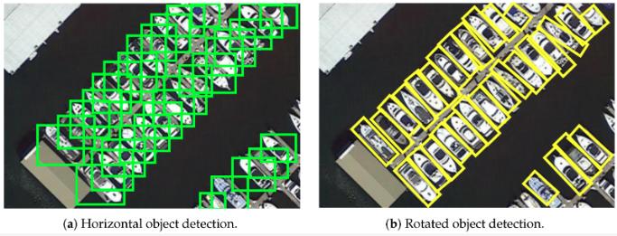
   
  <b>Image showing the suitability of rotated bounding boxes in remote sensing.</b>

Object detection in remote sensing involves locating and surrounding objects of interest with bounding boxes. Due to the large size of remote sensing images and the fact that objects may only comprise a few pixels, object detection can be challenging in this context. The imbalance between the area of the objects to be detected and the background, combined with the potential for objects to be easily confused with random features in the background, further complicates the task. Object detection generally performs better on larger objects, but becomes increasingly difficult as the objects become smaller and more densely packed. The accuracy of object detection models can also degrade rapidly as image resolution decreases, which is why it is common to use high resolution imagery, such as 30cm RGB, for object detection in remote sensing. A unique characteristic of aerial images is that objects can be oriented in any direction. To effectively extract measurements of the length and width of an object, it can be crucial to use rotated bounding boxes that align with the orientation of the object. This approach enables more accurate and meaningful analysis of the objects within the image. [Image source](https://www.mdpi.com/2072-4292/13/21/4291)

---

### Object tracking in videos

- **[Tctrack](https://github.com/vision4robotics/TCTrack)** — *Temporal Contexts for Aerial Tracking.*

- **[Cfme](https://github.com/SY-Xuan/CFME)** — *Object Tracking in Satellite Videos by Improved Correlation Filters With Motion Estimations.*

- **[Tgram](https://github.com/HeQibin/TGraM)** — *Multi-Object Tracking in Satellite Videos with Graph-Based Multi-Task Modeling.*

- **[Satellite Video Mod Groundtruth](https://github.com/zhangjunpeng9354/satellite_video_mod_groundtruth)** — *Groundtruth on satellite video for evaluating moving object detection algorithm.*

- **[Moving Object Detection Dsfnet](https://github.com/ChaoXiao12/Moving-object-detection-DSFNet)** — *DSFNet: Dynamic and Static Fusion Network for Moving Object Detection in Satellite Videos.*

- **[Hift](https://github.com/vision4robotics/HiFT)** — *Hierarchical Feature Transformer for Aerial Tracking.*

---

### Object detection with rotated bounding boxes

Orinted bounding boxes (OBB) are polygons representing rotated rectangles. For datasets checkout DOTA & HRSC2016. Start with Yolov8

- **[Mmrotate](https://github.com/open-mmlab/mmrotate)** — *Rotated Object Detection Benchmark, with pretrained models and function for inferencing on very large images.*

- **[Orienteddet](https://github.com/DL4EO/oriented-det)** — *A lightweight PyTorch framework for rotated object detection in aerial and satellite imagery, with oriented models, geometry operations and DOTA support.*

- **[Obbdetection](https://github.com/jbwang1997/OBBDetection)** — *An oriented object detection library, which is based on MMdetection.*

- **[Rotate Yolov3](https://github.com/ming71/rotate-yolov3)** — *Rotation object detection implemented with yolov3. Also see [yolov3-polygon](https://github.com/ming71/yolov3-polygon).*

- **[Drbox](https://github.com/liulei01/DRBox)** — *For detection tasks where the objects are orientated arbitrarily, e.g. vehicles, ships and airplanes.*

- **[S2anet](https://github.com/csuhan/s2anet)** — *Align Deep Features for Oriented Object Detection.*

- **[Cfc Net](https://github.com/ming71/CFC-Net)** — *A Critical Feature Capturing Network for Arbitrary-Oriented Object Detection in Remote Sensing Images.*

- **[Redet](https://github.com/csuhan/ReDet)** — *A Rotation-equivariant Detector for Aerial Object Detection.*

- **[Bbavectors Oriented Object Detection](https://github.com/yijingru/BBAVectors-Oriented-Object-Detection)** — *Oriented Object Detection in Aerial Images with Box Boundary-Aware Vectors.*

- **[Csl Retinanet Tensorflow](https://github.com/Thinklab-SJTU/CSL_RetinaNet_Tensorflow)** — *Arbitrary-Oriented Object Detection with Circular Smooth Label.*

- **[R3det On Mmdetection](https://github.com/SJTU-Thinklab-Det/r3det-on-mmdetection)** — *R3Det: Refined Single-Stage Detector with Feature Refinement for Rotating Object.*

- **[R Dfpn Fpn Tensorflow](https://github.com/yangxue0827/R-DFPN_FPN_Tensorflow)** — *Rotation Dense Feature Pyramid Networks (Tensorflow).*

- **[R2cnn Faster Rcnn Tensorflow](https://github.com/DetectionTeamUCAS/R2CNN_Faster-RCNN_Tensorflow)** — *Rotational region detection based on Faster-RCNN.*

- **[Rotated Retinanet](https://github.com/ming71/Rotated-RetinaNet)** — *Implemented in pytorch, it supports the following datasets: DOTA, HRSC2016, ICDAR2013, ICDAR2015, UCAS-AOD, NWPU VHR-10, VOC2007.*

- **[Obbdet Swin](https://github.com/ming71/OBBDet_Swin)** — *The sixth place winning solution in 2021 Gaofen Challenge.*

- **[Cg Net](https://github.com/WeiZongqi/CG-Net)** — *Learning Calibrated-Guidance for Object Detection in Aerial Images.*

- **[Orientedreppoints Dota](https://github.com/hukaixuan19970627/OrientedRepPoints_DOTA)** — *Oriented RepPoints + Swin Transformer/ReResNet.*

- **[Yolov5 Obb](https://github.com/hukaixuan19970627/yolov5_obb)** — *Yolov5 + Oriented Object Detection.*

- **[How To Train Yolov5 Obb](https://blog.roboflow.com/yolov5-for-oriented-object-detection/)** — *YOLOv5 OBB tutorial and [YOLOv5 OBB noteboook](https://colab.research.google.com/drive/16nRwsioEYqWFLBF5VpT_NvELeOeupURM#scrollTo=1NZxhXTMWvek).*

- **[Ohdet Tensorflow](https://github.com/SJTU-Thinklab-Det/OHDet_Tensorflow)** — *Can be applied to rotation detection and object heading detection.*

- **[Seodore](https://github.com/nijkah/Seodore)** — *Framework maintaining recent updates of mmdetection.*

- **[Rotation Retinanet Pytorch](https://github.com/HsLOL/Rotation-RetinaNet-PyTorch)** — *Oriented detector Rotation-RetinaNet implementation on Optical and SAR ship dataset.*

- **[Aidet](https://github.com/jwwangchn/aidet)** — *An open source object detection in aerial image toolbox based on MMDetection.*

- **[Rotation Yolov5](https://github.com/BossZard/rotation-yolov5)** — *Rotation detection based on yolov5.*

- **[Slrdet](https://github.com/LUCKMOONLIGHT/SLRDet)** — *Project based on mmdetection to reimplement RRPN and use the model Faster R-CNN OBB.*

- **[Axislearning](https://github.com/RSIA-LIESMARS-WHU/AxisLearning)** — *Axis Learning for Orientated Objects Detection in Aerial Images.*

- **[Detection And Recognition In Remote Sensing Image](https://github.com/whywhs/Detection_and_Recognition_in_Remote_Sensing_Image)** — *This work uses PaNet to realize Detection and Recognition in Remote Sensing Image by MXNet.*

- **[Drbox V2 Tensorflow](https://github.com/ZongxuPan/DrBox-v2-tensorflow)** — *Tensorflow implementation of DrBox-v2 which is an improved detector with rotatable boxes for target detection in remote sensing images.*

- **[Rotation Efficientdet D0](https://github.com/HsLOL/Rotation-EfficientDet-D0)** — *A PyTorch Implementation Rotation Detector based EfficientDet Detector, applied to custom rotation vehicle datasets.*

- **[Dodet](https://github.com/yanqingyao1994/DODet)** — *Dual alignment for oriented object detection, uses DOTA dataset.*

- **[Gf Csl](https://github.com/WangJian981002/GF-CSL)** — *Gaussian Focal Loss: Learning Distribution Polarized Angle Prediction for Rotated Object Detection in Aerial Images.*

- **[Polar Encodings](https://github.com/flyingshan/Learning-Polar-Encodings-For-Arbitrary-Oriented-Ship-Detection-In-SAR-Images)** — *Learning Polar Encodings for Arbitrary-Oriented Ship Detection in SAR Images.*

- **[R Centernet](https://github.com/ZeroE04/R-CenterNet)** — *Detector for rotated-object based on CenterNet.*

- **[Piou](https://github.com/clobotics/piou)** — *Orientated Object Detection; IoU Loss, applied to DOTA dataset.*

- **[Dafne](https://github.com/steven-lang/DAFNe)** — *A One-Stage Anchor-Free Approach for Oriented Object Detection.*

- **[Apronet](https://github.com/geovsion/AProNet)** — *Detecting objects with precise orientation from aerial images. Applied to datasets DOTA and HRSC2016.*

- **[Ucas Aod Benchmark](https://github.com/ming71/UCAS-AOD-benchmark)** — *A benchmark of UCAS-AOD dataset.*

- **[Rotateobjectdetection](https://github.com/XinzeLee/RotateObjectDetection)** — *Based on Ultralytics/yolov5, with adjustments to enable rotate prediction boxes. Also see [PolygonObjectDetection](https://github.com/XinzeLee/PolygonObjectDetection).*

- **[Ad Toolbox](https://github.com/liuyanyi/AD-Toolbox)** — *Aerial Detection Toolbox based on MMDetection and MMRotate, with support for more datasets.*

- **[Gghl](https://github.com/Shank2358/GGHL)** — *A General Gaussian Heatmap Label Assignment for Arbitrary-Oriented Object Detection.*

- **[Npmmr Det](https://github.com/Shank2358/NPMMR-Det)** — *A Novel Nonlocal-Aware Pyramid and Multiscale Multitask Refinement Detector for Object Detection in Remote Sensing Images.*

- **[Aopg](https://github.com/jbwang1997/AOPG)** — *Anchor-Free Oriented Proposal Generator for Object Detection.*

- **[Se2 Det](https://github.com/Virusxxxxxxx/SE2-Det)** — *Semantic-Edge-Supervised Single-Stage Detector for Oriented Object Detection in Remote Sensing Imagery.*

- **[Orientedreppoints](https://github.com/LiWentomng/OrientedRepPoints)** — *Oriented RepPoints for Aerial Object Detection.*

- **[Ts Conv](https://github.com/Shank2358/TS-Conv)** — *Task-wise Sampling Convolutions for Arbitrary-Oriented Object Detection in Aerial Images.*

- **[Fcosr](https://github.com/lzh420202/FCOSR)** — *A Simple Anchor-free Rotated Detector for Aerial Object Detection. This implement is modified from mmdetection. See also [TensorRT_Inference](https://github.com/lzh420202/TensorRT_Inference).*

- **[Obb Detection](https://github.com/HsLOL/OBB_Detection)** — *Finalist's solution in the track of Oriented Object Detection in Remote Sensing Images, 2022 Guangdong-Hong Kong-Macao Greater Bay Area International Algorithm Competition.*

- **[Sam Mmrotate](https://github.com/Li-Qingyun/sam-mmrotate)** — *SAM (Segment Anything Model) for generating rotated bounding boxes with MMRotate, which is a comparison method of H2RBox-v2.*

- **[Mmrotate Dcfl](https://github.com/Chasel-Tsui/mmrotate-dcfl)** — *Dynamic Coarse-to-Fine Learning for Oriented Tiny Object Detection.*

- **[H2rbox Mmrotate](https://github.com/yangxue0827/h2rbox-mmrotate)** — *Horizontal Box Annotation is All You Need for Oriented Object Detection.*

- **[Spatial Transform Decoupling](https://github.com/yuhongtian17/Spatial-Transform-Decoupling)** — *Spatial Transform Decoupling for Oriented Object Detection.*

- **[Ars Detr](https://github.com/httle/ARS-DETR)** — *Aspect Ratio Sensitive Oriented Object Detection with Transformer.*

- **[Cfinet](https://github.com/shaunyuan22/CFINet)** — *Small Object Detection via Coarse-to-fine Proposal Generation and Imitation Learning. Introduces [SODA-A dataset](https://shaunyuan22.github.io/SODA/).*

- **[Frcnn Git](https://github.com/runa91/FRCNN_git)** — *Faster R-CNN implementation for rotated boxes.*

---

### Object detection enhanced by super resolution

- **[Super Resolution And Object Detection](https://medium.com/the-downlinq/super-resolution-and-object-detection-a-love-story-part-4-8ad971eef81e)** — *Super-resolution is a relatively inexpensive enhancement that can improve object detection performance.*

- **[Eesrgan](https://github.com/Jakaria08/EESRGAN)** — *Small-Object Detection in Remote Sensing Images with End-to-End Edge-Enhanced GAN and Object Detector Network.*

- **[Mid Low Resolution Remote Sensing Ship Detection Using Super Resolved Feature Representation](https://www.preprints.org/manuscript/202108.0337/v1)**

- **[Eesrgan](https://github.com/divyam96/EESRGAN)** — *Small-Object Detection in Remote Sensing Images with End-to-End Edge-Enhanced GAN and Object Detector Network. Applied to COWC & [OGST](https://data.mendeley.com/datasets/bkxj8z84m9/3) datasets.*

- **[Fbnet](https://github.com/wdzhao123/FBNet)** — *Feature Balance for Fine-Grained Object Classification in Aerial Images.*

- **[Superyolo](https://github.com/icey-zhang/SuperYOLO)** — *SuperYOLO: Super Resolution Assisted Object Detection in Multimodal Remote Sensing Imagery.*

---

### Salient object detection

Detecting the most noticeable or important object in a scene

- **[Acconet](https://github.com/MathLee/ACCoNet)** — *Adjacent Context Coordination Network for Salient Object Detection in Optical Remote Sensing Images.*

- **[Mccnet](https://github.com/MathLee/MCCNet)** — *Multi-Content Complementation Network for Salient Object Detection in Optical Remote Sensing Images.*

- **[Corrnet](https://github.com/MathLee/CorrNet)** — *Lightweight Salient Object Detection in Optical Remote Sensing Images via Feature Correlation.*

- **[Reading List For Deep Learning Based Salient Object Detection In Optical Remote Sensing Images](https://github.com/MathLee/ORSI-SOD_Summary)**

- **[Orssd Dataset](https://github.com/rmcong/ORSSD-dataset)** — *Salient object detection dataset.*

- **[Eorssd Dataset](https://github.com/rmcong/EORSSD-dataset)** — *Extended Optical Remote Sensing Saliency Detection (EORSSD) Dataset.*

- **[Dafnet Tip20](https://github.com/rmcong/DAFNet_TIP20)** — *Dense Attention Fluid Network for Salient Object Detection in Optical Remote Sensing Images.*

- **[Emfinet](https://github.com/Kunye-Shen/EMFINet)** — *Edge-Aware Multiscale Feature Integration Network for Salient Object Detection in Optical Remote Sensing Images.*

- **[Erpnet](https://github.com/zxforchid/ERPNet)** — *Edge-guided Recurrent Positioning Network for Salient Object Detection in Optical Remote Sensing Images.*

- **[Fsminet](https://github.com/zxforchid/FSMINet)** — *Fully Squeezed Multi-Scale Inference Network for Fast and Accurate Saliency Detection in Optical Remote Sensing Images.*

- **[Agnet](https://github.com/NuaaYH/AGNet)** — *AGNet: Attention Guided Network for Salient Object Detection in Optical Remote Sensing Images.*

- **[Mscnet](https://github.com/NuaaYH/MSCNet)** — *A lightweight multi-scale context network for salient object detection in optical remote sensing images.*

- **[Gpnet](https://github.com/liuyu1002/GPnet)** — *Global Perception Network for Salient Object Detection in Remote Sensing Images.*

- **[Seanet](https://github.com/MathLee/SeaNet)** — *Lightweight Salient Object Detection in Optical Remote Sensing Images via Semantic Matching and Edge Alignment.*

- **[Gelenet](https://github.com/MathLee/GeleNet)** — *Salient Object Detection in Optical Remote Sensing Images Driven by Transformer.*

---

### Object detection - Buildings, rooftops & solar panels

- **[Satellite Image Tinhouse Detector](https://github.com/yasserius/satellite_image_tinhouse_detector)** — *Detection of tin houses from satellite/aerial images using the Tensorflow Object Detection API.*

- **[Building Extraction With Yolt2 And Spacenet Data](https://medium.com/the-downlinq/building-extraction-with-yolt2-and-spacenet-data-a926f9ffac4f)**

- **[Xbd Hurricanes](https://github.com/dbuscombe-usgs/XBD-hurricanes)** — *Models for building (and building damage) detection in high-resolution (<1m) satellite and aerial imagery using a modified RetinaNet model.*

- **[Ssd Spacenet](https://github.com/aurotripathy/ssd-spacenet)** — *Detect buildings in the Spacenet dataset using Single Shot MultiBox Detector (SSD).*

- **[3dbuildinginfomap](https://github.com/LllC-mmd/3DBuildingInfoMap)** — *Simultaneous extraction of building height and footprint from Sentinel imagery using ResNet.*

- **[Deepsolaris](https://github.com/thinkpractice/DeepSolaris)** — *A EuroStat project to detect solar panels in aerial images, further material [here](https://github.com/FHNW-IVGI/workshop_geopython2019/tree/master/Ex.02_SolarPanels).*

- **[Ml Objectdetection Cafo](https://github.com/Qberto/ML_ObjectDetection_CAFO)** — *Detect Concentrated Animal Feeding Operations (CAFO) in Satellite Imagery.*

- **[Multi Level Building Detection Framework](https://github.com/luoxiaoliaolan/Multi-level-Building-Detection-Framework)** — *Multilevel Building Detection Framework in Remote Sensing Images Based on Convolutional Neural Networks.*

- **[Automatic Damage Annotation On Post Hurricane Satellite Imagery](https://dds-lab.github.io/disaster-damage-detection/)** — *Detect damaged buildings using tensorflow object detection API. With repos [here](https://github.com/DDS-Lab/disaster-image-processing) and [here](https://github.com/annieyan/PreprocessSatelliteImagery-ObjectDetection).*

- **[Mappingchallenge](https://github.com/krishanr/mappingchallenge)** — *YOLOv5 applied to the AICrowd Mapping Challenge dataset.*

---

### Object detection - Ships, boats, vessels & wake

- **[Airbus Ship Detection Challenge](https://www.kaggle.com/c/airbus-ship-detection)** — *Using oriented bounding boxes. Read [Detecting ships in satellite imagery: five years later…](https://medium.com/artificialis/detecting-ships-in-satellite-imagery-five-years-later-28df2e83f987).*

- **[Kaggle Ships In Google Earth Yolov8](https://github.com/robmarkcole/kaggle-ships-in-satellite-imagery-with-YOLOv8)** — *Applying YOLOv8 to Kaggle Ships in Google Earth dataset.*

- **[How Hard Is It For An Ai To Detect Ships On Satellite Images?](https://medium.com/earthcube-stories/how-hard-it-is-for-an-ai-to-detect-ships-on-satellite-images-7265e34aadf0)**

- **[Sarfish](https://github.com/MJCruickshank/SARfish)** — *Ship detection in Sentinel 1 Synthetic Aperture Radar (SAR) imagery.*

- **[Arbitrary Oriented Ship Detection Through Center Head Point Extraction](https://github.com/JinleiMa/ASD)**

- **[Ship Detection](https://github.com/rugg2/ship_detection)** — *Using an interesting combination of CNN classifier, Class Activation Mapping (CAM) & UNET segmentation.*

- **[Building A Complete Ship Detection Algorithm Using Yolov3 And Planet Satellite Images](https://medium.com/intel-software-innovators/ship-detection-in-satellite-images-from-scratch-849ccfcc3072)** — *Covers finding and annotating data (using LabelMe), preprocessing large images into chips, and training Yolov3. [Repo](https://github.com/amanbasu/ship-detection).*

- **[Ship Detection In Satellite Images](https://github.com/zmf0507/Ship-detection-in-satellite-images)** — *Experiments with  UNET, YOLO, Mask R-CNN, SSD, Faster R-CNN, RETINA-NET.*

- **[Ship Detection From Satellite Images Using Yolov4](https://github.com/debasis-dotcom/Ship-Detection-from-Satellite-Images-using-YOLOV4)** — *Uses Kaggle Airbus Ship Detection dataset.*

- **[Shipsnet Detector](https://github.com/rhammell/shipsnet-detector)** — *Detect container ships in Planet imagery using machine learning.*

- **[Mask R Cnn For Ship Detection & Segmentation](https://medium.com/@gabogarza/mask-r-cnn-for-ship-detection-segmentation-a1108b5a083)** — *Blog post with [repo](https://github.com/gabrielgarza/Mask_RCNN).*

- **[Contrastive Ssl Ship Detection](https://github.com/alina2204/contrastive_SSL_ship_detection)** — *Contrastive self supervised learning for ship detection in Sentinel 2 images.*

- **[Boat Detection With Multi Region Growing Method In Satellite Images](https://medium.com/@ipmach/boat-detection-with-multi-region-growing-method-in-satellite-images-3339a6c29a8c)**

- **[Small Boat Detector](https://github.com/swricci/small-boat-detector)** — *Trained yolo v3 model weights and configuration file to detect small boats in satellite imagery.*

- **[Satellite Imagery Datasets Containing Ships](https://github.com/JasonManesis/Satellite-Imagery-Datasets-Containing-Ships)** — *A list of optical and radar satellite datasets for ship detection, classification, semantic segmentation and instance segmentation tasks.*

- **[Vessel Detection Sentinels](https://github.com/allenai/vessel-detection-sentinels)** — *Sentinel-1 and Sentinel-2 Vessel Detection.*

- **[Ship Detection](https://github.com/gouravbarkle/Ship-Detection)** — *CNN approach for ship detection in the ocean using a satellite image.*

- **[Vesseltracker](https://github.com/carlossantamarizq/vesselTracker)** — *Project based on reduced model of Yolov5 architecture using Pytorch. Custom dataset based on SAR imagery provided by Sentinel-1 through Earth Engine API.*

- **[Marine Debris Ml Model](https://github.com/danieltyukov/marine-debris-ml-model)** — *Marine Debris Detection using tensorflow object detection API.*

- **[Sdgh Net](https://github.com/WangZhenqing-RS/SDGH-Net-Ship-Detection-in-Optical-Remote-Sensing-Images-Based-on-Gaussian-Heatmap-Regression)** — *Ship Detection in Optical Remote Sensing Images Based on Gaussian Heatmap Regression.*

- **[Lr Tsdet](https://github.com/Lausen-Ng/LR-TSDet)** — *LR-TSDet: Towards Tiny Ship Detection in Low-Resolution Remote Sensing Images.*

- **[Fgscr 42](https://github.com/DYH666/FGSCR-42)** — *A public Dataset for Fine-Grained Ship Classification in Remote sensing images.*

- **[Wakenet](https://github.com/Lilytopia/WakeNet)** — *Rethinking Automatic Ship Wake Detection: State-of-the-Art CNN-based Wake Detection via Optical Images.*

- **[Levir Ship](https://github.com/WindVChen/LEVIR-Ship)** — *A dataset for tiny ship detection under medium-resolution remote sensing images.*

- **[Push And Pull Network](https://github.com/WindVChen/Push-and-Pull-Network)** — *Contrastive Learning for Fine-grained Ship Classification in Remote Sensing Images.*

- **[Drenet](https://github.com/WindVChen/DRENet)** — *A Degraded Reconstruction Enhancement-Based Method for Tiny Ship Detection in Remote Sensing Images With a New Large-Scale Dataset.*

- **[Xview3 The First Place Solution](https://github.com/BloodAxe/xView3-The-First-Place-Solution)** — *A winning solution for [xView 3](https://iuu.xview.us/) challenge (Vessel detection, classification and length estimation on Sentinetl-1 images). Contains trained models, inference pipeline and training code & configs to reproduce the results.*

- **[Vessel Detection Viirs](https://github.com/allenai/vessel-detection-viirs)** — *Model and service code for streaming vessel detections from VIIRS satellite imagery.*

- **[Wakemodel Llmassist](https://github.com/pbeukema/wakemodel_llmassist)** — *Wake detection in Sentinel-2, uses an EfficientNet-B0 architecture adapted for keypoint detection.*

- **[Orfenet](https://github.com/dyl96/ORFENet)** — *Tiny Object Detection in Remote Sensing Images Based on Object Reconstruction and Multiple Receptive Field Adaptive Feature Enhancement. Uses LEVIR-Ship & AI-TODv2 datasets.*

- **[Mayrajeo S2 Ship Detection](https://github.com/mayrajeo/ship-detection)** — *Detecting marine vessels from Sentinel-2 imagery with YOLOv8.*

- **[Chpdet](https://github.com/zf020114/CHPDet)** — *PyTorch implementation of "Arbitrary-Oriented Ship Detection through Center-Head Point Extraction".*

- **[Vds2raw](https://github.com/sirbastiano/VDS2Raw)** — *VFNet with ResNet-18 for Vessel Detection in S-2 Raw Imagery.*

- **[Global Fishing Capacity Vessel Detection Model](https://github.com/allenai/global_fishing_capacity_detector)** — *From Allen.ai and using Maxar imagery.*

- **[Darkvessel Stack](https://github.com/arunshar/darkvessel-stack)** — *A multi-modal stack for dark vessel detection fusing Sentinel-1 SAR, Sentinel-2 optical, and AIS through a geospatial foundation model backbone (Prithvi-2 / Clay / SatMAE++). Covers detection, segmentation, classification, change detection, super-resolution, time-series forecasting, and anomaly reasoning. Benchmarked on xView3-SAR with Microsoft Planetary Computer ingest.*

---

### Object detection - Cars, vehicles & trains

- **[Detection Of Parkinglots And Driveways With Retinanet](https://github.com/spiyer99/retinanet)**

- **[Pytorch Vedai](https://github.com/MichelHalmes/pytorch-vedai)** — *Object detection on the VEDAI dataset: Vehicle Detection in Aerial Imagery.*

- **[Truck Detection With Sentinel 2 During Covid 19 Crisis](https://github.com/hfisser/Truck_Detection_Sentinel2_COVID19)** — *Moving objects in Sentinel-2 data causes a specific reflectance relationship in the RGB, which looks like a rainbow, and serves as a marker for trucks. Improve accuracy by only analysing roads. Not using object detection but relevant. Also see [S2TD](https://github.com/hfisser/S2TD).*

- **[Cowc Car Counting](https://github.com/motokimura/cowc_car_counting)** — *Car counting on the. Not sctictly object detection but a CNN to predict the car count in a tile.*

- **[Carcounting](https://github.com/JacksonPeoples/CarCounting)** — *Using Yolov3 & COWC dataset.*

- **[Rotation Efficientdet D0](https://github.com/HsLOL/Rotation-EfficientDet-D0)** — *PyTorch implementation of Rotated EfficientDet, applied to a custom rotation vehicle dataset (car counting).*

- **[Rsvc2021 Dataset](https://github.com/YinongGuo/RSVC2021-Dataset)** — *A dataset for Vehicle Counting in Remote Sensing images, created from the DOTA & ITCVD.*

- **[Vehicle Counting In Very Low Resolution Aerial Images](https://github.com/hbsszq/Vehicle-Counting-in-Very-Low-Resolution-Aerial-Images)** — *Vehicle Counting in Very Low-Resolution Aerial Images via Cross-Resolution Spatial Consistency and Intraresolution Time Continuity.*

- **[Detecting Trucks](https://github.com/datasciencecampus/detecting-trucks)** — *Detecting large vehicles in Sentinel-2.*

---

### Object detection - Planes & aircraft

- **[Flightscope Bench](https://github.com/toelt-llc/FlightScope_Bench)** — *A Deep Comprehensive Assessment of Aircraft Detection Algorithms in Satellite Imagery, including Faster RCNN, DETR, SSD, RTMdet, RetinaNet, CenterNet, YOLOv5, and YOLOv8.*

- **[Faster Rcnn To Detect Airplanes](https://github.com/ShubhankarRawat/Airplane-Detection-for-Satellites)**

- **[Yoltv4](https://github.com/avanetten/yoltv4)** — *Includes examples on the [RarePlanes dataset](https://registry.opendata.aws/rareplanes/).*

- **[Aircraft Detection](https://github.com/hakeemtfrank/aircraft-detection)** — *Experiments to test the performance of a Gaussian process (GP) classifier with various kernels on the UC Merced land use land cover (LULC) dataset.*

- **[Aircraft Detection From Satellite Images Yolov3](https://github.com/emrekrtorun/aircraft-detection-from-satellite-images-yolov3)** — *Trained on kaggle cgi-planes-in-satellite-imagery-w-bboxes dataset.*

- **[Hrplanesv2 Data Set](https://github.com/dilsadunsal/HRPlanesv2-Data-Set)** — *YOLOv4 and YOLOv5 weights trained on the HRPlanesv2 dataset.*

- **[Deep Learning For Aircraft Recognition](https://github.com/Shayan-Bravo/Deep-Learning-for-Aircraft-Recognition)** — *A CNN model trained to classify and identify various military aircraft through satellite imagery.*

- **[Frcnn For Aircraft Detection](https://github.com/Huatsing-Lau/FRCNN-for-Aircraft-Detection)**

- **[Ergo Planes Detector](https://github.com/evilsocket/ergo-planes-detector)** — *An ergo based project that relies on a convolutional neural network to detect airplanes from satellite imagery, uses the PlanesNet dataset.*

- **[Pytorch Remote Sensing](https://github.com/miko7879/pytorch-remote-sensing)** — *Aircraft detection using the 'Airbus Aircraft Detection' dataset and Faster-RCNN with ResNet-50 backbone using pytorch.*

- **[Fasterrcnn Objectdetection](https://github.com/UKMIITB/FasterRCNN_ObjectDetection)** — *Faster RCNN model for aircraft detection and localisation in satellite images and creating a webpage with live server for public usage.*

- **[Hrplanes](https://github.com/TolgaBkm/HRPlanes)** — *Weights of YOLOv4 and Faster R-CNN networks trained with HRPlanes dataset.*

- **[Aerial Detection](https://github.com/alexbakr/aerial-detection)** — *Uses Yolov5 & Icevision.*

- **[Rareplanes Yolov5](https://github.com/jeffaudi/rareplanes-yolov5)** — *Using YOLOv5 and the RarePlanes dataset to detect and classify sub-characteristics of aircraft, with [article](https://medium.com/artificialis/detecting-aircrafts-on-airbus-pleiades-imagery-with-yolov5-5f3d464b75ad).*

- **[Onlyplanes](https://github.com/naivelogic/OnlyPlanes)** — *Incrementally Tuning Synthetic Training Datasets for Satellite Object Detection.*
  
- **[Efficient Yolo Rs Airplane Detection](https://github.com/RSandAI/Efficient-YOLO-RS-Airplane-Detection)** — *Implementation of YOLOv8 and YOLOv9 for efficient airplane detection in VHR satellite imagery (2025).*

---

### Object detection - Infrastructure & utilities

- **[Wind Turbine Detector](https://github.com/lbborkowski/wind-turbine-detector)** — *Wind Turbine Object Detection from Aerial Imagery Using TensorFlow Object Detection API.*

- **[Water Tanks And Swimming Pools Detection](https://github.com/EduardoFernandes1410/PATREO-Dengue)** — *Uses Faster R-CNN.*

- **[Pcan](https://www.mdpi.com/2072-4292/13/7/1243)** — *Part-Based Context Attention Network for Thermal Power Plant Detection in Remote Sensing Imagery, with [dataset](https://github.com/wenxinYin/AIR-TPPDD).*

- **[Windturbinedetection](https://github.com/nvriese1/WindTurbineDetection)** — *Implementation of transfer learning approach using the YOLOv7 framework to detect and rapidly quantify wind turbines in raw LANDSAT and NAIP satellite imagery.*

- **[Arctic Infrastructure Detection Paper](https://github.com/eliasm56/Arctic-Infrastructure-Detection-Paper)** — *Convolutional Neural Networks for Automated Built Infrastructure Detection in the Arctic Using Sub-Meter Spatial Resolution Satellite Imagery [paper](https://www.mdpi.com/2072-4292/14/11/2719).*

---

### Object detection - Oil storage tank detection

Oil is stored in tanks at many points between extraction and sale, and the volume of oil in storage is an important economic indicator.

- **[A Beginner’s Guide To Calculating Oil Storage Tank Occupancy With Help Of Satellite Imagery](https://medium.com/planet-stories/a-beginners-guide-to-calculating-oil-storage-tank-occupancy-with-help-of-satellite-imagery-e8f387200178)**

- **[Oil Tank Volume Estimation](https://github.com/kheyer/Oil-Tank-Volume-Estimation)** — *Combines object detection and classical computer vision.*

- **[Subpixelcircledetection](https://github.com/anttad/SubpixelCircleDetection)** — *CIRCULAR-SHAPED OBJECT DETECTION IN LOW RESOLUTION SATELLITE IMAGES.*

- **[Oil Well Detector](https://github.com/dzubke/oil_well_detector)** — *Detect oil wells in the Bakken oil field based on satellite imagery.*

- **[Acontrariotankdetection](https://github.com/anttad/AContrarioTankDetection)** — *Oil Tank Detection in Satellite Images via a Contrario Clustering.*

- **[Fast Large Image Object Detection Yolov7](https://github.com/shah0nawaz/Fast-Large-Image-Object-Detection-yolov7)** — *The oil yolov7 model is trained on oil storage tanks (OST) dataset.*

- **[Oiltank Capacity Detection](https://github.com/GeNiaaz/Oiltank-Capacity-Detection)** — *Analyse storage tanks around the world and identify the external floating roof tanks.*

---

### Object detection - Animals

A variety of techniques can be used to count animals, including object detection and instance segmentation. For convenience they are all listed here:

- **[Cownter Strike](https://github.com/IssamLaradji/cownter_strike)** — *Counting cows, located with point-annotations, two models: CSRNet (a density-based method) & LCFCN (a detection-based method).*

- **[Deepcattlecount](https://github.com/leoniehodel/deepCattleCount)** — *CSRNet-based cattle counting in very high-resolution satellite imagery to study land use and policy impacts in the Brazilian Amazon.*

- **[Cnn Mosquito Detection](https://github.com/sriramelango/CNN-Mosquito-Detection)** — *Determining the locations of potentially dangerous breeding grounds, compared YOLOv4, YOLOR & YOLOv5.*

- **[Borowicz Etal Spacewhale](https://github.com/lynch-lab/Borowicz_etal_Spacewhale)** — *Locate whales using ResNet.*

- **[Walrus Detection And Count](https://github.com/sweetlhare/walrus-detection-and-count)** — *Uses Mask R-CNN instance segmentation.*

- **[Marinemammalsdetection](https://github.com/Pangoraw/MarineMammalsDetection)** — *Weakly Supervised Detection of Marine Animals in High Resolution Aerial Images.*

- **[Audubon F21](https://github.com/RiceD2KLab/Audubon_F21)** — *Deep object detection for waterbird monitoring using aerial imagery.*

- **[Beluga Whale Detection From Satellite Imagery With Point Labels](https://github.com/VoyagerXvoyagerx/beluga-seeker/tree/main)**

- **[Herdnet](https://github.com/Alexandre-Delplanque/HerdNet)** — *From Crowd to Herd Counting: How to Precisely Detect and Count African Mammals using Aerial Imagery and Deep Learning?*

- **[Sat Rhino](https://github.com/sat-rhino/sat-rhino)** — *Evaluating a YOLOv12 model, plus tools for generating synthetic data in Blender.*

---

### Object detection - Miscellaneous

- **[Object Detection And Image Segmentation With Deep Learning On Earth Observation Data: A Review](https://www.mdpi.com/2072-4292/12/10/1667)**

- **[Awesome Aerial Object Detection Bu Murari023](https://github.com/murari023/awesome-aerial-object-detection)** — *, [another by visionxiang](https://github.com/visionxiang/awesome-object-detection-in-aerial-images) and [awesome-tiny-object-detection](https://github.com/kuanhungchen/awesome-tiny-object-detection) list many relevant papers.*

- **[Satellite Imagery Multiscale Rapid Detection With Windowed Networks (simrdwn)](https://github.com/avanetten/simrdwn)** — *Combines some of the leading object detection algorithms into a unified framework designed to detect objects both large and small in overhead imagery. Train models and test on arbitrary image sizes with YOLO (versions 2 and 3), Faster R-CNN, SSD, or R-FCN.*

- **[Yoltv4](https://github.com/avanetten/yoltv4)** — *YOLTv4 is designed to detect objects in aerial or satellite imagery in arbitrarily large images that far exceed the ~600×600 pixel size typically ingested by deep learning object detection frameworks.*

- **[Tensorflow Benchmarks For Object Detection In Aerial Images](https://github.com/yangxue0827/RotationDetection)**

- **[Pytorch Benchmarks For Object Detection In Aerial Images](https://github.com/dingjiansw101/AerialDetection)**

- **[Aspdnet](https://github.com/liuqingjie/ASPDNet)** — *Counting dense objects in remote sensing images.*

- **[Xview Yolov3](https://github.com/ultralytics/xview-yolov3)** — *XView 2018 Object Detection Challenge: YOLOv3 Training and Inference.*

- **[Faster Rcnn For Xview Satellite Data Challenge](https://github.com/samirsen/small-object-detection)**

- **[Object Detection Satellite Imagery Multi Vehicles Dataset (simd)](https://github.com/asimniazi63/Object-Detection-on-Satellite-Images)** — *RetinaNet,Yolov3 and Faster RCNN for multi object detection on satellite images dataset.*

- **[Sniper/autofocus](https://github.com/mahyarnajibi/SNIPER)** — *An efficient multi-scale object detection training/inference algorithm.*

- **[Electric Pylon Detection In Rsi](https://github.com/qsjxyz/Electric-Pylon-Detection-in-RSI)** — *A dataset which contains 1500 remote sensing images of electric pylons used to train ten deep learning models.*

- **[Is Count](https://github.com/sustainlab-group/IS-Count)** — *IS-Count is a sampling-based and learnable method for estimating the total object count in a region.*

- **[Clustered Object Detection In Aerial Image](https://github.com/fyangneil/Clustered-Object-Detection-in-Aerial-Image)**

- **[Yolov5s For Satellite Imagery](https://github.com/KevinMuyaoGuo/yolov5s_for_satellite_imagery)** — *Yolov5s applied to the DOTA dataset.*

- **[Retinanet Pytorch](https://github.com/HsLOL/RetinaNet-PyTorch)** — *RetinaNet implementation on remote sensing ship dataset (SSDD).*

- **[Detecting Cyclone Centers Custom Yolov3](https://github.com/ShubhayanS/Detecting-Cyclone-Centers-Custom-YOLOv3)** — *Tropical cyclones (TCs) are intense warm-cored cyclonic vortices, developed from low-pressure systems over the tropical oceans and driven by complex air-sea interaction.*

- **[Object Detection Yolov3 Retinanet Fasterrcnn](https://github.com/bostankhan6/Object-Detection-YoloV3-RetinaNet-FasterRCNN)** — *Trained on a private dataset.*

- **[Google Earth Object Recognition](https://github.com/InnovAIco/Google-earth-Object-Recognition)** — *Code for training and evaluating on Dior Dataset (Google Earth Images) using RetinaNet and YOLOV5.*

- **[Detection Of Multiclass Objects In Optical Remote Sensing Images](https://github.com/WenchaoliuMUC/Detection-of-Multiclass-Objects-in-Optical-Remote-Sensing-Images)** — *Detection of Multiclass Objects in Optical Remote Sensing Images.*

- **[Sb Msn](https://github.com/weihancug/Sampling-Balance_Multi-stage_Network)** — *Improving Training Instance Quality in Aerial Image Object Detection With a Sampling-Balance-Based Multistage Network.*

- **[Yoltv5](https://github.com/avanetten/yoltv5)** — *Detects objects in arbitrarily large aerial or satellite images that far exceed the ~600×600 pixel size typically ingested by deep learning object detection frameworks. Uses YOLOv5 & pytorch.*

- **[Air](https://github.com/Accenture/AIR)** — *A deep learning object detector framework written in Python for supporting Land Search and Rescue Missions.*

- **[Dior Detect](https://github.com/hm-better/dior_detect)** — *Benchmarks for object detection on DIOR dataset.*

- **[Opld Pytorch](https://github.com/yf19970118/OPLD-Pytorch)** — *Learning Point-Guided Localization for Detection in Remote Sensing Images.*

- **[F3net](https://github.com/yxhnjust/F3Net)** — *Feature Fusion and Filtration Network for Object Detection in Optical Remote Sensing Images.*

- **[Glnet](https://github.com/Zhu1Teng/GLNet)** — *Global to Local: Clip-LSTM-Based Object Detection From Remote Sensing Images.*

- **[Sraf Net](https://github.com/Complicateddd/SRAF-Net)** — *A Scene-Relevant Anchor-Free Object Detection Network in Remote Sensing Images.*

- **[Shapobjectdetection](https://github.com/hiroki-kawauchi/SHAPObjectDetection)** — *SHAP-Based Interpretable Object Detection Method for Satellite Imagery.*

- **[Nwd](https://github.com/jwwangchn/NWD)** — *A Normalized Gaussian Wasserstein Distance for Tiny Object Detection. Uses AI-TOD dataset.*

- **[Msfc Net](https://github.com/ZhAnGToNG1/MSFC-Net)** — *Multiscale Semantic Fusion-Guided Fractal Convolutional Object Detection Network for Optical Remote Sensing Imagery.*

- **[Lo Det](https://github.com/Shank2358/LO-Det)** — *LO-Det: Lightweight Oriented Object Detection in Remote Sensing Images.*

- **[R2ipoints](https://github.com/shnew/R2IPoints)** — *Pursuing Rotation-Insensitive Point Representation for Aerial Object Detection.*

- **[Object Detection](https://github.com/xiaojs18/Object-Detection)** — *Multi-Scale Object Detection with the Pixel Attention Mechanism in a Complex Background.*

- **[Mmdet Rfla](https://github.com/Chasel-Tsui/mmdet-rfla)** — *RFLA: Gaussian Receptive based Label Assignment for Tiny Object Detection.*

- **[Interactive Multi Class Tiny Object Detection](https://github.com/ChungYi347/Interactive-Multi-Class-Tiny-Object-Detection)** — *Interactive Multi-Class Tiny-Object Detection.*

- **[Small Object Detection Benchmark](https://github.com/fcakyon/small-object-detection-benchmark)** — *Slicing Aided Hyper Inference and Fine-tuning for Small Object Detection (SAHI).*

- **[Od Satellite Isaid](https://github.com/muzairkhattak/OD-Satellite-iSAID)** — *Object Detection in Aerial Images: A Case Study on Performance Improvement using iSAID.*

- **[Large Selective Kernel Network](https://github.com/zcablii/Large-Selective-Kernel-Network)** — *Large Selective Kernel Network for Remote Sensing Object Detection.*

- **[Satellite Imagery Detection Yolov7](https://github.com/Radhika-Keni/Satellite_Imagery_Detection_YOLOV7)** — *YOLOV7 applied to xView1 Dataset.*

- **[Fsanet](https://github.com/Lausen-Ng/FSANet)** — *FSANet: Feature-and-Spatial-Aligned Network for Tiny Object Detection in Remote Sensing Images.*

- **[Oan](https://github.com/Ranchosky/OAN)** — *Fewer is More: Efficient Object Detection in Large Aerial Images, based on MMdetection.*

- **[Dota C](https://github.com/hehaodong530/DOTA-C)** — *Evaluating the robustness of object detection models to 19 types of image quality degradation.*

- **[Satellite Remote Sensing Image Object Detection](https://github.com/ypw-lbj/Satellite-Remote-Sensing-Image-Object-Detection)** — *Using RefineDet & DOTA dataset.*

- **[Sfrnet](https://github.com/Ranchosky/SFRNet)** — *SFRNet: Fine-Grained Oriented Object Recognition via Separate Feature Refinement.*

- **[Contrail Seg](https://github.com/junzis/contrail-seg)** — *Neural network models for contrail detection and segmentation.*

- **[Dq Detr](https://github.com/hoiliu-0801/DQ-DETR)** — *DETR with Dynamic Query for Tiny Object Detection, uses AI-TOD-v1 and AI-TOD-v2 Datasets.*

---

### Object counting

When the object count, but not its shape is required, U-net can be used to treat this as an image-to-image translation problem.

- **[Centroid Unet](https://github.com/gicait/centroid-unet)** — *Centroid-UNet is deep neural network model to detect centroids from satellite images.*

- **[Cownter Strike](https://github.com/IssamLaradji/cownter_strike)** — *Counting cows, located with point-annotations, two models: CSRNet (a density-based method) & LCFCN (a detection-based method).*

- **[Bayesian Car Counting](https://github.com/albinjal/Bayesian-Car-Counting)** — *Car counting in overhead imagery using Bayesian loss with point supervision on the COWC dataset.*

- **[Treematch](https://github.com/dgominski/treematch)** — *Tree density estimation from satellite imagery using optimal transport and mixed strong and weak point supervision; includes the multi-sensor TinyTrees benchmark.*

- **[Do U Net](https://github.com/ToyahJade/DO-U-Net)** — *An effective approach for when the size of an object needs to be known, as well as the number of objects in the image, initially created to segment and count Internally Displaced People (IDP) camps in Afghanistan.*

- **[Counting From Sky](https://github.com/gaoguangshuai/Counting-from-Sky-A-Large-scale-Dataset-for-Remote-Sensing-Object-Counting-and-A-Benchmark-Method)** — *A Large-scale Dataset for Remote Sensing Object Counting and A Benchmark Method.*

- **[Psgcnet](https://github.com/gaoguangshuai/PSGCNet)** — *PSGCNet: A Pyramidal Scale and Global Context Guided Network for Dense Object Counting in Remote Sensing Images.*

- **[Psgcnet](https://github.com/gaoguangshuai/psgcnet)** — *A Pyramidal Scale and Global Context Guided Network for Dense Object Counting in Remote-Sensing Images.*

#

---

### Regression

  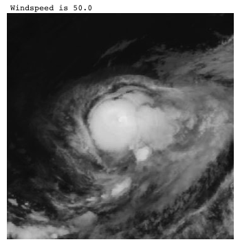
   
  <b>Regression prediction of windspeed.</b>

Regression in remote sensing involves predicting continuous variables such as wind speed, tree height, or soil moisture from an image. Both classical machine learning and deep learning approaches can be used to accomplish this task. Classical machine learning utilizes feature engineering to extract numerical values from the input data, which are then used as input for a regression algorithm like linear regression. On the other hand, deep learning typically employs a convolutional neural network (CNN) to process the image data, followed by a fully connected neural network (FCNN) for regression. The FCNN is trained to map the input image to the desired output, providing predictions for the continuous variables of interest. [Image source](https://github.com/h-fuzzy-logic/python-windspeed)

- **[Gedi Bdl](https://github.com/langnico/GEDI-BDL)** — *Global canopy height regression and uncertainty estimation from GEDI LIDAR waveforms with deep ensembles.*

- **[Global Canopy Height Map](https://github.com/AI4Forest/Global-Canopy-Height-Map)** — *Estimating Canopy Height at Scale (ICML2024).*

- **[Highrescanopyheight](https://github.com/facebookresearch/HighResCanopyHeight)** — *Code for Meta paper: Very high resolution canopy height maps from RGB imagery using self-supervised vision transformer and convolutional decoder trained on Aerial Lidar.*

- **[Opticalwavegauging Dnn](https://github.com/OpticalWaveGauging/OpticalWaveGauging_DNN)** — *Optical wave gauging using deep neural networks.*

- **[Satellite Pose Estimation](https://github.com/eio/satellite-pose-estimation)** — *Adapts a ResNet50 model architecture to perform pose estimation on several series of satellite images (both real and synthetic).*

- **[Tropical Cyclone Wind Estimation Competition](https://mlhub.earth/10.34911/rdnt.xs53up)** — *On RadiantEarth MLHub.*

- **[Denguenet](https://github.com/mimikuo365/DengueNet-IJCAI)** — *DengueNet: Dengue Prediction using Spatiotemporal Satellite Imagery for Resource-Limited Countries.*

- **[Tropical Cyclone Uq](https://github.com/nilsleh/tropical_cyclone_uq)** — *Uncertainty Aware Tropical Cyclone Wind Speed Estimation from Satellite Data.*

- **[Aqnet](https://github.com/CoDIS-Lab/AQNet)** — *Predicting air quality via multimodal AI and satellite imagery.*

- **[Soil Moisture Retrieval From Google Research](https://github.com/google-research/google-research/tree/master/soil_moisture_retrieval)** — *A Deep Learning Data Fusion Model Using Sentinel-1/2, SoilGrids, SMAP, and GLDAS for Soil Moisture Retrieval.*

- **[Temp Mosaiks](https://github.com/reed-colloton/temp-mosaiks)** — *Predict ground-level temperature with MOSAIKS.*

- **[Biomsharp](https://github.com/laiaalbors/biomsharp)** — *Biomass Super-resolution for High AccuRacy Prediction.*

- **[Treasure Net](https://github.com/Global-Earth-Observation/threasure-net)** — *Super-Resolved Canopy Height Mapping from Sentinel-2 Time Series Using LiDAR HD Reference Data across Metropolitan France.*

- **[Seabed Net](https://github.com/pagraf/Seabed-Net)** — *A multi-task network for joint bathymetry and pixel-based seabed classification from remote sensing imagery in shallow waters, uses [MagicBathyNet](https://www.magicbathy.eu/magicbathynet.html) dataset.*

- **[Echosat](https://github.com/AI4Forest/ECHOSAT)** — *Estimating Canopy Height Over Space And Time, uses a Swin Video UNet architecture that processes multi-sensor satellite data.*

- **[Popcorn](https://popcorn-population.github.io/)** — *High-resolution Population Maps Derived from Sentinel-1 and Sentinel-2, with follow up work [Bourbon](https://github.com/nandometzger/bourbon).*

- **[Urbancontrolnet](https://github.com/kailaisun/UrbanControlNet/)** — *Envisioning Global Urban Development with Satellite Imagery and Generative AI.*

- **[Emb2heights](https://github.com/VMarsocci/emb2heights-baselines)** — *Baseline for the Emb2Heights challenge - trains and runs inference for a model that predicts sub-pixel land cover percentages (Building, Vegetation, Water) and continuous structure heights (nDSM) directly from Earth Observation embeddings.*

#

---

### Image retrieval

  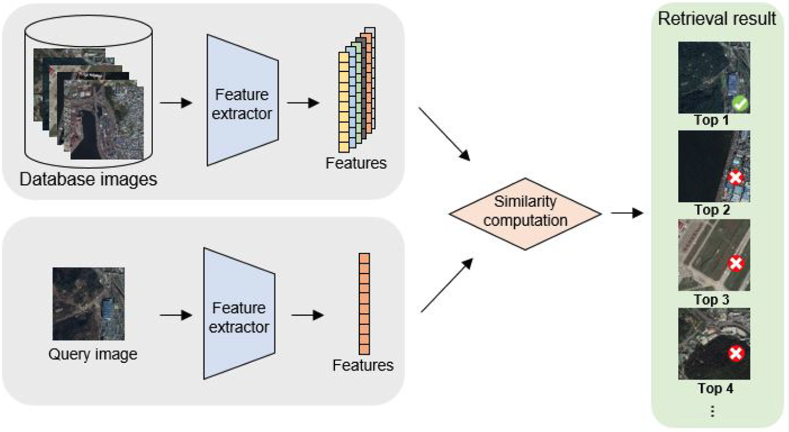
   
  <b>Illustration of the remote sensing image retrieval process.</b>

Image retrieval is the task of retrieving images from a collection that are similar to a query image. Image retrieval plays a vital role in remote sensing by enabling the efficient and effective search for relevant images from large image archives, and by providing a way to quantify changes in the environment over time. [Image source](https://www.mdpi.com/2072-4292/12/2/219)

- **[Demo Ahcl For Tgrs2022](https://github.com/weiweisong415/Demo_AHCL_for_TGRS2022)** — *Asymmetric Hash Code Learning (AHCL) for remote sensing image retrieval.*

- **[Galr](https://github.com/xiaoyuan1996/GaLR)** — *Remote Sensing Cross-Modal Text-Image Retrieval Based on Global and Local Information.*

- **[Retrievalsystem](https://github.com/xiaoyuan1996/retrievalSystem)** — *Cross-modal image retrieval system.*

- **[Amfmn](https://github.com/xiaoyuan1996/AMFMN)** — *Exploring a Fine-grained Multiscale Method for Cross-modal Remote Sensing Image Retrieval.*

- **[Active Learning For Remote Sensing Image Retrieval](https://github.com/flateon/Active-Learning-for-Remote-Sensing-Image-Retrieval)** — *Unofficial implementation of paper: A Novel Active Learning Method in Relevance Feedback for Content-Based Remote Sensing Image Retrieval.*

- **[Cmir Net](https://github.com/ushasi/CMIR-NET-A-deep-learning-based-model-for-cross-modal-retrieval-in-remote-sensing)** — *A deep learning based model for cross-modal retrieval in remote sensing.*

- **[Deep Hash Learning For Remote Sensing Image Retrieval](https://github.com/smallsmallflypigtang/Deep-Hash-learning-for-Remote-Sensing-Image-Retrieval)** — *Deep Hash Learning for Remote Sensing Image Retrieval.*

- **[Mhcln](https://github.com/MLEnthusiast/MHCLN)** — *Deep Metric and Hash-Code Learning for Content-Based Retrieval of Remote Sensing Images.*

- **[Hydroviet Vor](https://github.com/lannguyen0910/HydroViet_VOR)** — *Object Retrieval in satellite images with Triplet Network.*

- **[Hoss Reid](https://github.com/Alioth2000/Hoss-ReID)** — *Cross-modal ship re-identification (optical + SAR): HOSS ReID dataset and TransOSS baseline method (ICCV 2025).*

- **[Amfmn](https://github.com/AICyberTeam/AMFMN)** — *Exploring a Fine-Grained Multiscale Method for Cross-Modal Remote Sensing Image Retrieval.*

- **[Remote Sensing Image Retrieval](https://github.com/IBM/remote-sensing-image-retrieval)** — *Multi-Spectral Remote Sensing Image Retrieval using Geospatial Foundation Models (IBM Prithvi).*

- **[Composed Image Retrieval For Remote Sensing](https://github.com/billpsomas/rscir)**

- **[Csmae](https://github.com/jakhac/CSMAE)** — *About.*
Cross-Sensor Masked Autoencoder for Content Based Image Retrieval in Remote Sensing

#

---

### Image Captioning

  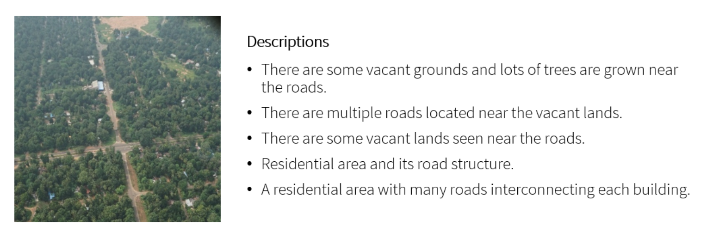
   
  <b>Example captioned image.</b>

Image Captioning is the task of automatically generating a textual description of an image. In remote sensing, image captioning can be used to automatically generate captions for satellite or aerial images, which can be useful for a variety of purposes, such as image search and retrieval, data cataloging, and data dissemination. The generated captions can provide valuable information about the content of the images, including the location, the type of terrain or objects present, and the weather conditions, among others. This information can be used to quickly and easily understand the content of the images, without having to manually examine each image. [Image source](https://github.com/chan64/remote_sensing_image_captioning)

- **[Awesome Remote Image Captioning](https://github.com/iOPENCap/awesome-remote-image-captioning)** — *A list of awesome remote sensing image captioning resources.*

- **[Awesome Vision Language Models For Earth Observation](https://github.com/geoaigroup/awesome-vision-language-models-for-earth-observation)**

- **[Capformer](https://github.com/Junjue-Wang/CapFormer)** — *Pure transformer for remote sensing image caption.*

- **[Remote Sensing Image Captioning](https://github.com/chan64/remote_sensing_image_captioning)** — *Region Driven Remote Sensing Image Captioning.*

- **[Remote Sensing Image Captioning With Transformer And Multilabel Classification](https://github.com/hiteshK03/Remote-sensing-image-captioning-with-transformer-and-multilabel-classification)**

- **[Siamese Spatial Graph Convolution Network](https://github.com/ushasi/Siamese-spatial-Graph-Convolution-Network)** — *Siamese graph convolutional network for content based remote sensing image retrieval.*

- **[Mlat](https://github.com/Chen-Yang-Liu/MLAT)** — *Remote-Sensing Image Captioning Based on Multilayer Aggregated Transformer.*

- **[Wordsent](https://github.com/hw2hwei/WordSent)** — *Word–Sentence Framework for Remote Sensing Image Captioning.*

- **[A Mask Guided Transformer With Topic Token](https://github.com/Meditation0119/a-mask-guided-transformer-with-topic-token-for-remote-sensing-image-captioning)** — *A Mask-Guided Transformer Network with Topic Token for Remote Sensing Image Captioning.*

- **[Meta Captioning](https://github.com/QiaoqiaoYang/MetaCaptioning)** — *A meta learning based remote sensing image captioning framework.*

- **[Transformer For Image Captioning](https://github.com/RicRicci22/Transformer-for-image-captioning)** — *A transformer for image captioning, trained on the UCM dataset.*

- **[Remote Sensing Image Caption](https://github.com/TalentBoy2333/remote-sensing-image-caption)** — *Image classification and image caption by PyTorch.*

- **[Clip Rsicd](https://github.com/arampacha/CLIP-rsicd)** — *Fine tuning CLIP on the [RSICD](https://github.com/201528014227051/RSICD_optimal) image captioning dataset, to enable querying large catalogues in natural language using . Also read [Why and How to Fine-tune CLIP](https://dienhoa.github.io/dhblog/posts/finetune_clip.html).*

- **[Multispectral Image Caption Unification Using Diffusion And Cycle Gan Models](https://github.com/kursatkomurcu/Multispectral-Caption-Image-Unification-via-Diffusion-and-CycleGAN)**

#

---

### Visual Question Answering

Visual Question Answering (VQA) is the task of automatically answering a natural language question about an image. In remote sensing, VQA enables users to interact with the images and retrieve information using natural language questions. For example, a user could ask a VQA system questions such as "What is the type of land cover in this area?", "What is the dominant crop in this region?" or "What is the size of the city in this image?". The system would then analyze the image and generate an answer based on its understanding of the image content.

- **[Vqa Easy2hard](https://gitlab.lrz.de/ai4eo/reasoning/VQA-easy2hard)** — *From Easy to Hard: Learning Language-guided Curriculum for Visual Question Answering on Remote Sensing Data.*

- **[Lit4rsvqa](https://git.tu-berlin.de/rsim/lit4rsvqa)** — *LiT-4-RSVQA: Lightweight Transformer-based Visual Question Answering in Remote Sensing.*

- **[Change Agent](https://github.com/Chen-Yang-Liu/Change-Agent)** — *Towards Interactive Comprehensive Remote Sensing Change Interpretation and Analysis.*

#

---

## Advanced Architectures & Methodologies

> Deep learning in remote sensing is rapidly evolving beyond standard supervised CNNs. The field is embracing Foundational Models, Vision Transformers (ViTs), and Self-Supervised Learning (SSL) to leverage the massive amounts of unlabelled satellite data. Techniques like contrastive learning, zero-shot classification, and generative adversarial networks (GANs) for super-resolution or cloud removal are pushing the boundaries of what is possible, enabling models to generalize better across different geographical regions and sensors.

### Super-resolution

  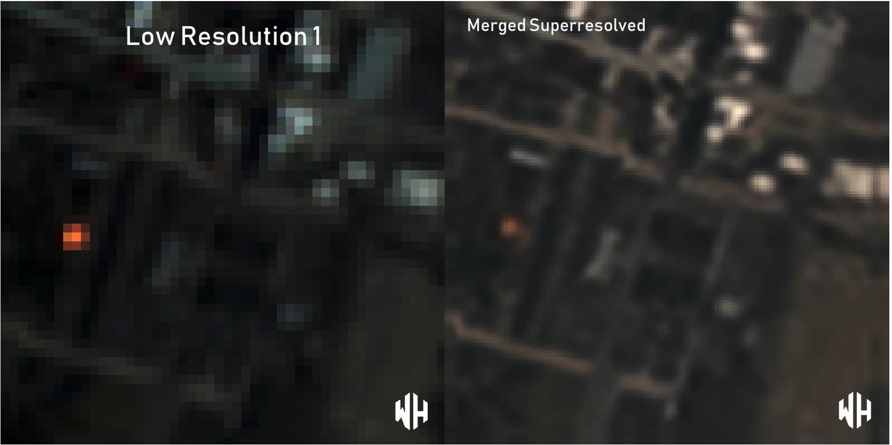
   
  <b>Super resolution using multiple low resolution images as input.</b>

Super-resolution is a technique aimed at improving the resolution of an imaging system. This process can be applied prior to other image processing steps to increase the visibility of small objects or boundaries. Despite its potential benefits, the use of super-resolution is controversial due to the possibility of introducing artifacts that could be mistaken for real features. Super-resolution techniques are broadly categorized into two groups: single image super-resolution (SISR) and multi-image super-resolution (MISR). SISR focuses on enhancing the resolution of a single image, while MISR utilizes multiple images of the same scene to create a high-resolution output. Each approach has its own advantages and limitations, and the choice of method depends on the specific application and desired outcome. [Image source](https://github.com/worldstrat/worldstrat).

---

### Multi image super-resolution (MISR)

Note that nearly all the MISR publications resulted from the [PROBA-V Super Resolution competition](https://kelvins.esa.int/proba-v-super-resolution/)

- **[Deepsum](https://github.com/diegovalsesia/deepsum)** — *Deep neural network for Super-resolution of Unregistered Multitemporal images (ESA PROBA-V challenge).*

- **[3dwdsrnet](https://github.com/frandorr/3DWDSRNet)** — *Satellite Image Multi-Frame Super Resolution (MISR) Using 3D Wide-Activation Neural Networks.*

- **[Rams](https://github.com/EscVM/RAMS)** — *Multi-Image Super Resolution of Remotely Sensed Images Using Residual Attention Deep Neural Networks.*

- **[Tr Misr](https://github.com/Suanmd/TR-MISR)** — *Transformer-based MISR framework for the the PROBA-V super-resolution challenge. With [paper](https://ieeexplore.ieee.org/abstract/document/9684717).*

- **[Highres Net](https://github.com/ElementAI/HighRes-net)** — *Pytorch implementation of HighRes-net, a neural network for multi-frame super-resolution, trained and tested on the European Space Agency’s Kelvin competition.*

- **[Probavref](https://github.com/centreborelli/ProbaVref)** — *Repurposing the Proba-V challenge for reference-aware super resolution.*

- **[Mstt Stvsr](https://github.com/XY-boy/MSTT-STVSR)** — *Space-time Super-resolution for Satellite Video: A Joint Framework Based on Multi-Scale Spatial-Temporal Transformer, JAG, 2022.*

- **[Self Supervised Super Resolution For Multi Exposure Push Frame Satellites](https://centreborelli.github.io/HDR-DSP-SR/)**

- **[Ddrn](https://github.com/kuijiang94/DDRN)** — *Deep Distillation Recursive Network for Video Satellite Imagery Super-Resolution.*

- **[Worldstrat](https://github.com/worldstrat/worldstrat)** — *SISR and MISR implementations of SRCNN.*

- **[Misr Gru](https://github.com/rarefin/MISR-GRU)** — *Pytorch implementation of MISR-GRU, a deep neural network for multi image super-resolution (MISR), for ProbaV Super Resolution Competition.*

- **[Msdtgp](https://github.com/XY-boy/MSDTGP)** — *Satellite Video Super-Resolution via Multiscale Deformable Convolution Alignment and Temporal Grouping Projection.*

- **[Proba V Super Resolution Challenge](https://github.com/cedricoeldorf/proba-v-super-resolution-challenge)** — *Solution to ESA's satellite imagery super resolution challenge.*

- **[Proba V Super Resolution](https://github.com/spicy-mama/PROBA-V-Super-Resolution)** — *Solution using a custom deep learning architecture.*

- **[Satlas Super Resolution](https://github.com/allenai/satlas-super-resolution)** — *Satlas Super Resolution: model is an adaptation of ESRGAN, with changes that allow the input to be a time series of Sentinel-2 images.*

- **[Misr Remote Sensing Srgan](https://github.com/simon-donike/Remote-Sensing-SRGAN)** — *PyTorch SRGAN for RGB Remote Sensing imagery, performing both SISR and MISR. MISR implementation inspired by RecursiveNet (HighResNet). Includes pretrained Checkpoints.*

- **[Misr S2](https://github.com/aimiokab/MISR-S2)** — *Cross-sensor super-resolution of irregularly sampled Sentinel-2 time series.*

---

### Single image super-resolution (SISR)

- **[Swin2 Mose](https://github.com/IMPLabUniPr/swin2-mose)** — *Swin2-MoSE: A New Single Image Super-Resolution Model for Remote Sensing.*

- **[Sentinel2 Superresolution](https://github.com/Evoland-Land-Monitoring-Evolution/sentinel2_superresolution)** — *Super-resolution of 10 Sentinel-2 bands to 5-meter resolution, starting from L1C or L2A (Theia format) products. Trained on Sen2Venµs.*

- **[Super Resolution For Satellite Imagery Srcnn Repo](https://github.com/WarrenGreen/srcnn)**

- **[Tensorflow Implementation Of "accurate Image Super Resolution Using Very Deep Convolutional Networks" Adapted For Working With Geospatial Data](https://github.com/CosmiQ/VDSR4Geo)**

- **[Random Forest Super Resolution (rfsr Repo)](https://github.com/jshermeyer/RFSR)** — *Including [sample data](https://github.com/jshermeyer/RFSR/tree/master/SampleImagery).*

- **[Super Resolution Using Gan](https://github.com/saraivaufc/super-resolution-using-gan)** — *Super-Resolution of Sentinel-2 Using Generative Adversarial Networks.*

- **[Sspsr Pytorch](https://github.com/junjun-jiang/SSPSR)** — *A spatial-spectral prior deep network for single hyperspectral image super-resolution.*

- **[Cincgan](https://github.com/Junshk/CinCGAN-pytorch)** — *Unsupervised Image Super-Resolution using Cycle-in-Cycle Generative Adversarial Networks.*

- **[Satellite Image Srgan Using Pytorch](https://github.com/xjohnxjohn/Satellite-image-SRGAN)**

- **[Hs Sr Tvtv](https://github.com/marijavella/hs-sr-tvtv)** — *Enhanced Hyperspectral Image Super-Resolution via RGB Fusion and TV-TV Minimization.*

- **[Sr4rs](https://github.com/remicres/sr4rs)** — *Super resolution for remote sensing, with pre-trained model for Sentinel-2, SRGAN-inspired.*

- **[Rfsr Tgrs](https://github.com/wxywhu/RFSR_TGRS)** — *Hyperspectral Image Super-Resolution via Recurrent Feedback Embedding and Spatial-Spectral Consistency Regularization.*

- **[Sen2venµs](https://zenodo.org/record/6514159#.YoRxM5PMK3I)** — *A dataset for the training of Sentinel-2 super-resolution algorithms. With [paper](https://www.mdpi.com/2306-5729/7/7/96).*

- **[Transenet](https://github.com/Shaosifan/TransENet)** — *Transformer-based Multi-Stage Enhancement for Remote Sensing Image Super-Resolution.*

 - **[Sg Fbgan](https://github.com/hanlinwu/SG-FBGAN)** — *Remote Sensing Image Super-Resolution via Saliency-Guided Feedback GANs.*

- **[Finetune Esrgan](https://github.com/johnjaniczek/finetune_ESRGAN)** — *Finetune the ESRGAN super resolution generator for remote sensing images and video.*

- **[Mip](https://github.com/jiaming-wang/MIP)** — *Unsupervised Remote Sensing Super-Resolution via Migration Image Prior.*

- **[Optical Remotesensing Image Resolution](https://github.com/wenjiaXu/Optical-RemoteSensing-Image-Resolution)** — *Deep Memory Connected Neural Network for Optical Remote Sensing Image Restoration. Two applications: Gaussian image denoising and single image super-resolution.*

- **[Hsenet](https://github.com/Shaosifan/HSENet)** — *Hybrid-Scale Self-Similarity Exploitation for Remote Sensing Image Super-Resolution.*

- **[Sr Remotesensing](https://github.com/Jing25/SR_RemoteSensing)** — *Super-Resolution deep learning models for remote sensing data based on [BasicSR](https://github.com/XPixelGroup/BasicSR).*

- **[Rsi Net](https://github.com/EricBrock/RSI-Net)** — *A Deep Multi-task Convolutional Neural Network for Remote Sensing Image Super-resolution and Colorization.*

- **[Edsr Super Resolution](https://github.com/RakeshRaj97/EDSR-Super-Resolution)** — *EDSR model using PyTorch applied to satellite imagery.*

- **[Cyclecnn](https://github.com/haopzhang/CycleCNN)** — *Nonpairwise-Trained Cycle Convolutional Neural Network for Single Remote Sensing Image Super-Resolution.*

- **[Sisr With With Real World Degradation Modeling](https://github.com/zhangjizhou-bit/Single-image-Super-Resolution-of-Remote-Sensing-Images-with-Real-World-Degradation-Modeling)** — *Single-Image Super Resolution of Remote Sensing Images with Real-World Degradation Modeling.*

- **[Pixel Smasher](https://github.com/ekcomputer/pixel-smasher)** — *Super-Resolution Surface Water Mapping on the Canadian Shield Using Planet CubeSat Images and a Generative Adversarial Network.*

- **[Satellite Image Super Resolution](https://github.com/farahmand-m/satellite-image-super-resolution)** — *A Comparative Study on CNN-Based Single-Image Super-Resolution Techniques for Satellite Images.*

- **[Satellitesr](https://github.com/kmalhan/SatelliteSR)** — *Comparison of a number of techniques on the DOTA dataset.*

- **[Super Resolution Using Gan / 4x Improvement](https://github.com/purijs/satellite-superresolution)** — *Applied to Sentinel 2.*

- **[Rs Esrgan](https://github.com/luissalgueiro/rs-esrgan)** — *RS-ESRGAN: Super-Resolution of Sentinel-2 Imagery Using Generative Adversarial Networks.*

- **[Ts Rsgan](https://github.com/yicrane/TS-RSGAN)** — *Super-Resolution of Remote Sensing Images for ×4 Resolution without Reference Images. Applied to Sentinel-2.*

- **[Cdcr](https://github.com/Suanmd/CDCR)** — *Combining Discrete and Continuous Representation: Scale-Arbitrary Super-Resolution for Satellite Images.*

- **[Funsr](https://github.com/KyanChen/FunSR)** — *CContinuous Remote Sensing Image Super-Resolution based on Context Interaction in Implicit Function Space.*

- **[Haunet Rsisr](https://github.com/likakakaka/HAUNet_RSISR)** — *Hybrid Attention-Based U-Shaped Network for Remote Sensing Image Super-Resolution.*

- **[L1bsr](https://github.com/centreborelli/L1BSR)** — *Exploiting Detector Overlap for Self-Supervised SISR of Sentinel-2 L1B Imagery.*

- **[Deep Harmonization](https://github.com/venkatesh-thiru/Deep-Harmonization)** — *Deep Learning-based Harmonization and Super-Resolution of Landsat-8 and Sentinel-2 images.*

- **[Sgdm](https://github.com/wwangcece/SGDM)** — *Semantic Guided Large Scale Factor Remote Sensing Image Super-resolution with Generative Diffusion Prior.*

- **[Sen2sr](https://github.com/ESAOpenSR/SEN2SR)** — *A Python package to super-resolve Sentinel-2 satellite imagery up to 2.5 meters.*

- **[Latent Diffusion Super Resolution: Sentinel 2](https://github.com/ESAOpenSR/opensr-model)** — *Latent diffusion model to SR RGB-NIR of Sentinel-2 by a factor of 4. Features Interactive Colab demo, run the model on your own coordinates immediately. Can be used together with [SEN2SR](https://github.com/ESAOpenSR/SEN2SR) to SR all 10 & 20m bands of S2 to 2.5m.*
  
- **[Sisr4rs](https://github.com/Evoland-Land-Monitoring-Evolution/sisr4rs)** — *Single Image Super-Resolution for HR remote-sensing sensors.*

- **[Ds Hat: Dual Stream Hierarchical Attention Transformer For Dem Super Resolution](https://github.com/sayantanonfire/DSHAT-Code-of-Computer-Vision-for-DEM-Super-resolution)**

- **[Remote Sensing Srgan](https://github.com/ESAOpenSR/SRGAN)** — *GAN framework for super-resolution of Sentinel-2 and other remote-sensing imagery. It supports arbitrary band counts, configurable generator/discriminator designs, scalable depth/width, and a modular loss system designed for stable GAN training on EO data.*

- **[Opensr Test](https://github.com/ESAOpenSR/opensr-test)** — *A comprehensive benchmark for real-world Sentinel-2 imagery super-resolution.*

- **[Sentinel 5p Super Resolution](https://github.com/hyamomar/Sentinel-5P-Super-Resolution/tree/main)** — *Supervised and Self-Supervised Deep Learning for Hyperspectral Image Super-Resolution.*

- **[Sfg Swinsr](https://github.com/aminurhossain/SFG-SwinSR)** — *Spatial-Frequency Gated Swin Transformer for Remote Sensing Single-Image Super-Resolution.*

---

### Super-resolution - Miscellaneous

- **[The Value Of Super Resolution — Real World Use Case](https://medium.com/sentinel-hub/the-value-of-super-resolution-real-world-use-case-2ba811f4cd7f)** — *Medium article on parcel boundary detection with super-resolved satellite imagery.*

- **[Super Resolution On Satellite Imagery Using Deep Learning](https://medium.com/the-downlinq/super-resolution-on-satellite-imagery-using-deep-learning-part-1-ec5c5cd3cd2)** — *Nov 2016 blog post by CosmiQ Works with a nice introduction to the topic. Proposes and demonstrates a new architecture with perturbation layers with practical guidance on the methodology and [code](https://github.com/CosmiQ/super-resolution). [Three part series](https://medium.com/the-downlinq/super-resolution-on-satellite-imagery-using-deep-learning-part-3-2e2f61eee1d3).*

- **[Introduction To Spatial Resolution](https://medium.com/sentinel-hub/the-most-misunderstood-words-in-earth-observation-d0106adbe4b0)**

- **[Awesome Super Resolution](https://github.com/ptkin/Awesome-Super-Resolution)** — *Another 'awesome' repo, getting a little out of date now.*

- **[Super Resolution (python) Utilities For Managing Large Satellite Images](https://github.com/jshermeyer/SR_Utils)**

- **[Pytorch Enhance](https://github.com/isaaccorley/pytorch-enhance)** — *Library of Image Super-Resolution Models, Datasets, and Metrics for Benchmarking or Pretrained Use. Also [checkout this implementation in Jax](https://github.com/isaaccorley/jax-enhance).*

- **[Super Resolution In Opencv](https://learnopencv.com/super-resolution-in-opencv/)**

- **[Ai Based Super Resolution And Change Detection To Enforce Sentinel 2 Systematic Usage](https://medium.com/@sistema_gmbh/ai-based-super-resolution-and-change-detection-to-enforce-sentinel-2-systematic-usage-65aa37d0365)** — *Worldview-2 images (2m) were used to create a reference dataset and increase the spatial resolution of the Copernicus sensor from 10m to 5m.*

- **[Srcdnet](https://github.com/liumency/SRCDNet)** — *Super-resolution-based Change Detection Network with Stacked Attention Module for Images with Different Resolutions. SRCDNet is designed to learn and predict change maps from bi-temporal images with different resolutions.*

- **[Model Guided Deep Hyperspectral Image Super Resolution](https://github.com/chengerr/Model-Guided-Deep-Hyperspectral-Image-Super-resolution)** — *Code accompanying the paper: Model-Guided Deep Hyperspectral Image Super-Resolution.*

- **[Super Resolving Beyond Satellite Hardware](https://github.com/smpetrie/superres)** — *[paper](https://arxiv.org/abs/2103.06270) assessing SR performance in reconstructing realistically degraded satellite images.*

- **[Satellite Pixel Synthesis Pytorch](https://github.com/KellyYutongHe/satellite-pixel-synthesis-pytorch)** — *PyTorch implementation of NeurIPS 2021 paper: Spatial-Temporal Super-Resolution of Satellite Imagery via Conditional Pixel Synthesis.*

- **[Sre Han](https://github.com/bostankhan6/SRE-HAN)** — *Squeeze-and-Residual-Excitation Holistic Attention Network improves super-resolution (SR) on remote-sensing imagery compared to other state-of-the-art attention-based SR models.*

- **[Satsr](https://github.com/deephdc/satsr)** — *A project to perform super-resolution on multispectral images from any satellite, including Sentinel 2, Landsat 8, VIIRS &MODIS.*

- **[Oli2msi](https://github.com/wjwjww/OLI2MSI)** — *Dataset for remote sensing imagery super-resolution composed of Landsat8-OLI and Sentinel2-MSI images.*

- **[Mmsr](https://github.com/palmdong/MMSR)** — *Learning Mutual Modulation for Self-Supervised Cross-Modal Super-Resolution.*

- **[Hsrnet](https://github.com/liangjiandeng/HSRnet)** — *Hyperspectral Image Super-resolution via Deep Spatio-spectral Attention Convolutional Neural Networks.*

- **[Rrsgan](https://github.com/dongrunmin/RRSGAN)** — *RRSGAN: Reference-Based Super-Resolution for Remote Sensing Image.*

- **[Hdr Dsp Sr](https://github.com/centreborelli/HDR-DSP-SR)** — *Self-supervised multi-image super-resolution for push-frame satellite images.*

- **[Gan Hsi Sr](https://github.com/ZhuangChen25674/GAN-HSI-SR)** — *Hyperspectral Image Super-Resolution by Band Attention Through Adversarial Learning.*

- **[Saldrn](https://github.com/hanlinwu/SalDRN)** — *Lightweight Stepless Super-Resolution of Remote Sensing Images via Saliency-Aware Dynamic Routing Strategy [paper](https://arxiv.org/abs/2210.07598).*

- **[Blindsrsnf](https://github.com/hanlinwu/BlindSRSNF)** — *Conditional Stochastic Normalizing Flows for Blind Super-Resolution of Remote Sensing Images [paper](https://arxiv.org/abs/2210.07751).*

- **[Sentinel2 Sr Toolbox](https://github.com/matciotola/Sentinel2-SR-Toolbox)** — *A Comprehensive Benchmarking Framework for Sentinel-2 Sharpening: Methods, Dataset, and Evaluation Metrics.*

#

---

### Pansharpening

  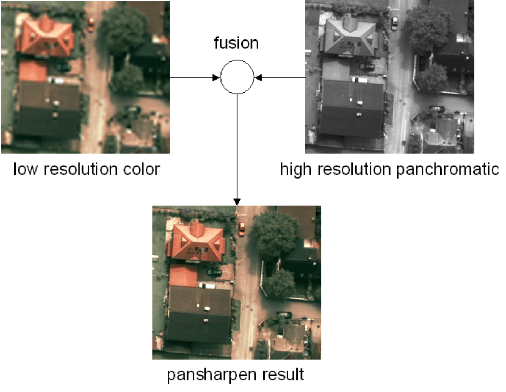
   
  <b>Pansharpening example with a resolution difference of factor 4.</b>

Pansharpening is a data fusion method that merges the high spatial detail from a high-resolution panchromatic image with the rich spectral information from a lower-resolution multispectral image. The result is a single, high-resolution color image that retains both the sharpness of the panchromatic band and the color information of the multispectral bands. This process enhances the spatial resolution while preserving the spectral qualities of the original images. [Image source](https://www.researchgate.net/publication/308121983_Computer_Vision_for_Large_Format_Digital_Aerial_Cameras)

- Several algorithms described [in the ArcGIS docs](http://desktop.arcgis.com/en/arcmap/10.3/manage-data/raster-and-images/fundamentals-of-panchromatic-sharpening.htm), with the simplest being taking the mean of the pan and RGB pixel value.

- **[Pgcu](https://github.com/Zeyu-Zhu/PGCU)** — *Probability-based Global Cross-modal Upsampling for Pansharpening.*

- **[Rio Pansharpen](https://github.com/mapbox/rio-pansharpen)** — *Pansharpening Landsat scenes.*

- **[Simple Pansharpening Algorithms](https://github.com/ThomasWangWeiHong/Simple-Pansharpening-Algorithms)**

- **[Working For Pansharpening](https://github.com/yuanmaoxun/Working-For-Pansharpening)** — *Long list of pansharpening methods and update of [Awesome-Pansharpening](https://github.com/Lihui-Chen/Awesome-Pansharpening).*

- **[Psgan](https://github.com/liuqingjie/PSGAN)** — *A Generative Adversarial Network for Remote Sensing Image Pan-sharpening.*

- **[Pansharpening By Convolutional Neural Network](https://github.com/ThomasWangWeiHong/Pansharpening-by-Convolutional-Neural-Network)**

- **[Pbr Filter](https://github.com/dbuscombe-usgs/PBR_filter)** — *Pansharpening by Background Removal algorithm for sharpening RGB images.*

- **[Py Pansharpening](https://github.com/codegaj/py_pansharpening)** — *Multiple algorithms implemented in python.*

- **[Deep Learning Pansharpening](https://github.com/xyc19970716/Deep-Learning-PanSharpening)** — *Deep-learning based pan-sharpening code package, we reimplemented include PNN, MSDCNN, PanNet, TFNet, SRPPNN, and our purposed network DIPNet.*

- **[Hypertransformer](https://github.com/wgcban/HyperTransformer)** — *A Textural and Spectral Feature Fusion Transformer for Pansharpening.*

- **[Dip Hyperkite](https://github.com/wgcban/DIP-HyperKite)** — *Hyperspectral Pansharpening Based on Improved Deep Image Prior and Residual Reconstruction.*

- **[D2tnet](https://github.com/Meiqi-Gong/D2TNet)** — *A ConvLSTM Network with Dual-direction Transfer for Pan-sharpening.*

- **[Pancolorgan Vhr Satellite Images](https://github.com/esertel/PanColorGAN-VHR-Satellite-Images)** — *Rethinking CNN-Based Pansharpening: Guided Colorization of Panchromatic Images via GANs.*

- **[Mtl Pan Seg](https://github.com/andrewekhalel/MTL_PAN_SEG)** — *Multi-task deep learning for satellite image pansharpening and segmentation.*

- **[Z Pnn](https://github.com/matciotola/Z-PNN)** — *Pansharpening by convolutional neural networks in the full resolution framework.*

- **[Gtp Pnet](https://github.com/HaoZhang1018/GTP-PNet)** — *GTP-PNet: A residual learning network based on gradient transformation prior for pansharpening.*

- **[Udl](https://github.com/XiaoXiao-Woo/UDL)** — *Dynamic Cross Feature Fusion for Remote Sensing Pansharpening.*

- **[Psdata](https://github.com/yisun98/PSData)** — *A Large-Scale General Pan-sharpening DataSet, which contains PSData3 (QB, GF-2, WV-3) and PSData4 (QB, GF-1, GF-2, WV-2).*

- **[Afpn](https://github.com/yisun98/AFPN)** — *Adaptive Detail Injection-Based Feature Pyramid Network For Pan-sharpening.*

- **[Pan Sharpening](https://github.com/yisun98/pan-sharpening)** — *Multiple methods demonstrated for multispectral and panchromatic images.*

- **[Psgan Family](https://github.com/zhysora/PSGan-Family)** — *PSGAN: A Generative Adversarial Network for Remote Sensing Image Pan-Sharpening.*

- **[Pannet Landsat](https://github.com/oyam/PanNet-Landsat)** — *A Deep Network Architecture for Pan-Sharpening.*

- **[Dlpan Toolbox](https://github.com/liangjiandeng/DLPan-Toolbox)** — *Machine Learning in Pansharpening: A Benchmark, from Shallow to Deep Networks.*

- **[Lppn](https://github.com/ChengJin-git/LPPN)** — *Laplacian pyramid networks: A new approach for multispectral pansharpening.*

- **[S2 Ssc Cnn](https://github.com/hvn2/S2_SSC_CNN)** — *Zero-shot Sentinel-2 Sharpening Using A Symmetric Skipped Connection Convolutional Neural Network.*

- **[S2s Ucnn](https://github.com/hvn2/S2S_UCNN)** — *Sentinel 2 sharpening using a single unsupervised convolutional neural network with MTF-Based degradation model.*

- **[Sse Net](https://github.com/RSMagneto/SSE-Net)** — *Spatial and Spectral Extraction Network With Adaptive Feature Fusion for Pansharpening.*

- **[Ucgan](https://github.com/zhysora/UCGAN)** — *Unsupervised Cycle-consistent Generative Adversarial Networks for Pan-sharpening.*

- **[Gcpnet](https://github.com/Keyu-Yan/GCPNet)** — *When Pansharpening Meets Graph Convolution Network and Knowledge Distillation.*

- **[Panformer](https://github.com/zhysora/PanFormer)** — *PanFormer: a Transformer Based Model for Pan-sharpening.*

- **[Pansharpening](https://github.com/nithin-gr/Pansharpening)** — *Pansformers: Transformer-Based Self-Attention Network for Pansharpening.*

- **[Sentinel 2 Band Pan Sharpening](https://github.com/purijs/Sentinel-2-Superresolution)**

- **[Uapn](https://github.com/keviner1/UAPN)** — *Official PyTorch implementation of our TGRS paper: Deep Adaptive Pansharpening via Uncertainty-aware Image Fusion.*

- **[Pansharpening Toolkit](https://github.com/Osman-Geomatics93/pansharpening-toolkit-)** — *Pansharpening toolkit with classic and deep learning methods.*

#

---

### Image-to-image translation

  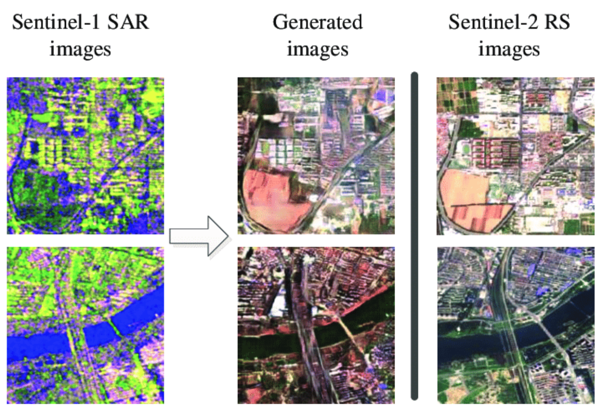
   
  <b>(left) Sentinel-1 SAR input, (middle) translated to RGB and (right) Sentinel-2 true RGB image for comparison.</b>

Image-to-image translation is a crucial aspect of computer vision that utilizes machine learning models to transform an input image into a new, distinct output image. In the field of remote sensing, it plays a significant role in bridging the gap between different imaging domains, such as converting Synthetic Aperture Radar (SAR) images into RGB (Red Green Blue) images. This technology has a wide range of applications, including improving image quality, filling in missing information, and facilitating cross-domain image analysis and comparison. By leveraging deep learning algorithms, image-to-image translation has become a powerful tool in the arsenal of remote sensing researchers and practitioners. [Image source](https://www.researchgate.net/publication/335648375_SAR-to-Optical_Image_Translation_Using_Supervised_Cycle-Consistent_Adversarial_Networks)

- **[How To Develop A Pix2pix Gan For Image To Image Translation](https://machinelearningmastery.com/how-to-develop-a-pix2pix-gan-for-image-to-image-translation/)** — *How to develop a Pix2Pix model for translating satellite photographs to Google map images. A good intro to GANS.*

- **[A Growing Problem Of ‘deepfake Geography’: How Ai Falsifies Satellite Images](https://www.washington.edu/news/2021/04/21/a-growing-problem-of-deepfake-geography-how-ai-falsifies-satellite-images/)**

- **[Kaggle Pix2pix Maps](https://www.kaggle.com/datasets/alincijov/pix2pix-maps)** — *Dataset for pix2pix to take a google map satellite photo and build a street map.*

- **[Guided Deep Decoder](https://github.com/tuezato/guided-deep-decoder)** — *With guided deep decoder, you can solve different image pair fusion problems, allowing super-resolution, pansharpening or denoising.*

- **[Hackathon Ci 2020](https://github.com/paulaharder/hackathon-ci-2020)** — *Generate nighttime imagery from infrared observations.*

- **[Satellite To Satellite Translation](https://github.com/anonymous-ai-for-earth/satellite-to-satellite-translation)** — *VAE-GAN architecture for unsupervised image-to-image translation with shared spectral reconstruction loss. Model is trained on GOES-16/17 and Himawari-8 L1B data.*

- **[Pytorch Implementation Of Unet For Converting Aerial Satellite Images Into Google Maps Kinda Images](https://github.com/greed2411/unet_pytorch)**

- **[Seamless Satellite Image Synthesis](https://github.com/Misaliet/Seamless-Satellite-image-Synthesis)** — *Generate abitrarily large RGB images from a map.*

- **[How To Develop A Pix2pix Gan For Image To Image Translation](https://machinelearningmastery.com/how-to-develop-a-pix2pix-gan-for-image-to-image-translation/)** — *Article on machinelearningmastery.com.*

- **[Satellite Imagery To Map Translation Using Pix2pix Gan Framework](https://github.com/anh-nn01/Satellite-Imagery-to-Map-Translation-using-Pix2Pix-GAN-framework)**

- **[Rsit Srm Isd](https://github.com/summitgao/RSIT_SRM_ISD)** — *PyTorch implementation of Remote sensing image translation via style-based recalibration module and improved style discriminator.*

- **[Acpv Net](https://heinzjiao.github.io/acpv-net-project-page/)** — *All-Class Polygonal Vectorization for Seamless Vector Map Generation from Aerial Imagery.*

- **[Pix2pix Google Maps](https://github.com/manishemirani/pix2pix_google_maps)** — *Converts satellite images to map images using pix2pix models.*

- **[Sar2color Igarss2018 Chainer](https://github.com/enomotokenji/sar2color-igarss2018-chainer)** — *Image Translation Between Sar and Optical Imagery with Generative Adversarial Nets.*

- **[Hsi2rgb](https://github.com/JakobSig/HSI2RGB)** — *Create realistic looking RGB images using remote sensing hyperspectral images.*

- **[Sat To Map](https://github.com/shagunuppal/sat_to_map)** — *Learning mappings to generate city maps images from corresponding satellite images.*

- **[Pix2pix Gans](https://github.com/shashi7679/pix2pix-GANs)** — *Generate Map using Satellite Image & PyTorch.*

- **[Map Sat](https://github.com/miquel-espinosa/map-sat)** — *Generate Your Own Scotland: Satellite Image Generation Conditioned on Maps.*

#

---

### Data fusion

  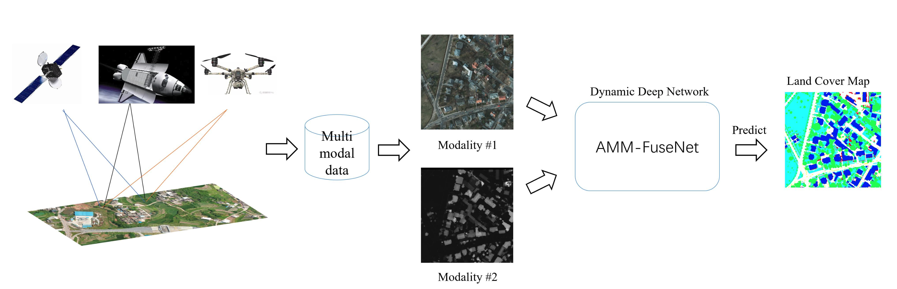
   
  <b>Illustration of a fusion workflow.</b>

Data fusion is a technique for combining information from different sources such as Synthetic Aperture Radar (SAR), optical imagery, and non-imagery data such as Internet of Things (IoT) sensor data. The integration of diverse data sources enables data fusion to overcome the limitations of individual sources, leading to the creation of models that are more accurate and informative than those constructed from a single source. [Image source](https://www.mdpi.com/2072-4292/14/18/4458)

- **[Awesome Data Fusion For Remote Sensing](https://github.com/px39n/Awesome-Data-Fusion-for-Remote-Sensing)**

- **[Udaln Grsl](https://github.com/JiaxinLiCAS/UDALN_GRSL)** — *Deep Unsupervised Blind Hyperspectral and Multispectral Data Fusion.*

- **[Croptypemapping](https://github.com/ellaampy/CropTypeMapping)** — *Crop type mapping from optical and radar (Sentinel-1&2) time series using attention-based deep learning.*

- **[Multimodal Remote Sensing Toolkit](https://github.com/likyoo/Multimodal-Remote-Sensing-Toolkit)** — *Uses Hyperspectral and LiDAR Data.*

- **[Aerial Template Matching](https://github.com/m-hamza-mughal/Aerial-Template-Matching)** — *Development of an algorithm for template Matching on aerial imagery applied to UAV dataset.*

- **[Ds Unet](https://github.com/SebastianHafner/DS_UNet)** — *Sentinel-1 and Sentinel-2 Data Fusion for Urban Change Detection using a Dual Stream U-Net, uses Onera Satellite Change Detection dataset.*

- **[Dda Urbanextraction](https://github.com/SebastianHafner/DDA_UrbanExtraction)** — *Unsupervised Domain Adaptation for Global Urban Extraction using Sentinel-1 and Sentinel-2 Data.*

- **[Swinstfm](https://github.com/LouisChen0104/swinstfm)** — *Remote Sensing Spatiotemporal Fusion using Swin Transformer.*

- **[Lovecs](https://github.com/Junjue-Wang/LoveCS)** — *Cross-sensor domain adaptation for high-spatial resolution urban land-cover mapping: from airborne to spaceborne imagery.*

- **[Comingdowntoearth](https://github.com/aysim/comingdowntoearth)** — *Implementation of 'Coming Down to Earth: Satellite-to-Street View Synthesis for Geo-Localization'.*

- **[Matching Between Acoustic And Satellite Images](https://github.com/giovgiac/neptune)**

- **[Maprepair](https://github.com/zorzi-s/MapRepair)** — *Deep Cadastre Maps Alignment and Temporal Inconsistencies Fix in Satellite Images.*

- **[Compressive Sensing And Deep Learning Framework](https://github.com/rahulgite94/Compressive-Sensing-and-Deep-Learning-Framework)** — *Compressive Sensing is used as an initial guess to combine data from multiple sources, with LSTM used to refine the result.*

- **[Deepsim](https://github.com/wangxiaodiu/DeepSim)** — *DeepSIM: GPS Spoofing Detection on UAVs using Satellite Imagery Matching.*

- **[Mhf Net](https://github.com/XieQi2015/MHF-net)** — *Multispectral and Hyperspectral Image Fusion by MS/HS Fusion Net.*

- **[Remote Sensing Image Fusion](https://github.com/huangshanshan33/Remote_Sensing_Image_Fusion)** — *Semi-Supervised Remote Sensing Image Fusion Using Multi-Scale Conditional Generative Adversarial network with Siamese Structure.*

- **[Cnns For Multi Source Remote Sensing Data Fusion](https://github.com/yyyyangyi/CNNs-for-Multi-Source-Remote-Sensing-Data-Fusion)** — *Single-stream CNN with Learnable Architecture for Multi-source Remote Sensing Data.*

- **[Deep Generative Reflectance Fusion](https://github.com/Cervest/ds-generative-reflectance-fusion)** — *Achieving Landsat-like reflectance at any date by fusing Landsat and MODIS surface reflectance with deep generative models.*

- **[Ieee Tgrs Mdl Rs](https://github.com/danfenghong/IEEE_TGRS_MDL-RS)** — *More Diverse Means Better: Multimodal Deep Learning Meets Remote-Sensing Imagery Classification.*

- **[Ssrnet](https://github.com/hw2hwei/SSRNET)** — *SSR-NET: Spatial-Spectral Reconstruction Network for Hyperspectral and Multispectral Image Fusion.*

- **[Cross View Image Matching](https://github.com/kregmi/cross-view-image-matching)** — *Bridging the Domain Gap for Ground-to-Aerial Image Matching.*

- **[Cof Msmg Pcnn](https://github.com/WeiTan1992/CoF-MSMG-PCNN)** — *Remote Sensing Image Fusion via Boundary Measured Dual-Channel PCNN in Multi-Scale Morphological Gradient Domain.*

- **[Robust Matching Network On Remote Sensing Imagery Pytorch](https://github.com/mrk1992/robust_matching_network_on_remote_sensing_imagery_pytorch)** — *A Robust Matching Network for Gradually Estimating Geometric Transformation on Remote Sensing Imagery.*

- **[Edcstfn](https://github.com/theonegis/edcstfn)** — *An Enhanced Deep Convolutional Model for Spatiotemporal Image Fusion.*

- **[Ganstfm](https://github.com/theonegis/ganstfm)** — *A Flexible Reference-Insensitive Spatiotemporal Fusion Model for Remote Sensing Images Using Conditional Generative Adversarial Network.*

- **[Cmaff](https://github.com/DocF/CMAFF)** — *Cross-Modality Attentive Feature Fusion for Object Detection in Multispectral Remote Sensing Imagery.*

- **[Solc](https://github.com/yisun98/SOLC)** — *MCANet: A joint semantic segmentation framework of optical and SAR images for land use classification. Uses [WHU-OPT-SAR-dataset](https://github.com/AmberHen/WHU-OPT-SAR-dataset).*

- **[Mft](https://github.com/AnkurDeria/MFT)** — *Multimodal Fusion Transformer for Remote Sensing Image Classification.*

- **[Isprs S2fl](https://github.com/danfenghong/ISPRS_S2FL)** — *Multimodal Remote Sensing Benchmark Datasets for Land Cover Classification with A Shared and Specific Feature Learning Model.*

- **[Hsht Satellite Imagery Synthesis](https://github.com/yuvalofek/HSHT-Satellite-Imagery-Synthesis)** — *Improving Flood Maps by Increasing the Temporal Resolution of Satellites Using Hybrid Sensor Fusion.*

- **[Mdc](https://github.com/Kasra2020/MDC)** — *Unsupervised Data Fusion With Deeper Perspective: A Novel Multisensor Deep Clustering Algorithm.*

- **[Fusatnet](https://github.com/ShivamP1993/FusAtNet)** — *FusAtNet: Dual Attention based SpectroSpatial Multimodal Fusion Network for Hyperspectral and LiDAR Classification.*

- **[Amm Fusenet](https://github.com/oktaykarakus/ReSIF/tree/main/AMM-FuseNet)** — *Attention-Based Multi-Modal Image Fusion Network for Land Cover Mapping.*

- **[Manet](https://github.com/caohuimin/MANet)** — *MANet: A Network Architecture for Remote Sensing Spatiotemporal Fusion Based on Multiscale and Attention Mechanisms.*

- **[Dcsa Net](https://github.com/Julia90/DCSA-Net)** — *Dynamic Convolution Self-Attention Network for Land-Cover Classification in VHR Remote-Sensing Images.*

- **[Deforestation From Data Fusion](https://github.com/felferrari/deforestation-from-data-fusion)** — *Fusing Sentinel-1 and Sentinel-2 images for deforestation detection in the Brazilian Amazon under diverse cloud conditions.*

- **[Sct Fusion](https://git.tu-berlin.de/rsim/sct-fusion)** — *Transformer-based Multi-Modal Learning for Multi Label Remote Sensing Image Classification.*

- **[Rsi Mmsegmentation](https://github.com/EarthNets/RSI-MMSegmentation)** — *GAMUS: A Geometry-aware Multi-modal Semantic Segmentation Benchmark for Remote Sensing Data.*

- **[Dfc2022 Baseline](https://github.com/isaaccorley/dfc2022-baseline)** — *Baseline solution to the 2022 IEEE GRSS Data Fusion Contest (DFC2022) using TorchGeo, PyTorch Lightning, and Segmentation Models PyTorch to train a U-Net with a ResNet-18 backbone and a loss function of Focal + Dice loss to perform semantic segmentation on the DFC2022 dataset.*

- **[Multiviewrs Models](https://github.com/fmenat/multiviewRS-models)** — *List of multi-view fusion learning models proposed for remote sensing (RS) multi-view data.*

- **[Tif: Time Series Based Image Fusion](https://github.com/GERSL/TIF)** — *Produce 10 m Harmonized Landsat and Sentinel-2 (HLS) data by fusing 30 m Landsat 8-9 and 10 m Sentinel-2 A/B time series.*

- **[Anytimeformer](https://github.com/tangkai-RS/AnytimeFormer)** — *Fusing irregular and asynchronous SAR-optical time series to reconstruct reflectance at any given time.*

- **[Rose](https://github.com/bailubin/Rose)** — *Integrating remote sensing with OpenStreetMap data for comprehensive scene understanding through multi-modal self-supervised learning.*

- **[Mdaf Net](https://github.com/MSFLabX/MDAF-Net)** — *A multimodal fusion framework designed for joint classification of hyperspectral imaging (HSI) and LiDAR data.*

#

---

### Generative networks

  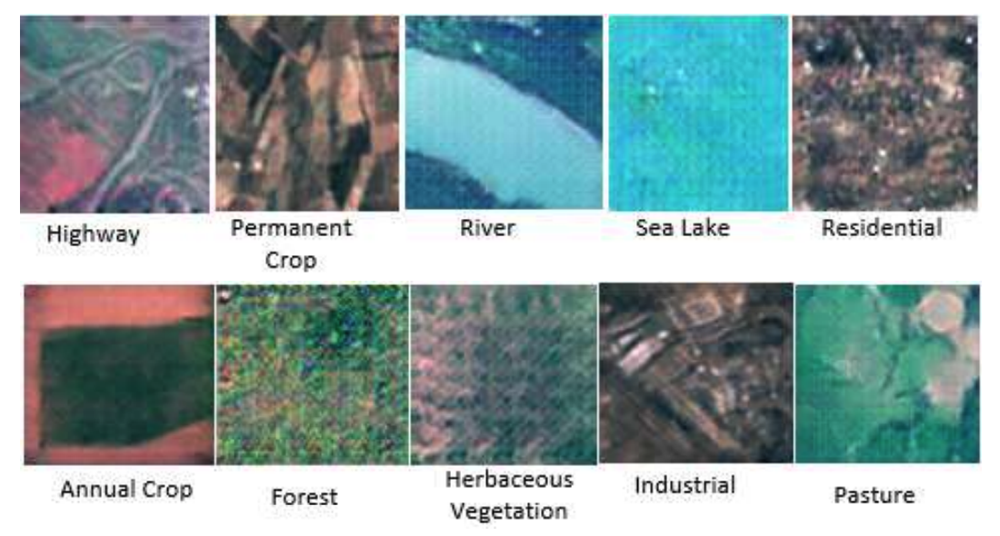
   
  <b>Example generated images using a GAN.</b>

Generative networks (e.g. GANs and diffusion models) aim to generate new, synthetic data that appears similar to real-world data. This generated data can be used for a wide range of purposes, including data augmentation, data imbalance correction, and filling in missing or corrupted data. Including generating synthetic data can improve the performance of remote sensing algorithms and models, leading to more accurate and reliable results. [Image source](https://arxiv.org/abs/2207.14580)

- **[Nir Gan](https://github.com/simon-donike/NIR-GAN)** — *NIR-GAN: Generate a synthetic NIR band from RGB Remote Sensing Imagery (Sentinel-2, SPOT, basemaps, ...).*

- **[Using Generative Adversarial Networks To Address Scarcity Of Geospatial Training Data](https://medium.com/radiant-earth-insights/using-generative-adversarial-networks-to-address-scarcity-of-geospatial-training-data-e61cacec986e)** — *GAN perform better than CNN in segmenting land cover classes outside of the training dataset (article, no code).*

- **[Building A Nets](https://github.com/lixiang-ucas/Building-A-Nets)** — *Robust building extraction from high-resolution remote sensing images with adversarial networks.*

- **[Ganmapper](https://github.com/ualsg/GANmapper)** — *A building footprint generator using Generative Adversarial Networks.*

- **[Csa Cdgan](https://github.com/wangle53/CSA-CDGAN)** — *Channel Self-Attention Based Generative Adversarial Network for Change Detection of Remote Sensing Images.*

- **[Dsgan](https://github.com/lzhengchun/DSGAN)** — *A conditinal GAN for dynamic precipitation downscaling.*

- **[Marsgan](https://github.com/kheyer/MarsGAN)** — *GAN trained on satellite photos of Mars.*

- **[Hc Adgan](https://github.com/summitgao/HC_ADGAN)** — *Codes for the paper Adaptive Dropblock Enhanced GenerativeAdversarial Networks for Hyperspectral Image Classification.*

- **[Scalae](https://github.com/LendelTheGreat/SCALAE)** — *Formatting the Landscape: Spatial conditional GAN for varying population in satellite imagery. Method to generate satellite imagery from custom 2D population maps.*

- **[Satellite Image Forgery Detection And Localization](https://github.com/tailongnguyen/Satellite-Image-Forgery-Detection-and-Localization)**

- **[Stgan](https://github.com/ermongroup/STGAN)** — *PyTorch Implementation of STGAN for Cloud Removal in Satellite Images.*

- **[Ds Gan Spatiotemporal Evaluation](https://github.com/Cervest/ds-gan-spatiotemporal-evaluation)** — *Evaluating use of deep generative models in remote sensing applications.*

- **[Gan Based Method To Generate High Resolution Remote Sensing For Data Augmentation And Image Classification](https://github.com/weihancug/GAN-based-HRRS-Sample-Generation-for-Image-Classification)**

- **[Remote Sensing Image Generation](https://github.com/aashishrai3799/Remote-Sensing-Image-Generation)** — *Generate RS Images using Generative Adversarial Networks (GAN).*

- **[Roadda](https://github.com/LANMNG/RoadDA)** — *Stagewise Unsupervised Domain Adaptation with Adversarial Self-Training for Road Segmentation of Remote Sensing Images.*

- **[Psgan Family](https://github.com/zhysora/PSGan-Family)** — *A Generative Adversarial Network for Remote Sensing Image Pan-Sharpening.*

- **[Satellite Image Augmetation With Gans](https://github.com/Oarowolo11/11785-Project)** — *Image Augmentation for Satellite Images.*

- **[Opt2sar Cyclegan](https://github.com/zzh811/opt2sar-cyclegan)** — *Research on SAR image generation method based on non-homologous data.*

- **[Shoreline Extraction Gan](https://github.com/mlundine/Shoreline_Extraction_GAN)** — *Shoreline extraction via generative adversarial networks, prediction via LSTMs.*

- **[Landsat8 Sentinel2 Fusion](https://github.com/Rohit18/Landsat8-Sentinel2-Fusion)** — *Translating Landsat 8 to Sentinel-2 using a GAN.*

- **[Seg2sat](https://github.com/RubenGres/Seg2Sat)** — *Seg2Sat explores the potential of diffusion algorithms such as StableDiffusion and ControlNet to generate aerial images based on terrain segmentation data.*

- **[Sar2optical](https://github.com/MuhammedM294/SAR2Optical)** — *Transcoding Sentinel-1 SAR to Sentinel-2 using cGAN.*

- **[Urban Tree Generator](https://github.com/adnan0819/Urban-Tree-Generator)** — *Spatio-Temporal and Generative Deep Learning for Urban Tree Localization and Modeling [paper](https://link.springer.com/article/10.1007/s00371-022-02526-x).*

- **[Ecomapper](https://github.com/maltevb/ecomapper)** — *Generative Modeling for Climate-Aware Satellite Imagery.*

- **[Wgast](https://github.com/Sofianebouaziz1/WGAST)** — *Weakly-Supervised Generative Network for Daily 10 m Land Surface Temperature Estimation via Spatio-Temporal Fusion.*

- **[Earthsynth: Generating Informative Earth Observation With Diffusion Models](https://github.com/jaychempan/EarthSynth)**

- **[Satdifuser](https://github.com/yurujaja/SatDiFuser)** — *Can Generative Geospatial Diffusion Models Excel as Discriminative Geospatial Foundation Models?*

- **[Ctgan](https://github.com/come880412/CTGAN)** — *Cloud Transformer Generative Adversarial Network.*

 -[SADER](https://github.com/zyfzs0/SADER) -> Structure-Aware Diffusion Framework with Deterministic Resampling for Multi-Temporal Remote Sensing Cloud Removal

- **[Noise2change](https://github.com/chiangliu/noise2change)** — *Generating Any Changes in the Noise Domain.*

- **[Sat Jepa Diff](https://github.com/VU-AIML/SAT-JEPA-DIFF/)** — *Bridging Self-Supervised Learning and Generative Diffusion for Satellite Image Forecasting.*

#

---

### Autoencoders, dimensionality reduction, image embeddings & similarity search

  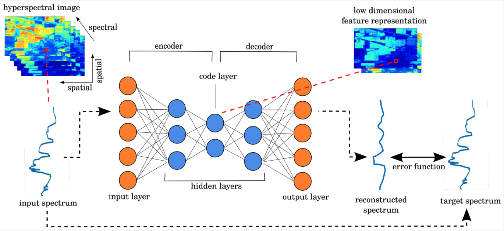
   
  <b>Example of using an autoencoder to create a low dimensional representation of hyperspectral data.</b>

Autoencoders are a type of neural network that aim to simplify the representation of input data by compressing it into a lower dimensional form. This is achieved through a two-step process of encoding and decoding, where the encoding step compresses the data into a lower dimensional representation, and the decoding step restores the data back to its original form. The goal of this process is to reduce the data's dimensionality, making it easier to store and process, while retaining the essential information. Dimensionality reduction, as the name suggests, refers to the process of reducing the number of dimensions in a dataset. This can be achieved through various techniques such as principal component analysis (PCA) or singular value decomposition (SVD). Autoencoders are one type of neural network that can be used for dimensionality reduction. In the field of computer vision, image embeddings are vector representations of images that capture the most important features of the image. These embeddings can then be used to perform similarity searches, where images are compared based on their features to find similar images. This process can be used in a variety of applications, such as image retrieval, where images are searched based on certain criteria like color, texture, or shape. It can also be used to identify duplicate images in a dataset. [Image source](https://www.mdpi.com/2072-4292/11/7/864)

- **[Awesome Geospatial Embeddings](https://github.com/hfangcat/Awesome-Geospatial-Embeddings)** — *A curated list of papers that focus on how to represent Earth data in embedding space.*

- **[Towards Geospatial Embeddings — Isprs 2026 Tutorial](https://github.com/konstantinklemmer/isprs26-embeddings-tutorial)** — *Hands-on notebooks for using SatCLIP and AlphaEarth embeddings and producing training-free MOSAIKS features.*

- **[Let Sne](https://github.com/meghshukla/LEt-SNE)** — *Dimensionality Reduction and visualization technique that compensates for the curse of dimensionality.*

- **[Image Similarity Search](https://github.com/spaceml-org/Image-Similarity-Search)** — *An app that helps perform super fast image retrieval on PyTorch models for better embedding space interpretability.*

- **[Interactive Tsne](https://github.com/spaceml-org/Interactive-TSNE)** — *A tool that provides a way to visually view a PyTorch model's feature representation for better embedding space interpretability.*

- **[Roofnet](https://github.com/ultysim/RoofNet)** — *Identify roof age using historical satellite images to lower the customer acquisition cost for new solar installations. Uses a VAE: Variational Autoencoder.*

- **[Visual Search Over Billions Of Aerial And Satellite Images](https://arxiv.org/abs/2002.02624)**

- **[Parallax](https://github.com/uber-research/parallax)** — *Tool for interactive embeddings visualization.*

- **[Deep Gapfill](https://github.com/remicres/Deep-Gapfill)** — *Official implementation of Optical image gap filling using deep convolutional autoencoder from optical and radar images.*

- **[Mxnet Repository For Generating Embeddings On Satellite Images](https://github.com/fisch92/Metric-embeddings-for-satellite-image-classification)** — *Includes sampling of images, mining algorithms, different architectures, error functions, measures for evaluation.*

- **[Clip Rsicd](https://github.com/arampacha/CLIP-rsicd)** — *Fine tuning CLIP on the [RSICD](https://github.com/201528014227051/RSICD_optimal) image captioning dataset, to enable querying large catalogues in natural language using.*

- **[Grn Sndl](https://github.com/jiankang1991/GRN-SNDL)** — *Model the relations between samples (or scenes) by making use of a graph structure which is fed into network learning.*

- **[Saumoco](https://github.com/jiankang1991/SauMoCo)** — *Deep Unsupervised Embedding for Remotely Sensed Images Based on Spatially Augmented Momentum Contrast.*

- **[Tgrs Ride](https://github.com/jiankang1991/TGRS_RiDe)** — *Rotation Invariant Deep Embedding for RemoteSensing Images.*

- **[Ravaen](https://github.com/spaceml-org/RaVAEn)** — *RaVAEn is a lightweight, unsupervised approach for change detection in satellite data based on Variational Auto-Encoders (VAEs) with the specific purpose of on-board deployment.*

- **[Reverse Image Search Using Deep Discrete Feature Extraction And Locality Sensitive Hashing](https://github.com/martenjostmann/deep-discrete-image-retrieval)**

- **[Snca Ce](https://github.com/jiankang1991/SNCA_CE)** — *Deep Metric Learning based on Scalable Neighborhood Components for Remote Sensing Scene Characterization.*

- **[Landslidedetection From Satellite Imagery](https://github.com/shulavkarki/LandslideDetection-from-satellite-imagery)** — *Using Attention and Autoencoder boosted CNN.*

- **[Split Brain Remote Sensing](https://github.com/vladan-stojnic/split-brain-remote-sensing)** — *Analysis of Color Space Quantization in Split-Brain Autoencoder for Remote Sensing Image Classification.*

- **[Image Similarity Measures](https://github.com/up42/image-similarity-measures)** — *Implementation of eight evaluation metrics to access the similarity between two images.*

- **[Large Scale Geovisual Search](https://github.com/sdhayalk/Large_Scale_GeoVisual_Search)** — *ResNet architecture on UC Merced Land Use Dataset with hamming distance for similarity based search.*

- **[Geobacter](https://github.com/JakeForsey/geobacter)** — *Generates useful feature embeddings for geospatial locations.*

- **[Satellite Image Segmentation](https://github.com/kunnalparihar/Satellite-Image-Segmentation)** — *The KV-Net model uses this feature of autoencoders to reconnect the disconnected roads.*

- **[Satellite Image Enhancement](https://github.com/VNDhanush/Satellite-Image-Enhancement)** — *Image enhancement using GAN's and autoencoders.*

- **[Variational Autoencoder For Satellite Imagery](https://github.com/RayanAAY-ops/Variational-Autoencoder-For-Satellite-Imagery)** — *A special VAE to squeeze N images into one single representation with colors segmentating the different objects.*

- **[Dincae](https://github.com/gher-ulg/DINCAE)** — *Data-Interpolating Convolutional Auto-Encoder is a neural network to reconstruct missing data in satellite observations.*

- **[3d Sits Clustering](https://github.com/ekalinicheva/3D_SITS_Clustering)** — *Unsupervised Satellite Image Time Series Clustering Using Object-Based Approaches and 3D Convolutional Autoencoder.*

- **[Sat Cnn](https://github.com/GDSL-UL/sat_cnn)** — *Estimating Generalized Measures of Local Neighbourhood Context from Multispectral Satellite Images Using a Convolutional Neural Network. Uses a convolutional autoencoder (CAE).*

- **[You Are Here](https://github.com/ZhouMengjie/you-are-here)** — *You Are Here: Geolocation by Embedding Maps and Images.*

- **[Tensorflow Similarity](https://github.com/tensorflow/similarity)** — *Offers state-of-the-art algorithms for metric learning and all the necessary components to research, train, evaluate, and serve similarity-based models.*

- **[Airbus Sdc Dup](https://github.com/WillieMaddox/Airbus_SDC_dup)** — *Project focused on detecting duplicate regions of overlapping satellite imagery. Applied to Airbus ship detection dataset.*

- **[Scale Mae](https://github.com/bair-climate-initiative/scale-mae)** — *Scale-MAE: A Scale-Aware Masked Autoencoder for Multiscale Geospatial Representation Learning.*

- **[Cross Scale Mae](https://github.com/aicip/Cross-Scale-MAE)** — *Code for paper: Cross-Scale MAE: A Tale of Multiscale Exploitation in Remote Sensing.*

- **[Satclip](https://github.com/microsoft/satclip)** — *A Global, General-Purpose Geographic Location Encoder from Microsoft.*

- **[Osmgraphclip](https://github.com/d-michail/osmgraphclip)** — *A CLIP-style contrastive model that learns global location representations from OpenStreetMap graphs and geographic coordinates.*

- **[Astronaut Photography Localization & Iterative Coregistration](https://earthloc-and-earthmatch.github.io/)**

- **[Rs Cbir](https://github.com/amirafshari/rs-cbir)** — *Satellite Image Vector Database and Multimodal Search using fine-tuned ResNet50 on AID dataset.*

- **[Torchspatial](https://github.com/seai-lab/TorchSpatial)** — *A Location Encoding Framework and Benchmark for Spatial Representation Learning.*

- **[Experimental Design Multichannel](https://github.com/sbb-gh/experimental-design-multichannel)** — *Task-based image channel selection e.g. select most informative hyperspectral wavelengths and perform a task. [Paper](https://openreview.net/forum?id=MloaGA6WwX).*

- **[Pmaa](https://github.com/XavierJiezou/PMAA)** — *A Progressive Multi-scale Attention Autoencoder Model for High-Performance Cloud Removal from Multi-temporal Satellite Imagery.*

- **[Temporal Mosaiks](https://github.com/isaaccorley/temporal-mosaiks)** — *Embed2Scale Challenge 4th Place Solution (Training Free!).*

- **[Range](https://github.com/mvrl/RANGE)** — *Retrieval Augmented Neural Fields for Multi-Resolution Geo-Embeddings.*

- **[Geoclap](https://github.com/mvrl/geoclap)** — *Learning Tri-modal Embeddings for Zero-Shot Soundscape Mapping.*

- **[Predicting Butterfly Species Presence From Satellite Data](https://github.com/vdplasthijs/PECL)** — *Resnet-based model to predict species presence vectors from satellite images. The model uses PECL (Paired Embeddings Contrastive Loss) as contrastive regularisation.*

- **[Neuco Bench](https://github.com/embed2scale/NeuCo-Bench)** — *A benchmarking framework for evaluating compressed embeddings on downstream tasks. Originally developed to evaluate challenge submissions for the 2025 EARTHVISION Challenge at CVPR.*

- **[Geovibes](https://github.com/cr458/geovibes)** — *Toolkit for evaluating geospatial embeddings models through similarity search, combining FAISS vector indexing with DuckDB metadata to enable interactive map-based exploration.*

- **[Tessera Embeddings Explorer](https://github.com/sk818/TEE)**

- **[Pixelverse](https://github.com/developmentseed/pixelverse)** — *Cloud native tooling to generate and store pixelwise geospatial foundation model embeddings.*

- **[Looted Site Detection](https://github.com/microsoft/looted_site_detection)** — *Compares embeddings with CNNs, by Microsoft.*

- **[Ai For Good Tutorial 2026](https://github.com/embed2scale/AI-for-Good-Tutorial-2026)** — *Introduces embedding workflows for Earth Observation using TerraTorch and NeuCo-Bench.*

- **[Geopool](https://github.com/isaaccorley/geopool)** — *From Pixels to Patches — Pooling Strategies for Earth Embeddings.*

- **[Terracodec](https://github.com/IBM/TerraCodec)** — *A family of pretrained neural compression models for optical Sentinel-2 Earth Observation imagery.*

- **[Rs Embed](https://github.com/cybergis/rs-embed)** — *A single line of code to get embeddings from Any Remote Sensing Foundation Model (RSFM) for Any Place and Any Time.*

- **[Satellitebench](https://github.com/mitcriticaldatacolombia/SatelliteBench)** — *A data fusion framework that combines satellite images and tabular data for dengue prediction and socioeconomic analysis.*

- **[Deltabit](https://github.com/calebrob6/deltabit)** — *An interactive change-detection workbench for satellite imagery using  AlphaEarth Foundations (AEF) embeddings, with blog post: [Compressing Earth Embeddings, pt. 3 – DeltaBit](https://geospatialml.com/posts/change-detection/).*

- **[Beta Earth](https://github.com/asterisk-labs/beta-earth)** — *Embedding Sentinel-2 and Sentinel-1 with a Little Help of AlphaEarth.*

#

---

### Anomaly detection

Anomaly detection refers to the process of identifying unusual patterns or outliers in satellite or aerial images that do not conform to expected norms. This is crucial in applications such as environmental monitoring, defense surveillance, and urban planning. Machine learning algorithms, particularly unsupervised learning methods, are used to analyze vast amounts of remote sensing data efficiently. These algorithms learn the typical patterns and variations in the data, allowing them to flag anomalies such as unexpected land cover changes, illegal deforestation, or unusual maritime activities. The detection of these anomalies can provide valuable insights for timely decision-making and intervention in various fields.

- **[Marine Anomaly Detection](https://github.com/lucamarini22/marine-anomaly-detection)** — *Semantic segmentation of marine anomalies using semi-supervised learning (FixMatch for semantic segmentation) on Sentinel-2 multispectral images.*

- **[Tdd](https://github.com/Jingtao-Li-CVer/TDD)** — *One-Step Detection Paradigm for Hyperspectral Anomaly Detection via Spectral Deviation Relationship Learning.*

- **[Anomaly Detection In Sar Imagery](https://github.com/iamyadavabhishek/anomaly-detection-in-SAR-imagery)** — *Identify an unknown ship in docks using keras & retinanet.*

- **[Pub Ffi Gan](https://github.com/awweide/pub-ffi-gan)** — *Applying generative adversarial networks for anomaly detection in hyperspectral remote sensing imagery.*

- **[How Airbus Detects Anomalies In Iss Telemetry Data Using Tfx](https://blog.tensorflow.org/2020/04/how-airbus-detects-anomalies-iss-telemetry-data-tfx.html)** — *Uses an autoencoder.*

- **[Agrisen Cog](https://github.com/tselea/agrisen-cog)** — *A Multicountry, Multitemporal Large-Scale Sentinel-2 Benchmark Dataset for Crop Mapping: includes an anomaly detection preprocessing step.*

- **[Sits Extremeevents](https://github.com/hfangcat/SITS-ExtremeEvents)** — *Leveraging Satellite Image Time Series for Accurate Extreme Event Detection.*

#

---

### Mixed data learning

Mixed data learning is the process of learning from datasets that may contain an mix of images, textual and numeric data. Mixed data learning can help improve the accuracy of models by allowing them to learn from multiple sources at once and use more sophisticated methods to identify patterns and correlations.

- **[Multi Input Deep Neural Networks With Pytorch Lightning Combine Image And Tabular Data](https://rosenfelder.ai/multi-input-neural-network-pytorch/)** — *Excellent intro article using pytorch, not actually applied to satellite data but to real estate data, with [repo](https://github.com/MarkusRosen/pytorch_multi_input_example).*

- **[Joint Learning From Earth Observation And Openstreetmap Data To Get Faster Better Semantic Maps](https://arxiv.org/abs/1705.06057)** — *Fusion based architectures and coarse-to-fine segmentation to include the OpenStreetMap layer into multispectral-based deep fully convolutional networks, arxiv paper.*

- **[Pyimagesearch Article On Mixed Data](https://www.pyimagesearch.com/2019/02/04/keras-multiple-inputs-and-mixed-data/)**

- **[Pytorch Widedeep](https://github.com/jrzaurin/pytorch-widedeep)** — *A flexible package for multimodal-deep-learning to combine tabular data with text and images using Wide and Deep models in Pytorch.*

- **[Accidentriskmap](https://github.com/songtaohe/accidentRiskMap)** — *Inferring high-resolution traffic accident risk maps based on satellite imagery and GPS trajectories.*

- **[Sub Meter Resolution Canopy Height Map By Meta](https://research.facebook.com/blog/2023/4/every-tree-counts-large-scale-mapping-of-canopy-height-at-the-resolution-of-individual-trees/)** — *Satellite Metadata combined with outputs from simple CNN to regress canopy height.*

- **[Methane Emission Project](https://github.com/stlbnmaria/methane-emission-project)** — *Classification CNNs was combined in an ensemble approach with traditional methods on tabular data.*

- **[Automergenet](https://github.com/ADA-research/AutoMergeNet)** — *A neural architecture search approach for automatic methane plume detection in TROPOMI images.*

#

---

### Few & zero shot learning

This is a class of techniques which attempt to make predictions for classes with few, one or even zero examples provided during training. In zero shot learning (ZSL) the model is assisted by the provision of auxiliary information which typically consists of descriptions/semantic attributes/word embeddings for both the seen and unseen classes at train time ([ref](https://learnopencv.com/zero-shot-learning-an-introduction/)). These approaches are particularly relevant to remote sensing, where there may be many examples of common classes, but few or even zero examples for other classes of interest.

- **[Aerial Sam](https://github.com/geoaigroup/Aerial-SAM)** — *Zero-Shot Refinement of Buildings’ Segmentation Models using SAM.*

- **[Fsodm](https://github.com/lixiang-ucas/FSODM)** — *Few-shot Object Detection on Remote Sensing Images.*

- **[Few Shot Classification Of Aerial Scene Images Via Meta Learning](https://www.mdpi.com/2072-4292/13/1/108/htm)** — *2020 publication, a classification model that can quickly adapt to unseen categories using only a few labeled samples.*

- **[Papers About Few Shot Learning / Meta Learning On Remote Sensing](https://github.com/lx709/Few-shot-Learning-Meta-Learning-on-Remote-Sensing-Papers)**

- **[Spnet](https://github.com/zoraup/SPNet)** — *Siamese-Prototype Network for Few-Shot Remote Sensing Image Scene Classification.*

- **[Mdl4ow](https://github.com/sjliu68/MDL4OW)** — *Few-Shot Hyperspectral Image Classification With Unknown Classes Using Multitask Deep Learning.*

- **[P Cnn](https://github.com/Ybowei/P-CNN)** — *Prototype-CNN for Few-Shot Object Detection in Remote Sensing Images.*

- **[Cir Fsd 2022](https://github.com/Li-ZK/CIR-FSD-2022)** — *Context Information Refinement for Few-Shot Object Detection in Remote Sensing Images.*

- **[Ieee Tnnls Gia Cfsl](https://github.com/YuxiangZhang-BIT/IEEE_TNNLS_Gia-CFSL)** — *Graph Information Aggregation Cross-Domain Few-Shot Learning for Hyperspectral Image Classification.*

- **[Tip 2022 Cmfsl](https://github.com/B-Xi/TIP_2022_CMFSL)** — *Few-shot Learning with Class-Covariance Metric for Hyperspectral Image Classification.*

- **[Sen12ms Human Few Shot Classifier](https://github.com/MarcCoru/sen12ms-human-few-shot-classifier)** — *Humans are poor few-shot classifiers for Sentinel-2 land cover.*

- **[S3net](https://github.com/ZhaohuiXue/S3Net)** — *S3Net: Spectral–Spatial Siamese Network for Few-Shot Hyperspectral Image Classification.*

- **[Siamesenet For Few Shot Hyperspectral Classification](https://github.com/jjwwczy/jjwwczy-SiameseNet-for-few-shot-Hyperspectral-Classification)** — *3DCSN:SiameseNet-for-few-shot-Hyperspectral-Classification.*

- **[Messl](https://github.com/OMEGAFSL/MESSL)** — *Multiform Ensemble Self-Supervised Learning for Few-Shot Remote Sensing Scene Classification.*

- **[Sccnet](https://github.com/linhanwang/SCCNet)** — *Self-Correlation and Cross-Correlation Learning for Few-Shot Remote Sensing Image Semantic Segmentation.*

- **[Oem Fewshot Challenge](https://github.com/cliffbb/OEM-Fewshot-Challenge)** — *OpenEarthMap Land Cover Mapping Few-Shot Challenge.*
Generalized Few-shot Semantic Segmentation

- **[Meteor](https://github.com/MarcCoru/meteor)** — *A small deep learning meta-model with a single output.*

- **[Segland](https://github.com/LiZhuoHong/SegLand)** — *Generalized Few-Shot Meets Remote Sensing: Discovering Novel Classes in Land Cover Mapping via Hybrid Semantic Segmentation Framework. 1st place in the OpenEarthMap Land Cover Mapping Few-Shot Challenge.*

- **[Mcfa Pytorch](https://github.com/masuqiang/MCFA-Pytorch)** — *Multi-level Cross-modal Feature Alignment via Contrastive Learning towards Zero-shot Classification of Remote Sensing Image Scenes [paper](https://arxiv.org/abs/2306.06066).*

#

---

### Self-supervised, unsupervised & contrastive learning

Self-supervised, unsupervised & contrastive learning are all methods of machine learning that use unlabeled data to train algorithms. Self-supervised learning uses labeled data to create an artificial supervisor, while unsupervised learning uses only the data itself to identify patterns and similarities. Contrastive learning uses pairs of data points to learn representations of data, usually for classification tasks. Note that self-supervised approaches are commonly used in the training of so-called Foundational models, since they enable learning from large quantities of unlablleded data, tyipcally time series.

- **[Seasonal Contrast: Unsupervised Pre Training From Uncurated Remote Sensing Data](https://devblog.pytorchlightning.ai/seasonal-contrast-transferable-visual-representations-for-remote-sensing-73a17863ed07)** — *Seasonal Contrast (SeCo) is an effective pipeline to leverage unlabeled data for in-domain pre-training of remote sensing representations. Models trained with SeCo achieve better performance than their ImageNet pre-trained counterparts and state-of-the-art self-supervised learning methods on multiple downstream tasks. [paper](https://arxiv.org/abs/2103.16607) and [repo](https://github.com/ElementAI/seasonal-contrast).*

- **[Tile2vec: Unsupervised Representation Learning For Spatially Distributed Data](https://ermongroup.github.io/blog/tile2vec/)**

- **[Contrastive Sensor Fusion](https://github.com/descarteslabs/contrastive_sensor_fusion)** — *Code implementing Contrastive Sensor Fusion, an approach for unsupervised learning of multi-sensor representations targeted at remote sensing imagery.*

- **[Hyperspectral Autoencoders](https://github.com/lloydwindrim/hyperspectral-autoencoders)** — *Tools for training and using unsupervised autoencoders and supervised deep learning classifiers for hyperspectral data, built on tensorflow. Autoencoders are unsupervised neural networks that are useful for a range of applications such as unsupervised feature learning and dimensionality reduction.*

- **[Marta Gans: Unsupervised Representation Learning For Remote Sensing Image Classification](https://github.com/BUPTLdy/MARTA-GAN)**

- **[A Generalizable And Accessible Approach To Machine Learning With Global Satellite Imagery](https://www.nature.com/articles/s41467-021-24638-z)** — *Nature publication -> MOSAIKS is designed to solve an unlimited number of tasks at planet-scale quickly using feature vectors, [with repo](https://github.com/Global-Policy-Lab/mosaiks-paper). Also see [mosaiks-api](https://github.com/calebrob6/mosaiks-api).*

- **[Contrastive Satellite](https://github.com/hakeemtfrank/contrastive-satellite)** — *Using contrastive learning to create embeddings from optical EuroSAT Satellite-2 imagery.*

- **[Self Supervised Learning Of Remote Sensing Scene Representations Using Contrastive Multiview Coding](https://github.com/vladan-stojnic/CMC-RSSR)**

- **[Self Supervised Learner By Spaceml Org](https://github.com/spaceml-org/Self-Supervised-Learner)** — *Train a classifier with fewer labeled examples needed using self-supervised learning, example applied to UC Merced land use dataset.*

- **[Deepsentinel](https://github.com/Lkruitwagen/deepsentinel)** — *A sentinel-1 and -2 self-supervised sensor fusion model for general purpose semantic embedding.*

- **[Contrastive Ssl Ship Detection](https://github.com/alina2204/contrastive_SSL_ship_detection)** — *Contrastive self supervised learning for ship detection in Sentinel 2 images.*

- **[Geography Aware Ssl](https://github.com/sustainlab-group/geography-aware-ssl)** — *Uses spatially aligned images over time to construct temporal positive pairs in contrastive learning and geo-location to design pre-text tasks.*

- **[Cnn Supervised Classification](https://github.com/geojames/CNN-Supervised-Classification)** — *Python code for self-supervised classification of remotely sensed imagery - part of the Deep Riverscapes project.*

- **[Clustimage](https://github.com/erdogant/clustimage)** — *A python package for unsupervised clustering of images.*

- **[Landsurfaceclustering](https://github.com/lhalloran/LandSurfaceClustering)** — *Land surface classification using remote sensing data with unsupervised machine learning (k-means).*

- **[K Means Clustering For Surface Segmentation Of Satellite Images](https://medium.com/@maxfieldeland/k-means-clustering-for-surface-segmentation-of-satellite-images-ad1902791ebf)**

- **[Sentinel 2 Satellite Imagery For Crop Classification Using Unsupervised Clustering](https://medium.com/devseed/sentinel-2-satellite-imagery-for-crop-classification-part-2-47db3745eb49)** — *Label groups of pixels based on temporal trends of their NDVI values.*

- **[Thecoloroutofspace](https://github.com/stevinc/TheColorOutOfSpace)** — *The color out of space: learning self-supervised representations for Earth Observation imagery, using the BigEarthNet dataset.*

- **[Semantic Segmentation Of Sar Images Using A Self Supervised Technique](https://github.com/cattale93/pytorch_self_supervised_learning)**

- **[Stego](https://github.com/mhamilton723/STEGO)** — *Unsupervised Semantic Segmentation by Distilling Feature Correspondences, with [paper](https://arxiv.org/abs/2203.08414).*

- **[Unsupervised Segmentation Of Hyperspectral Remote Sensing Images With Superpixels](https://github.com/mpBarbato/Unsupervised-Segmentation-of-Hyperspectral-Remote-Sensing-Images-with-Superpixels)**

- **[Soundingearth](https://github.com/khdlr/SoundingEarth)** — *Self-supervised Audiovisual Representation Learning for Remote Sensing Data, uses the SoundingEarth [Dataset](https://zenodo.org/record/5600379#.Yom4W5PMK3I).*

- **[Singlescenesemsegtgrs2022](https://github.com/sudipansaha/singleSceneSemSegTgrs2022)** — *Unsupervised Single-Scene Semantic Segmentation for Earth Observation.*

- **[Sslremotesensing](https://github.com/flyakon/SSLRemoteSensing)** — *Semantic Segmentation of Remote Sensing Images With Self-Supervised Multitask Representation Learning.*

- **[Cbt](https://github.com/VMarsocci/CBT)** — *Continual Barlow Twins: continual self-supervised learning for remote sensing semantic segmentation.*

- **[Unsupervised Satellite Image Classification Based On Partial Adversarial Domain Adaptation](https://github.com/lwpyh/Unsupervised-Satellite-Image-Classfication-based-on-Partial-Domain-Adaptation)** — *Code for course project.*

- **[T2fts](https://github.com/wdzhao123/T2FTS)** — *Teaching Teachers First and Then Student: Hierarchical Distillation to Improve Long-Tailed Object Recognition in Aerial Images.*

- **[Ssltransformerrs](https://github.com/HSG-AIML/SSLTransformerRS)** — *Self-supervised Vision Transformers for Land-cover Segmentation and.*
  Classification

- **[Dino Mm](https://github.com/zhu-xlab/DINO-MM)** — *Self-supervised Vision Transformers for Joint SAR-optical Representation Learning.*

- **[Ssl4eo S12](https://github.com/zhu-xlab/SSL4EO-S12)** — *A large-scale dataset for self-supervised learning in Earth observation.*

- **[Ssl4eo Review](https://github.com/zhu-xlab/SSL4EO-Review)** — *Self-supervised Learning in Remote Sensing: A Review.*

- **[Transfer Learning Cspt](https://github.com/ZhAnGToNG1/transfer_learning_cspt)** — *Consecutive Pretraining: A Knowledge Transfer Learning Strategy with Relevant Unlabeled Data for Remote Sensing Domain.*

- **[Otl](https://github.com/qlilx/OTL)** — *Clustering-Based Representation Learning through Output Translation and Its Application to Remote-Sensing Images.*

- **[Push And Pull Network](https://github.com/WindVChen/Push-and-Pull-Network)** — *Contrastive Learning for Fine-grained Ship Classification in Remote Sensing Images.*

- **[Vissl Experiments](https://github.com/lewfish/ssl/tree/main/vissl_experiments)** — *Self-supervised Learning using Facebook [VISSL](https://github.com/facebookresearch/vissl) on the RESISC-45 satellite imagery classification dataset.*

- **[Ms2a Net](https://github.com/Kasra2020/MS2A-Net)** — *MS 2 A-Net: Multi-scale spectral-spatial association network for hyperspectral image clustering.*

- **[Uda For Rs](https://github.com/Levantespot/UDA_for_RS)** — *Unsupervised Domain Adaptation for Remote Sensing Semantic Segmentation with Transformer.*

- **[Pytorch Ssl Building Extract](https://github.com/Chendeyue/pytorch-ssl-building_extract)** — *Research on Self-Supervised Building Information Extraction with High-Resolution Remote Sensing Images for Photovoltaic Potential Evaluation.*

- **[Self Rare Wildlife](https://github.com/xcvil/self-rare-wildlife)** — *Self-Supervised Pretraining and Controlled Augmentation Improve Rare Wildlife Recognition in UAV Images.*

- **[Satmae](https://github.com/sustainlab-group/SatMAE)** — *SatMAE: Pre-training Transformers for Temporal and Multi-Spectral Satellite Imagery.*

- **[Fireclr Wildfires](https://github.com/spaceml-org/FireCLR-Wildfires)** — *Unsupervised Wildfire Change Detection based on Contrastive Learning.*

- **[False](https://github.com/GeoX-Lab/FALSE)** — *False Negative Samples Aware Contrastive Learning for Semantic Segmentation of High-Resolution Remote Sensing Image.*

- **[Matter](https://github.com/periakiva/MATTER)** — *Self-Supervised Material and Texture Representation Learning for Remote Sensing Tasks.*

- **[Fgmae](https://github.com/zhu-xlab/FGMAE)** — *Feature guided masked Autoencoder for self-supervised learning in remote sensing.*

- **[Gfm](https://github.com/mmendiet/GFM)** — *Towards Geospatial Foundation Models via Continual Pretraining.*

- **[Satvit](https://github.com/antofuller/SatViT)** — *Self-supervised training of multispectral optical and SAR vision transformers.*

- **[Sits Moco](https://github.com/YXu556/SITS-MoCo)** — *Self-supervised pre-training for large-scale crop mapping using Sentinel-2 time series.*

- **[Dino Mc](https://github.com/WennyXY/DINO-MC)** — *DINO-MC: Self-supervised Contrastive Learning for Remote Sensing Imagery with Multi-sized Local Crops.*

- **[Official Cmid](https://github.com/NJU-LHRS/official-CMID)** — *A Unified Self-Supervised Learning Framework for Remote Sensing Image Understanding [paper](https://arxiv.org/abs/2304.09670).*

- **[Domain Adaptable Self Supervised Representation Learning On Remote Sensing Satellite Imagery](https://github.com/muskaan712/Domain-Adaptable-Self-Supervised-Representation-Learning-on-Remote-Sensing-Satellite-Imagery)** — *Domain Adaptable Self-supervised Representation Learning on Remote Sensing Satellite Imagery.*

- **[Plrdiff](https://github.com/earth-insights/PLRDiff)** — *Unsupervised Hyperspectral Pansharpening via Low-rank Diffusion Model (Information Fusion 2024).*

- **[Rsos I2i](https://github.com/Sarmadfismael/RSOS_I2I)** — *Unsupervised Domain Adaptation for the Semantic Segmentation of Remote Sensing Images via One-Shot Image-to-Image Translation.*

- **[Aws Smsl Geospatial Analysis Deforestation](https://github.com/aws-samples/aws-smsl-geospatial-analysis-deforestation)** — *Detecting deforestation using unsupervised K-means clustering on Sentinel-2 satellite imagery and SageMaker Studio Lab(SMSL) [Sagemaker notebook](https://studiolab.sagemaker.aws/import/github.com/aws-samples/aws-smsl-geospatial-analysis-deforestation/blob/main/geospatial_analysis_deforestation.ipynb).*

- **[Dinov2 Remote Sensing](https://github.com/chagmgang/dinov2-remote-sensing)** — *Pytorch implementation and pretrained models for DINO v2 in remote sensing.*

- **[K Means Geocentroids For Dinov2](https://github.com/aliaksandr960/dinov2_geocentroids_southamerica)**

- **[Unigeoclip](https://github.com/gastruc/unigeoclip)** — *A large-scale multimodal remote sensing dataset for semantically grounded foundation modeling. It contains approximately 2.5 million spatially aligned samples spanning optical imagery, SAR, elevation, canopy height, land-cover products, and geographic metadata, paired with semantically grounded captions generated through an agentic captioning framework.*

#

---

### Weakly & semi-supervised learning

Weakly & semi-supervised learning are two methods of machine learning that use both labeled and unlabeled data for training. Weakly supervised learning uses weakly labeled data, which may be incomplete or inaccurate, while semi-supervised learning uses both labeled and unlabeled data. Weakly supervised learning is typically used in situations where labeled data is scarce and unlabeled data is abundant. Semi-supervised learning is typically used in situations where labeled data is abundant but also contains some noise or errors. Both techniques can be used to improve the accuracy of machine learning models by making use of additional data sources.

- **[Mare](https://github.com/VMarsocci/MARE)** — *Self-supervised Multi-Attention REsu-net for semantic segmentation in remote sensing.*

- **[Ssgf For Hrrs Scene Classification](https://github.com/weihancug/SSGF-for-HRRS-scene-classification)** — *A semi-supervised generative framework with deep learning features for high-resolution remote sensing image scene classification.*

- **[Sfgan](https://github.com/MLEnthusiast/SFGAN)** — *Semantic-Fusion Gans for Semi-Supervised Satellite Image Classification.*

- **[Ssdan](https://github.com/alhichri/SSDAN)** — *Multi-Source Semi-Supervised Domain Adaptation Network for Remote Sensing Scene Classification.*

- **[Hr S2dml](https://github.com/jiankang1991/HR-S2DML)** — *High-Rankness Regularized Semi-Supervised Deep Metric Learning for Remote Sensing Imagery.*

- **[Semantic Segmentation Of Satellite Images Using Point Supervision](https://github.com/KambachJannis/MasterThesis)**

- **[Fcd](https://github.com/jnyborg/fcd)** — *Fixed-Point GAN for Cloud Detection. A weakly-supervised approach, training with only image-level labels.*

- **[Weak Segmentation](https://github.com/LendelTheGreat/weak-segmentation)** — *Weakly supervised semantic segmentation for aerial images in pytorch.*

- **[Tnnls 2022 X Gpn](https://github.com/B-Xi/TNNLS_2022_X-GPN)** — *Semisupervised Cross-scale Graph Prototypical Network for Hyperspectral Image Classification.*

- **[Weakly Supervised](https://github.com/LobellLab/weakly_supervised)** — *Weakly Supervised Deep Learning for Segmentation of Remote Sensing Imagery. Demonstrates that segmentation can be performed using small datasets comprised of pixel or image labels.*

- **[Wan](https://github.com/engrjavediqbal/wan)** — *Weakly-Supervised Domain Adaptation for Built-up Region Segmentation in Aerial and Satellite Imagery.*

- **[Sourcerer](https://github.com/benjaminmlucas/sourcerer)** — *A Bayesian-inspired deep learning method for semi-supervised domain adaptation designed for land cover mapping from satellite image time series (SITS).*

- **[Msmatch](https://github.com/gomezzz/MSMatch)** — *Semi-Supervised Multispectral Scene Classification with Few Labels. Includes code to work with both the RGB and the multispectral (MS) versions of EuroSAT dataset and the UC Merced Land Use (UCM) dataset.*

- **[Flood Segmentation On Sentinel 1 Sar Imagery With Semi Supervised Learning](https://github.com/sidgan/ETCI-2021-Competition-on-Flood-Detection)**

- **[Semi Supervised Learning In Satellite Image Classification](https://medium.com/sentinel-hub/semi-supervised-learning-in-satellite-image-classification-e0874a76fc61)** — *Experimenting with MixMatch and the EuroSAT data set.*

- **[Scroadextractor](https://github.com/weiyao1996/ScRoadExtractor)** — *Scribble-based Weakly Supervised Deep Learning for Road Surface Extraction from Remote Sensing Images.*

- **[Icss](https://github.com/alteia-ai/ICSS)** — *Weakly-supervised continual learning for class-incremental segmentation.*

- **[Es Cp](https://github.com/majidseydgar/Res-CP)** — *Semi-Supervised Hyperspectral Image Classification Using a Probabilistic Pseudo-Label Generation Framework.*

- **[Flood Mapping Ssl](https://github.com/YJ-He/Flood_Mapping_SSL)** — *Enhancement of Urban Floodwater Mapping From Aerial Imagery With Dense Shadows via Semisupervised Learning.*

- **[Ms4d Net Building Damage Assessment](https://github.com/YJ-He/MS4D-Net-Building-Damage-Assessment)** — *MS4D-Net: Multitask-Based Semi-Supervised Semantic Segmentation Framework with Perturbed Dual Mean Teachers for Building Damage Assessment from High-Resolution Remote Sensing Imagery.*

- **[Sahara](https://github.com/giu-guarino/SAHARA)** — *Heterogeneous Semi-Supervised Transfer Learning with Adversarial Adaptation and Dynamic Pseudo-Labeling.*

- **[Vcnet](https://github.com/Tusaifei/VCNet)** — *A weakly supervised end-to-end deep-learning network for large-scale HR land-cover mapping. Introduces the 0.5 m/pixel Tokyo Dataset.*

- **[School Detection](https://github.com/zakarya-elmimouni/School_Detection)** — *Label-Efficient School Detection from Aerial Imagery via Weakly Supervised Pretraining and Fine-Tuning.*

#

---

### Active learning

Supervised deep learning techniques typically require a huge number of annotated/labelled examples to provide a training dataset. However labelling at scale take significant time, expertise and resources. Active learning techniques aim to reduce the total amount of annotation that needs to be performed by selecting the most useful images to label from a large pool of unlabelled images, thus reducing the time to generate useful training datasets. These processes may be referred to as [Human-in-the-Loop Machine Learning](https://medium.com/pytorch/https-medium-com-robert-munro-active-learning-with-pytorch-2f3ee8ebec)

- **[Active Learning For Object Detection In High Resolution Satellite Images](https://arxiv.org/abs/2101.02480)**

- **[Aide V2 Tools For Detecting Wildlife In Aerial Images Using Active Learning](https://github.com/microsoft/aerial_wildlife_detection)**

- **[Astronomical](https://github.com/grant-m-s/AstronomicAL)** — *An interactive dashboard for visualisation, integration and classification of data using Active Learning.*

- **[Active Labeler By Spaceml Org](https://github.com/spaceml-org/Active-Labeler)** — *A CLI Tool that facilitates labeling datasets with just a SINGLE line of code.*

- **[Labelling Platform For Mapping Africa Active Learning Project](https://github.com/agroimpacts/labeller)**

- **[Changedetectionproject](https://github.com/previtus/ChangeDetectionProject)** — *Trying out Active Learning in with deep CNNs for Change detection on remote sensing data.*

- **[Als4gan](https://github.com/immuno121/ALS4GAN)** — *Active Learning for Improved Semi Supervised Semantic Segmentation in Satellite Images.*

- **[Active Learning For Remote Sensing Image Retrieval](https://github.com/flateon/Active-Learning-for-Remote-Sensing-Image-Retrieval)** — *Unofficial implementation of paper: A Novel Active Learning Method in Relevance Feedback for Content-Based Remote Sensing Image Retrieval.*

- **[Dial](https://github.com/alteia-ai/DIAL)** — *DIAL: Deep Interactive and Active Learning for Semantic Segmentation in Remote Sensing.*

- **[Whales](https://github.com/microsoft/whales)** — *An active learning pipeline for identifying whales in high-resolution satellite imagery, by Microsoft.*

- **[Al4eo](https://github.com/Romain3Ch216/AL4EO)** — *A QGIS plug-in to run Active Learning techniques on Earth observation data.*

- **[Al4fm](https://github.com/mburges-cvl/ICCV_AL4FM)** — *Active Learning Meets Foundation Models: a real-time, SAM-assisted annotation framework for object detection in remote sensing imagery.*

#

---

### Federated learning

Federated learning is an approach to distributed machine learning where a central processor coordinates the training of an individual model in each of its clients. It is a type of distributed ML which means that the data is distributed among different devices or locations and the model is trained on all of them. The central processor aggregates the model updates from all the clients and then sends the global model parameters back to the clients. This is done to protect the privacy of data, as the data remains on the local device and only the global model parameters are shared with the central processor. This technique can be used to train models with large datasets that cannot be stored in a single device, as well as to enable certain privacy-preserving applications.

- **[Federated Learning For Remote Sensing](https://github.com/anandcu3/Federated-Learning-for-Remote-Sensing)** — *Implementation of three Federated Learning models.*

- **[Semantic Segmentation Unet Federated](https://github.com/PratikGarai/Semantic-Segmentation-UNet-Federated)** — *FedUKD: Federated UNet Model with Knowledge Distillation for Land Use Classification from Satellite and Street Views.*

- **[Mm Fl](https://git.tu-berlin.de/rsim/MM-FL)** — *Learning Across Decentralized Multi-Modal Remote Sensing Archives with Federated Learning.*

- **[Multi Modal Fl](https://git.tu-berlin.de/rsim/multi-modal-fl)** — *A Multi-Modal Federated Learning Framework for Remote Sensing Image Classification.*

#

---

### Adversarial ML

Efforts to detect falsified images & deepfakes

- **[Uae Rs](https://github.com/YonghaoXu/UAE-RS)** — *Dataset that provides black-box adversarial samples in the remote sensing field.*

- **[Psgan](https://github.com/xuxiangsun/PSGAN)** — *Perturbation Seeking Generative Adversarial Networks: A Defense Framework for Remote Sensing Image Scene Classification.*

- **[Sacnet](https://github.com/YonghaoXu/SACNet)** — *Self-Attention Context Network: Addressing the Threat of Adversarial Attacks for Hyperspectral Image Classification.*

#

---

### Large vision & language models (LLMs & LVMs)

- **[Awesome Remote Sensing Vision Language Models](https://github.com/lzw-lzw/awesome-remote-sensing-vision-language-models)**

- **[Awesome Remote Sensing Multimodal Large Language Model](https://github.com/ZhanYang-nwpu/Awesome-Remote-Sensing-Multimodal-Large-Language-Model)**

- **[Remote Sensing Chatgpt](https://github.com/HaonanGuo/Remote-Sensing-ChatGPT)** — *An open source tool for solving remote sensing tasks with ChatGPT in an interactive way.*

- **[Changeclip](https://github.com/dyzy41/ChangeCLIP)** — *ChangeCLIP: Remote sensing change detection with multimodal vision-language representation learning.*

- **[Skyeyegpt](https://github.com/ZhanYang-nwpu/SkyEyeGPT)** — *SkyEyeGPT: Unifying Remote Sensing Vision-Language Tasks via Instruction Tuning with Large Language Model.*

- **[Remoteclip](https://github.com/ChenDelong1999/RemoteCLIP)** — *A Vision Language Foundation Model for Remote Sensing.*

- **[Geochat](https://github.com/mbzuai-oryx/GeoChat)** — *Grounded Large Vision-Language Model for Remote Sensing.*

- **[Labs Gpt Stac](https://github.com/developmentseed/labs-gpt-stac)** — *Connect ChatGPT to a STAC API backend.*

- **[Earthgpt](https://github.com/wivizhang/EarthGPT)** — *A Universal Multi-modal Large Language Model for Multi-sensor Image Comprehension in Remote Sensing Domain.*

- **[H2rsvlm](https://github.com/opendatalab/H2RSVLM)** — *Towards Helpful and Honest Remote Sensing Large Vision Language Model.*

- **[Lhrs Bot](https://github.com/NJU-LHRS/LHRS-Bot)** — *Empowering Remote Sensing with VGI-Enhanced Large Multimodal Language Model.*

- **[Awesome Vlgfm](https://github.com/zytx121/Awesome-VLGFM)** — *Towards Vision-Language Geo-Foundation Models: A Survey.*

- **[Llama3 Ms Clip](https://github.com/IBM/MS-CLIP)** — *Multispectral Vision-Language Learning for Earth Observation, from IBM.*

- **[Dofa Clip](https://github.com/xiong-zhitong/DOFA-CLIP)** — *Multimodal Vision–Language Foundation Models for Earth Observation.*

- **[Segearth Ov 3](https://github.com/earth-insights/SegEarth-OV-3)** — *Exploring SAM 3 for Open-Vocabulary Semantic Segmentation in Remote Sensing Images.*

- **[Forestchat](https://github.com/JamesBrockUoB/ForestChat)** — *Adapting Vision-Language Models for Interactive Forest Change Analysis.*

- **[Mtrefseg](https://github.com/LiBingyu01/MTRefSeg)** — *MTRefSeg-R1 is a bi-temporal vision-language segmentation framework where the model receives two temporal images (T1, T2) plus a natural-language instruction and predicts the changed region. Built on the SegEarth-R1 codebase, it extends instruction-following change referring segmentation to remote-sensing, aerial, and normal-scene views.*

#

---

### Foundational models

- **[Awesome Remote Sensing Foundation Models](https://github.com/Jack-bo1220/Awesome-Remote-Sensing-Foundation-Models)**

- **[Clay Foundation Model](https://github.com/Clay-foundation/model)** — *An open source AI model and interface for Earth.*

- **[Terratorch](https://github.com/terrastackai/terratorch)** — *A Python toolkit for fine-tuning Geospatial Foundation Models from IBM, based on PyTorch Lightning and TorchGeo.*

- **[Earthpt](https://github.com/aspiaspace/earthPT)** — *A time series foundation model for Earth Observation.*

- **[Spectralgpt](https://github.com/danfenghong/IEEE_TPAMI_SpectralGPT)** — *Spectral remote sensing foundation model, with finetuning on classification, segmentation, and change detection tasks.*

- **[Seamo](https://github.com/danfenghong/Information_Fusion_SeaMo)** — *A Season-Aware Multimodal Foundation Model for Remote Sensing.*

- **[Dofa Pytorch](https://github.com/zhu-xlab/DOFA)** — *Dynamic One-For-All (DOFA) multimodal foundation models for Earth vision reference implementation.*

- **[Prithvi Foundation Model](https://github.com/NASA-IMPACT/hls-foundation-os)** — *Also see the [Baseline Model for Segmentation](https://github.com/ClarkCGA/multi-temporal-crop-classification-baseline).*

- **[Prithvi Pytorch](https://github.com/isaaccorley/prithvi-pytorch)** — *Makes Prithvi usable from Pytorch Lightning.*

- **[Geo Bench](https://github.com/ServiceNow/geo-bench)** — *A General Earth Observation benchmark for evaluating the performances of large pre-trained models on geospatial data.*

- **[Usat](https://github.com/stanfordmlgroup/USat)** — *A Unified Self-Supervised Encoder for Multi-Sensor Satellite Imagery.*

- **[Hydro Foundation Model](https://github.com/isaaccorley/hydro-foundation-model)** — *A Foundation Model for Water in Satellite Imagery.*

- **[Rsbuilding](https://github.com/Meize0729/RSBuilding)** — *Towards General Remote Sensing Image Building Extraction and Change Detection with Foundation Model.*

- **[Text2seg](https://github.com/Douglas2Code/Text2Seg)** — *A pipeline that combined multiple Vision Foundation Models (SAM, CLIP, GroundingDINO) to perform semantic segmentation.*

- **[Remote Sensing Rvsa](https://github.com/ViTAE-Transformer/Remote-Sensing-RVSA)** — *Advancing Plain Vision Transformer Towards Remote Sensing Foundation Model.*

- **[Fomo Bench](https://github.com/RolnickLab/FoMo-Bench)** — *A multi-modal, multi-scale and multi-task Forest Monitoring Benchmark for remote sensing foundation models.*

- **[Mtp](https://github.com/ViTAE-Transformer/MTP)** — *Advancing Remote Sensing Foundation Model via Multi-Task Pretraining.*

- **[Diffusionsat](https://www.samarkhanna.com/DiffusionSat/)** — *A Generative Foundation Model For Satellite Imagery.*

- **[Granite Geospatial Biomass](https://github.com/ibm-granite/granite-geospatial-biomass)** — *A geospatial model for Above Ground Biomass from IBM.*

- **[Rsp](https://github.com/ViTAE-Transformer/RSP)** — *An Empirical Study of Remote Sensing Pretraining.*

- **[Geo Bench](https://github.com/ServiceNow/geo-bench)** — *GEO-Bench is a General Earth Observation benchmark for evaluating the performances of large pre-trained models on geospatial data. Read the full [paper](https://arxiv.org/abs/2306.03831).*

- **[Rs5m](https://github.com/om-ai-lab/RS5M)** — *RS5M and GeoRSCLIP: A Large Scale Vision-Language Dataset and A Vision-Language Foundation Model for Remote Sensing.*

- **[Galileo](https://github.com/nasaharvest/galileo)** — *Learning Global and Local Features in Pretrained Remote Sensing Models, from Nasa Harvest.*

- **[Anysat](https://github.com/gastruc/AnySat)** — *One Earth Observation Model for Many Resolutions, Scales, and Modalities.*

- **[Universat](https://github.com/gastruc/UniverSat)** — *A resolution- and modality-agnostic transformer trained across diverse Earth observation sensors, spatial resolutions and temporal inputs.*

- **[Smarties](https://gsumbul.github.io/SMARTIES/)** — *Spectrum-Aware Multi-Sensor Auto-Encoder for Remote Sensing Images.*

- **[Terramind](https://github.com/IBM/terramind)** — *An any-to-any generative foundation model for Earth Observation, built by IBM and ESA.*

- **[Alphaearth Foundations](https://github.com/Brayden-Zhang/alphaearth-foundations)** — *A PyTorch implementation of the AlphaEarth geospatial foundation model from Google DeepMind.*

- **[Thor](https://github.com/FM4CS/THOR)** — *Transformer based foundation model for Heterogeneous Observation and Resolution.*

- **[Planaura](https://github.com/NRCan/planaura)** — *Canadian Geospatial Foundation Models.*

- **[Landsegmenter](https://github.com/zhu-xlab/LandSegmenter)** — *Towards a Flexible Foundation Model for Land Use and Land Cover Mapping.*

- **[Geolink Neurips2025](https://github.com/bailubin/GeoLink_NeurIPS2025)** — *GeoLink is a multimodal framework that empowers remote sensing foundation models by integrating OpenStreetMap (OSM) data in both pretraining stage and downstream tasks.*

- **[Wildfire Forecasting](https://asucicilab.github.io/wildfire-forecasting/)** — *Adapting Video Foundation Models for Spatiotemporal Wildfire Forecasting via Cross-Modal Progressive Fine-Tuning.*

- **[Remote Sensing Foundation Model For The Netherlands](https://github.com/PaulVermeeren/Remote-sensing-foundation-model-for-the-Netherlands)**

- **[Earthshift](https://github.com/kerner-lab/earthshift)** — *Benchmarking the robustness of geospatial foundation models (GFMs) to realistic distribution shifts in Earth Observation.*

- **[Floro](https://github.com/jorlrodriguezg/floro)** — *A Multimodal Geospatial Foundation Model for Ecological Remote Sensing Across Sensors and Scales, from Sentinel 2 to UAV.*

----
- *Logo created with* [*Brandmark*](https://app.brandmark.io/v3/)

---

## Earth Observation & Application Domains

> The application of deep learning to Earth Observation spans critical domains like precision agriculture, climate change monitoring, and disaster response. Specialized models process multi-temporal sequences (Time Series) for crop yield forecasting, utilize Synthetic Aperture Radar (SAR) for all-weather visibility, and track deforestation or urbanization via Change Detection. These domain-specific applications often fuse multi-modal data (e.g., optical, SAR, LiDAR, and DEMs) to extract actionable insights for global sustainability and economic analysis.

### Cloud detection & removal

  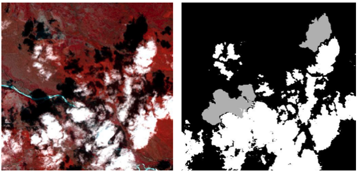
   
  <b>(left) False colour image and (right) a cloud & shadow mask.</b>

Clouds are a major issue in remote sensing images as they can obscure the underlying ground features. This hinders the accuracy and effectiveness of remote sensing analysis, as the obscured regions cannot be properly interpreted. In order to address this challenge, various techniques have been developed to detect clouds in remote sensing images. Both classical algorithms and deep learning approaches can be employed for cloud detection. Classical algorithms typically use threshold-based techniques and hand-crafted features to identify cloud pixels. However, these techniques can be limited in their accuracy and are sensitive to changes in image appearance and cloud structure. On the other hand, deep learning approaches leverage the power of convolutional neural networks (CNNs) to accurately detect clouds in remote sensing images. These models are trained on large datasets of remote sensing images, allowing them to learn and generalize the unique features and patterns of clouds. The generated cloud mask can be used to identify the cloud pixels and eliminate them from further analysis or, alternatively, cloud inpainting techniques can be used to fill in the gaps left by the clouds. This approach helps to improve the accuracy of remote sensing analysis and provides a clearer view of the ground, even in the presence of clouds. Image adapted from the paper 'Refined UNet Lite: End-to-End Lightweight Network for Edge-precise Cloud Detection'

- **[Cloudsen12](https://github.com/cloudsen12)** — *Sentinel 2 cloud dataset with a [varierty of models here](https://github.com/cloudsen12/models).*

- **[Segmentation Of Clouds In Satellite Images Using Deep Learning](https://medium.com/swlh/segmentation-of-clouds-in-satellite-images-using-deep-learning-a9f56e0aa83d)** — *Semantic segmentation using a Unet on the Kaggle 38-Cloud dataset.*

- **[Cloud Detection In Satellite Imagery](https://www.azavea.com/blog/2021/02/08/cloud-detection-in-satellite-imagery/)** — *Compares FPN+ResNet18 and CheapLab architectures on Sentinel-2 L1C and L2A imagery.*

- **[Benchmarking Deep Learning Models For Cloud Detection In Landsat 8 And Sentinel 2 Images](https://github.com/IPL-UV/DL-L8S2-UV)**

- **[Landsat 8 To Proba V Transfer Learning And Domain Adaptation For Cloud Detection](https://github.com/IPL-UV/pvl8dagans)**

- **[Multitemporal Cloud Masking In Google Earth Engine](https://github.com/IPL-UV/ee_ipl_uv)**

- **[S2cloudmask](https://github.com/daleroberts/s2cloudmask)** — *Sentinel-2 Cloud and Shadow Detection using Machine Learning.*

- **[Sentinel2 Cloud Detector](https://github.com/sentinel-hub/sentinel2-cloud-detector)** — *Sentinel Hub Cloud Detector for Sentinel-2 images in Python.*

- **[Pyatsa](https://github.com/agroimpacts/pyatsa)** — *Python package implementing the Automated Time-Series Analysis method for masking clouds in satellite imagery developed by Zhu and Helmer 2018.*

- **[Decloud](https://github.com/CNES/decloud)** — *Decloud enables the training of various deep nets to remove clouds in optical image, using e.g. Sentinel 1 & 2.*

- **[Cloudless](https://github.com/BradNeuberg/cloudless)** — *Deep learning pipeline for orbital satellite data for detecting clouds.*

- **[Deep Gapfill](https://github.com/remicres/Deep-Gapfill)** — *Official implementation of Optical image gap filling using deep convolutional autoencoder from optical and radar images.*

- **[Satellite Cloud Removal Dip](https://github.com/cidcom/satellite-cloud-removal-dip)** — *Satellite cloud removal with Deep Image Prior, with [paper](https://www.mdpi.com/2072-4292/14/6/1342).*

- **[Cloudfcn](https://github.com/aliFrancis/cloudFCN)** — *Python 3 package for Fully Convolutional Network development, specifically for cloud masking.*

- **[Fmask](https://github.com/GERSL/Fmask)** — *Fmask (Function of mask) is used for automated clouds, cloud shadows, snow, and water masking for Landsats 4-9 and Sentinel 2 images, in Matlab. Also see [PyFmask](https://github.com/akalenda/PyFmask).*

- **[How To Use Deep Learning, Pytorch Lightning, And The Planetary Computer To Predict Cloud Cover In Satellite Imagery](https://www.drivendata.co/blog/cloud-cover-benchmark/)**

- **[Cloud Cover Winners](https://github.com/drivendataorg/cloud-cover-winners)** — *Winning submissions for the On Cloud N: Cloud Cover Detection Challenge.*

- **[On Cloud N: Cloud Cover Detection Challenge 19th Place Solution](https://github.com/max-schaefer-dev/on-cloud-n-19th-place-solution)**

- **[Ukis Csmask](https://github.com/dlr-eoc/ukis-csmask)** — *Package to masks clouds in Sentinel-2, Landsat-8, Landsat-7 and Landsat-5 images.*

- **[Opensicdr](https://github.com/dr-lizhiwei/OpenSICDR)** — *Long list of satellite image cloud detection resources.*

- **[Rs Net](https://github.com/JacobJeppesen/RS-Net)** — *A cloud detection algorithm for satellite imagery based on deep learning.*

- **[Clouds Segmentation Project](https://github.com/TamirShalev/Clouds-Segmentation-Project)** — *Treats as a 3 class problem; Open clouds, Closed clouds and no clouds, uses pytorch on a dataset that consists of IR & Visual Grayscale images.*

- **[Stgan](https://github.com/ermongroup/STGAN)** — *STGAN for Cloud Removal in Satellite Images.*

- **[Mcgan Cvprw2017 Pytorch](https://github.com/enomotokenji/mcgan-cvprw2017-pytorch)** — *Filmy Cloud Removal on Satellite Imagery with Multispectral Conditional Generative Adversarial Nets.*

- **[Cloud Net: A Semantic Segmentation Cnn For Cloud Detection](https://github.com/SorourMo/Cloud-Net-A-semantic-segmentation-CNN-for-cloud-detection)** — *An end-to-end cloud detection algorithm for Landsat 8 imagery, trained on 38-Cloud Training Set.*

- **[Fcd](https://github.com/jnyborg/fcd)** — *Fixed-Point GAN for Cloud Detection. A weakly-supervised approach, training with only image-level labels.*

- **[Cloudx Net](https://github.com/sumitkanu/CloudX-Net)** — *An efficient and robust architecture used for detection of clouds from satellite images.*

- **[Cloud Detection Using Satellite Data](https://github.com/ZhouPeng-NIMST/cloud_detection_using_satellite_data)** — *Performed on Sentinel 2 data.*

- **[Luojia1 Cloud Detection](https://github.com/dedztbh/Luojia1-Cloud-Detection)** — *Luojia-1 Satellite Visible Band Nighttime Imagery Cloud Detection.*

- **[Sen12ms Cr Ts](https://github.com/PatrickTUM/SEN12MS-CR-TS)** — *A Remote Sensing Data Set for Multi-modal Multi-temporal Cloud Removal.*

- **[Es Ccgan](https://github.com/AnnaCUG/ES-CCGAN)** — *This is a dehazed method for remote sensing image, which based on CycleGAN.*

- **[Cloud Classification Dl](https://github.com/nishp763/Cloud_Classification_DL)** — *Classifying cloud organization patterns from satellite images using Deep Learning techniques (Mask R-CNN).*

- **[Cnn Based Cloud Detection Methods](https://github.com/LK-Peng/CNN-based-Cloud-Detection-Methods)** — *Understanding the Role of Receptive Field of Convolutional Neural Network for Cloud Detection in Landsat 8 OLI Imagery.*

- **[Cloud Removal Deploy](https://github.com/XavierJiezou/cloud-removal-deploy)** — *Flask app for cloud removal.*

- **[Cloudmattinggan](https://github.com/flyakon/CloudMattingGAN)** — *Generative Adversarial Training for Weakly Supervised Cloud Matting.*

- **[Km Predict](https://github.com/kappazeta/km_predict)** — *KappaMask, or km-predict, is a cloud detector for Sentinel-2 Level-1C and Level-2A input products applied to S2 full image prediction.*

- **[Cdnet](https://github.com/nkszjx/CDnet-pytorch-master)** — *CNN-Based Cloud Detection for Remote Sensing Imager.*

- **[Glnet](https://github.com/wuchangsheng951/GLNET)** — *Convolutional Neural Networks Based Remote Sensing Scene Classification under Clear and Cloudy Environments.*

- **[Cdnetv2](https://github.com/nkszjx/CDnetV2-pytorch-master)** — *CNN-Based Cloud Detection for Remote Sensing Imagery With Cloud-Snow Coexistence.*

- **[Grouped Features Alignment](https://github.com/nkszjx/grouped-features-alignment)** — *Unsupervised Domain Adaptation for Cloud Detection Based on Grouped Features Alignment and Entropy Minimization.*

- **[Detecting Cloud Cover Via Sentinel 2 Satellite Data](https://benjaminwarner.dev/2022/03/11/detecting-cloud-cover-via-satellite)** — *Blog post on Benjamin Warners Top-10 Percent Solution to DrivenData’s On CloudN Competition using fast.ai & customized version of XResNeXt50. [Repo](https://github.com/warner-benjamin/code_for_blog_posts/tree/main/2022/drivendata_cloudn).*

- **[Aisd](https://github.com/RSrscoder/AISD)** — *Deeply supervised convolutional neural network for shadow detection based on a novel aerial shadow imagery dataset.*

- **[Cloudgan](https://github.com/JerrySchonenberg/CloudGAN)** — *Detecting and Removing Clouds from RGB-images using Image Inpainting.*

- **[Using Gans To Augment Data For Cloud Image Segmentation Task](https://github.com/jain15mayank/GAN-augmentation-cloud-image-segmentation)**

- **[Cloud Segmentation From Satellite Imagery](https://github.com/vedantk-b/Cloud-Segmentation-from-Satellite-Imagery)** — *Applied to Sentinel-2 dataset.*

- **[Hrc Whu](https://github.com/dr-lizhiwei/HRC_WHU)** — *High-Resolution Cloud Detection Dataset comprising 150 RGB images and a resolution varying from 0.5 to 15 m in different global regions.*

- **[Mecgans](https://github.com/andrzejmizera/MEcGANs)** — *Cloud Removal from Satellite Imagery using Multispectral Edge-filtered Conditional Generative Adversarial Networks.*

- **[Cloudxnet](https://github.com/shyamfec/CloudXNet)** — *CloudX-net: A robust encoder-decoder architecture for cloud detection from satellite remote sensing images.*

- **[Cloud Buster](https://github.com/azavea/cloud-buster)** — *Sentinel-2 L1C and L2A Imagery with Fewer Clouds.*

- **[Satellitecloudgenerator](https://github.com/cidcom/SatelliteCloudGenerator)** — *A PyTorch-based tool to generate clouds for satellite images.*

- **[Sensei](https://github.com/aliFrancis/SEnSeI)** — *A python 3 package for developing sensor independent deep learning models for cloud masking in satellite imagery.*

- **[Cloud Detection Venus](https://github.com/pesekon2/cloud-detection-venus)** — *Using Convolutional Neural Networks for Cloud Detection on VENμS Images over Multiple Land-Cover Types.*

- **[Explaining Cloud Effects](https://github.com/JakobCode/explaining_cloud_effects)** — *Explaining the Effects of Clouds on Remote Sensing Scene Classification.*

- **[Clouds Images Segmentation](https://github.com/DavidHuji/Clouds-Images-Segmentation)** — *Marine Stratocumulus Cloud-Type Classification from SEVIRI Using Convolutional Neural Networks.*

- **[Decloud Gan](https://github.com/pixiedust18/DeCloud-GAN)** — *DeCloud GAN: An Advanced Generative Adversarial Network for Removing Cloud Cover in Optical Remote Sensing Imagery.*

- **[Cloud Segmentation Comparative](https://github.com/toelt-llc/cloud_segmentation_comparative)** — *BenchCloudVision: A Benchmark Analysis of Deep Learning Approaches for Cloud Detection and Segmentation in Remote Sensing Imagery.*

- **[Plfm Clouds Removal](https://github.com/alessandrosebastianelli/PLFM-Clouds-Removal)** — *Spatio-Temporal SAR-Optical Data Fusion for Cloud Removal via a Deep Hierarchical Model.*

- **[Cloud Removal Model Collection](https://github.com/littlebeen/Cloud-removal-model-collection)** — *A collection of the existing end-to-end cloud removal models.*

- **[Senseiv2](https://github.com/aliFrancis/SEnSeIv2)** — *Sensor Independent Cloud and Shadow Masking with Ambiguous Labels and Multimodal Inputs.*

- **[Cloud Detection Venus](https://github.com/pesekon2/cloud-detection-venus)** — *Using Convolutional Neural Networks for Cloud Detection on VENμS Images over Multiple Land-Cover Types.*

- **[Uncrtaints](https://github.com/PatrickTUM/UnCRtainTS)** — *Uncertainty Quantification for Cloud Removal in Optical Satellite Time Series.*

- **[U Tilise](https://github.com/prs-eth/U-TILISE)** — *A Sequence-to-sequence Model for Cloud Removal in Optical Satellite Time Series.*

- **[Cloudtran](https://github.com/DionysisChristopoulos/cloudtran)** — *Cloud removal from multi-temporal satellite images using axial transformer networks.*

- **[Self Supervised Cloud Detection](https://github.com/eudesyawog/self-supervised-cloud-detection)** — *Self-supervised representation learning for cloud detection using Sentinel-2 images.*

- **[Agflow Model](https://github.com/AGFlow-model/AGFlow-model)** — *A timestamp-conditioned spatiotemporal flow-matching framework for asynchronous Sentinel-1 SAR / Sentinel-2 optical fusion, targeting cloud removal, missing-frame reconstruction, and anytime optical image generation.*

#

---

### Change detection

  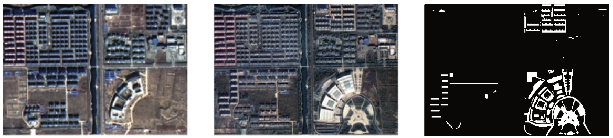
   
  <b>(left) Initial and (middle) after some development, with (right) the change highlighted.</b>

Change detection is a vital component of remote sensing analysis, enabling the monitoring of landscape changes over time. This technique can be applied to identify a wide range of changes, including land use changes, urban development, coastal erosion, and deforestation. Change detection can be performed on a pair of images taken at different times, or by analyzing multiple images collected over a period of time. It is important to note that while change detection is primarily used to detect changes in the landscape, it can also be influenced by the presence of clouds and shadows. These dynamic elements can alter the appearance of the image, leading to false positives in change detection results. Therefore, it is essential to consider the impact of clouds and shadows on change detection analysis, and to employ appropriate methods to mitigate their influence. [Image source](https://www.mdpi.com/2072-4292/11/3/240)

- **[Awesome Remote Sensing Change Detection](https://github.com/wenhwu/awesome-remote-sensing-change-detection)** — *Lists many datasets and publications.*

- **[Change Detection Review](https://github.com/MinZHANG-WHU/Change-Detection-Review)** — *A review of change detection methods, including code and open data sets for deep learning.*

- **[Stanet](https://github.com/justchenhao/STANet)** — *STANet for remote sensing image change detection.*

- **[Unet Based Unsupervised Change Detection](https://github.com/annabosman/UNet-based-Unsupervised-Change-Detection)** — *A convolutional neural network (CNN) and semantic segmentation is implemented to detect the changes between the images, as well as classify the changes into the correct semantic class.*

- **[Bit Cd](https://github.com/justchenhao/BIT_CD)** — *Official Pytorch Implementation of Remote Sensing Image Change Detection with Transformers.*

- **[Unstructured Change Detection Using Cnn](https://github.com/vbhavank/Unstructured-change-detection-using-CNN)**

- **[Qgis Plugin For Applying Change Detection Algorithms On High Resolution Satellite Imagery](https://github.com/dymaxionlabs/massive-change-detection)**

- **[Fully Convolutional Siamese Networks For Change Detection](https://github.com/rcdaudt/fully_convolutional_change_detection)**

- **[Urban Change Detection For Multispectral Earth Observation Using Convolutional Neural Networks](https://github.com/rcdaudt/patch_based_change_detection)** — *Used the Onera Satellite Change Detection (OSCD) dataset.*

- **[Iaug Cdnet](https://github.com/justchenhao/IAug_CDNet)** — *Official Pytorch Implementation of Adversarial Instance Augmentation for Building Change Detection in Remote Sensing Images.*

- **[Dpm Rnn Public](https://github.com/olliestephenson/dpm-rnn-public)** — *Code implementing a damage mapping method combining satellite data with deep learning.*

- **[Senseearth2020 Changedetection](https://github.com/LiheYoung/SenseEarth2020-ChangeDetection)** — *1st place solution to the Satellite Image Change Detection Challenge hosted by SenseTime; predictions of five HRNet-based segmentation models are ensembled, serving as pseudo labels of unchanged areas.*

- **[Kpcamnet](https://github.com/I-Hope-Peace/KPCAMNet)** — *Python implementation of the paper Unsupervised Change Detection in Multi-temporal VHR Images Based on Deep Kernel PCA Convolutional Mapping Network.*

- **[Cdlab](https://github.com/Bobholamovic/CDLab)** — *Benchmarking deep learning-based change detection methods.*

- **[Siam Nestedunet](https://github.com/likyoo/Siam-NestedUNet)** — *SNUNet-CD: A Densely Connected Siamese Network for Change Detection of VHR Images.*

- **[Sunet Change Detection](https://github.com/ShaoRuizhe/SUNet-change_detection)** — *Implementation of paper SUNet: Change Detection for Heterogeneous Remote Sensing Images from Satellite and UAV Using a Dual-Channel Fully Convolution Network.*

- **[Self Supervised Change Detection In Multi View Remote Sensing Images](https://github.com/cyx669521/self-supervised_change_detetction)**

- **[Mfpnet](https://github.com/wzjialang/MFPNet)** — *Remote Sensing Change Detection Based on Multidirectional Adaptive Feature Fusion and Perceptual Similarity.*

- **[Github For The Diux Xview Detection Challenge](https://github.com/DIUx-xView)** — *The xView2 Challenge focuses on automating the process of assessing building damage after a natural disaster.*

- **[Dasnet](https://github.com/lehaifeng/DASNet)** — *Dual attentive fully convolutional siamese networks for change detection of high-resolution satellite images.*

- **[Planet Movement](https://github.com/rhammell/planet-movement)** — *Find and process Planet image pairs to highlight object movement.*

- **[Temporal Cluster Matching](https://github.com/microsoft/temporal-cluster-matching)** — *Detecting change in structure footprints from time series of remotely sensed imagery.*

- **[Autorift](https://github.com/nasa-jpl/autoRIFT)** — *Fast and intelligent algorithm for finding the pixel displacement between two images.*

- **[Dsamnet](https://github.com/liumency/DSAMNet)** — *A Deeply Supervised Attention Metric-Based Network and an Open Aerial Image Dataset for Remote Sensing Change Detection.*

- **[Srcdnet](https://github.com/liumency/SRCDNet)** — *Super-resolution-based Change Detection Network with Stacked Attention Module for Images with Different Resolutions. SRCDNet is designed to learn and predict change maps from bi-temporal images with different resolutions.*

- **[A Deeply Supervised Image Fusion Network For Change Detection In High Resolution Bi Temporal Remote Sening Images](https://github.com/GeoZcx/A-deeply-supervised-image-fusion-network-for-change-detection-in-remote-sensing-images)**

- **[Changeformer](https://github.com/wgcban/ChangeFormer)** — *A Transformer-Based Siamese Network for Change Detection. Uses transformer architecture to address the limitations of CNN in handling multi-scale long-range details. Demonstrates that ChangeFormer captures much finer details compared to the other SOTA methods, achieving better performance on benchmark datasets.*

- **[Heterogeneous Cd](https://github.com/llu025/Heterogeneous_CD)** — *Heterogeneous Change Detection in Remote Sensing Images.*

- **[Changedetectionproject](https://github.com/previtus/ChangeDetectionProject)** — *Trying out Active Learning in with deep CNNs for Change detection on remote sensing data.*

- **[Dsfanet](https://github.com/rulixiang/DSFANet)** — *Unsupervised Deep Slow Feature Analysis for Change Detection in Multi-Temporal Remote Sensing Images.*

- **[Siamese Change Detection](https://github.com/mvkolos/siamese-change-detection)** — *Targeted synthesis of multi-temporal remote sensing images for change detection using siamese neural networks.*

- **[Bi Srnet](https://github.com/ggsDing/Bi-SRNet)** — *Bi-Temporal Semantic Reasoning for the Semantic Change Detection in HR Remote Sensing Images.*

- **[Siroc](https://github.com/lukaskondmann/SiROC)** — *Spatial Context Awareness for Unsupervised Change Detection in Optical Satellite Images. Applied to Sentinel-2 and high-resolution Planetscope imagery on four datasets.*

- **[Dsmscn](https://github.com/I-Hope-Peace/DSMSCN)** — *Tensorflow implementation for Change Detection in Multi-temporal VHR Images Based on Deep Siamese Multi-scale Convolutional Neural Networks.*

- **[Ravaen](https://github.com/spaceml-org/RaVAEn)** — *A lightweight, unsupervised approach for change detection in satellite data based on Variational Auto-Encoders (VAEs) with the specific purpose of on-board deployment. It flags changed areas to prioritise for downlink, shortening the response time.*

- **[Semicd](https://github.com/wgcban/SemiCD)** — *Revisiting Consistency Regularization for Semi-supervised Change Detection in Remote Sensing Images. Achieves the performance of supervised CD even with access to as little as 10% of the annotated training data.*

- **[Fccdn Pytorch](https://github.com/chenpan0615/FCCDN_pytorch)** — *FCCDN: Feature Constraint Network for VHR Image Change Detection.*

- **[Inlpg Python](https://github.com/zcsisiyao/INLPG_Python)** — *Structure Consistency based Graph for Unsupervised Change Detection with Homogeneous and Heterogeneous Remote Sensing Images.*

- **[Nspg Python](https://github.com/zcsisiyao/NSPG_Python)** — *Nonlocal patch similarity based heterogeneous remote sensing change detection.*

- **[Lgpnet Bcd](https://github.com/TongfeiLiu/LGPNet-BCD)** — *Building Change Detection for VHR Remote Sensing Images via Local-Global Pyramid Network and Cross-Task Transfer Learning Strategy.*

- **[Ds Unet](https://github.com/SebastianHafner/DS_UNet)** — *Sentinel-1 and Sentinel-2 Data Fusion for Urban Change Detection using a Dual Stream U-Net, uses Onera Satellite Change Detection dataset.*

- **[Siamesessl](https://github.com/SebastianHafner/SiameseSSL)** — *Urban change detection with a Dual-Task Siamese network and semi-supervised learning. Uses SpaceNet 7 dataset.*

- **[Cd Sota Methods](https://github.com/wgcban/CD-SOTA-methods)** — *Remote sensing change detection: State-of-the-art methods and available datasets.*

- **[Multimodalcd Isprs21](https://github.com/PatrickTUM/multimodalCD_ISPRS21)** — *Fusing Multi-modal Data for Supervised Change Detection.*

- **[Unsupervised Cd In Sits Using Dl And Graphs](https://github.com/ekalinicheva/Unsupervised-CD-in-SITS-using-DL-and-Graphs)** — *Unsupervised Change Detection Analysis in Satellite Image Time Series using Deep Learning Combined with Graph-Based Approaches.*

- **[Lsnet](https://github.com/qaz670756/LSNet)** — *Extremely Light-Weight Siamese Network For Change Detection in Remote Sensing Image.*

- **[End To End Cd For Vhr Satellite Image](https://github.com/daifeng2016/End-to-end-CD-for-VHR-satellite-image)** — *End-to-End Change Detection for High Resolution Satellite Images Using Improved UNet++.*

- **[Semantic Change Detection](https://github.com/daifeng2016/Semantic-Change-Detection)** — *SCDNET: A novel convolutional network for semantic change detection in high resolution optical remote sensing imagery.*

- **[Ercnn Drs Urban Change Monitoring](https://github.com/It4innovations/ERCNN-DRS_urban_change_monitoring)** — *Neural Network-Based Urban Change Monitoring with Deep-Temporal Multispectral and SAR Remote Sensing Data.*

- **[Egrcnn](https://github.com/luting-hnu/EGRCNN)** — *Edge-guided Recurrent Convolutional Neural Network for Multi-temporal Remote Sensing Image Building Change Detection.*

- **[Unsupervised Remote Sensing Change Detection](https://github.com/TangXu-Group/Unsupervised-Remote-Sensing-Change-Detection)** — *An Unsupervised Remote Sensing Change Detection Method Based on Multiscale Graph Convolutional Network and Metric Learning.*

- **[Cropland Cd](https://github.com/liumency/CropLand-CD)** — *A CNN-transformer Network with Multi-scale Context Aggregation for Fine-grained Cropland Change Detection.*

- **[Contrastive Surface Image Pretraining](https://github.com/isaaccorley/contrastive-surface-image-pretraining)** — *Supervising Remote Sensing Change Detection Models with 3D Surface Semantics.*

- **[Dcvavhroptical](https://github.com/sudipansaha/dcvaVHROptical)** — *Unsupervised Deep Change Vector Analysis for Multiple-Change Detection in VHR Images.*

- **[Hyperdimensionalcd](https://github.com/sudipansaha/hyperdimensionalCD)** — *Change Detection in Hyperdimensional Images Using Untrained Models.*

- **[Dsfanet](https://github.com/wwdAlger/DSFANet)** — *Unsupervised Deep Slow Feature Analysis for Change Detection in Multi-Temporal Remote Sensing Images.*

- **[Fcd Gan Pytorch](https://github.com/Cwuwhu/FCD-GAN-pytorch)** — *Fully Convolutional Change Detection Framework with Generative Adversarial Network (FCD-GAN) is a framework for change detection in multi-temporal remote sensing images.*

- **[Darnet Cd](https://github.com/jimmyli08/DARNet-CD)** — *A Densely Attentive Refinement Network for Change Detection Based on Very-High-Resolution Bitemporal Remote Sensing Images.*

- **[Xview2 Vulcan](https://github.com/RitwikGupta/xView2-Vulcan)** — *Damage assessment using pre and post orthoimagery. Modified + productionized model based off the first-place model from the xView2 challenge.*

- **[Escnet](https://github.com/Bobholamovic/ESCNet)** — *An End-to-End Superpixel-Enhanced Change Detection Network for Very-High-Resolution Remote Sensing Images.*

 - **[Deforestation Detection](https://github.com/vldkhramtsov/deforestation-detection)** — *DEEP LEARNING FOR HIGH-FREQUENCY CHANGE DETECTION IN UKRAINIAN FOREST ECOSYSTEM WITH SENTINEL-2.*

- **[Forest Change Detection](https://github.com/QuantuMobileSoftware/forest_change_detection)** — *Forest change segmentation with time-dependent models, including Siamese, UNet-LSTM, UNet-diff, UNet3D models.*

- **[Sentinelclearcutdetection](https://github.com/vldkhramtsov/SentinelClearcutDetection)** — *Scripts for deforestation detection on the Sentinel-2 Level-A images.*

- **[Clearcut Detection](https://github.com/QuantuMobileSoftware/clearcut_detection)** — *Research & web-service for clearcut detection.*

- **[Cdrl](https://github.com/cjf8899/CDRL)** — *Unsupervised Change Detection Based on Image Reconstruction Loss.*

- **[Ddpm Cd](https://github.com/wgcban/ddpm-cd)** — *Remote Sensing Change Detection (Segmentation) using Denoising Diffusion Probabilistic Models.*

- **[Dreamcd](https://github.com/tangkai-RS/DreamCD)** — *Change detection in remote sensing images.*

- **[Remote Sensing Time Series Change Detection](https://github.com/liulianni1688/Remote-sensing-time-series-change-detection)** — *Graph-based block-level urban change detection using Sentinel-2 time series.*

- **[Dfc2021 Msd Baseline](https://github.com/calebrob6/dfc2021-msd-baseline)** — *Multitemporal Semantic Change Detection track of the 2021 IEEE GRSS Data Fusion Competition.*

- **[Corrfusionnet](https://github.com/rulixiang/CorrFusionNet)** — *Multi-Temporal Scene Classification and Scene Change Detection with Correlation based Fusion.*

- **[Ircnn](https://github.com/thebinyang/IRCNN)** — *IRCNN: An Irregular-Time-Distanced Recurrent Convolutional Neural Network for Change Detection in Satellite Time Series.*

- **[Utrnet](https://github.com/thebinyang/UTRNet)** — *An Unsupervised Time-Distance-Guided Convolutional Recurrent Network for Change Detection in Irregularly Collected Images.*

- **[Open Cd](https://github.com/likyoo/open-cd)** — *An open source change detection toolbox based on a series of open source general vision task tools.*

- **[Tiny Model 4 Cd](https://github.com/AndreaCodegoni/Tiny_model_4_CD)** — *TINYCD: A (Not So) Deep Learning Model For Change Detection. Uses LEVIR-CD & WHU-CD datasets.*

- **[Fhd](https://github.com/ZSVOS/FHD)** — *Feature Hierarchical Differentiation for Remote Sensing Image Change Detection.*

- **[Building Expansion](https://github.com/reglab/building_expansion)** — *Enhancing Environmental Enforcement with Near Real-Time Monitoring: Likelihood-Based Detection of Structural Expansion of Intensive Livestock Farms.*

- **[Sadl Cd](https://github.com/justchenhao/SaDL_CD)** — *Semantic-aware Dense Representation Learning for Remote Sensing Image Change Detection.*

- **[Egctnet Pytorch](https://github.com/chen11221/EGCTNet_pytorch)** — *Building Change Detection Based on an Edge-Guided Convolutional Neural Network Combined with a Transformer.*

- **[S2 Cgan](https://git.tu-berlin.de/rsim/S2-cGAN)** — *S2-cGAN: Self-Supervised Adversarial Representation Learning for Binary Change Detection in Multispectral Images.*

- **[A Loss Function For Change Detection](https://github.com/Chuan-shanjia/A-loss-function-for-change-detection)** — *UAL: Unchanged Area Loss-Function for Change Detection Networks.*

- **[Ieee Tgrs Sstformer](https://github.com/yanhengwang-heu/IEEE_TGRS_SSTFormer)** — *Spectral–Spatial–Temporal Transformers for Hyperspectral Image Change Detection.*

- **[Dminet](https://github.com/ZhengJianwei2/DMINet)** — *Change Detection on Remote Sensing Images Using Dual-Branch Multilevel Intertemporal Network.*

- **[Afcf3d Net](https://github.com/wm-Githuber/AFCF3D-Net)** — *Adjacent-level Feature Cross-Fusion with 3D CNN for Remote Sensing Image Change Detection.*

- **[Dsahrnet](https://github.com/Githubwujinming/DSAHRNet)** — *A Deeply Attentive High-Resolution Network for Change Detection in Remote Sensing Images.*

- **[Rdpnet](https://github.com/Chnja/RDPNet)** — *RDP-Net: Region Detail Preserving Network for Change Detection.*

- **[Bgaae Cd](https://github.com/xauter/BGAAE_CD)** — *Bipartite Graph Attention Autoencoders for Unsupervised Change Detection Using VHR Remote Sensing Images.*

- **[Metric Cd](https://github.com/wgcban/Metric-CD)** — *Deep Metric Learning for Unsupervised Change Detection in Remote Sensing Images.*

- **[Hanet Cd](https://github.com/ChengxiHAN/HANet-CD)** — *HANet: A hierarchical attention network for change detection with bi-temporal very-high-resolution remote sensing images.*

- **[Srgcae](https://github.com/ChenHongruixuan/SRGCAE)** — *Unsupervised Multimodal Change Detection Based on Structural Relationship Graph Representation Learning.*

- **[Change Detection Onera Baselines](https://github.com/previtus/change_detection_onera_baselines)** — *Siamese version of U-Net baseline model.*

- **[Siamcrnn](https://github.com/ChenHongruixuan/SiamCRNN)** — *Change Detection in Multisource VHR Images via Deep Siamese Convolutional Multiple-Layers Recurrent Neural Network.*

- **[Graph Based Methods For Change Detection In Remote Sensing Images](https://github.com/jfflorez/Graph-based-methods-for-change-detection-in-remote-sensing-images)** — *Graph Learning Based on Signal Smoothness Representation for Homogeneous and Heterogeneous Change Detection.*

- **[Transunetplus2](https://github.com/aj1365/TransUNetplus2)** — *TransU-Net++: Rethinking attention gated TransU-Net for deforestation mapping. Uses the Amazon and Atlantic forest dataset.*

- **[Ar Cdnet](https://github.com/guanyuezhen/AR-CDNet)** — *Towards Accurate and Reliable Change Detection of Remote Sensing Images via Knowledge Review and Online Uncertainty Estimation.*

- **[Cicnet](https://github.com/ZhengJianwei2/CICNet)** — *Compact Intertemporal Coupling Network for Remote Sensing Change Detection.*

- **[Bginet](https://github.com/JackLiu-97/BGINet)** — *Remote Sensing Image Change Detection with Graph Interaction.*

- **[Dsnunet](https://github.com/NightSongs/DSNUNet)** — *DSNUNet: An Improved Forest Change Detection Network by Combining Sentinel-1 and Sentinel-2 Images.*

- **[Forest Cd](https://github.com/NightSongs/Forest-CD)** — *Forest-CD: Forest Change Detection Network Based on VHR Images.*

- **[S3net Cd](https://github.com/OMEGA-RS/S3Net_CD)** — *Superpixel-Guided Self-Supervised Learning Network for Change Detection in Multitemporal Image Change Detection.*

- **[T Unet](https://github.com/Pl-2000/T-UNet)** — *T-UNet: Triplet UNet for Change Detection in High-Resolution Remote Sensing Images.*

- **[Ucdformer](https://github.com/zhu-xlab/UCDFormer)** — *UCDFormer: Unsupervised Change Detection Using a Transformer-driven Image Translation.*

- **[Satellite Change Events](https://github.com/utkarshmall13/satellite-change-events)** — *Change Event Dataset for Discovery from Spatio-temporal Remote Sensing Imagery, uses Sentinel 2 CaiRoad & CalFire datasets.*

- **[Caco](https://github.com/utkarshmall13/CACo)** — *Change-Aware Sampling and Contrastive Learning for Satellite Images.*

- **[Lightcdnet](https://github.com/NightSongs/LightCDNet)** — *LightCDNet: Lightweight Change Detection Network Based on VHR Images.*

- **[Openminechangedetection](https://github.com/Dibz15/OpenMineChangeDetection)** — *Characterising Open Cast Mining from Satellite Data (Sentinel 2), implements TinyCD, LSNet & DDPM-CD.*

- **[Multi Task L Unet](https://github.com/mpapadomanolaki/multi-task-L-UNet)** — *A Deep Multi-Task Learning Framework Coupling Semantic Segmentation and Fully Convolutional LSTM Networks for Urban Change Detection. Applied to SpaceNet7 dataset.*

- **[Urban Change Detection](https://github.com/SebastianHafner/urban_change_detection)** — *Detecting Urban Changes With Recurrent Neural Networks From Multitemporal Sentinel-2 Data. [fabric](https://github.com/granularai/fabric) is another implementation.*

- **[Unetlstm](https://github.com/mpapadomanolaki/UNetLSTM)** — *Detecting Urban Changes With Recurrent Neural Networks From Multitemporal Sentinel-2 Data.*

- **[Sdacd](https://github.com/Perfect-You/SDACD)** — *An End-to-end Supervised Domain Adaptation Framework for Cross-domain Change Detection.*

- **[Cyclegan Based Da For Cd](https://github.com/pjsoto/CycleGAN-Based-DA-for-CD)** — *CycleGAN-based Domain Adaptation for Deforestation Detection.*

- **[Cgnet Cd](https://github.com/ChengxiHAN/CGNet-CD)** — *Change Guiding Network: Incorporating Change Prior to Guide Change Detection in Remote Sensing Imagery.*

- **[Pa Former](https://github.com/liumency/PA-Former)** — *PA-Former: Learning Prior-Aware Transformer for Remote Sensing Building Change Detection.*

- **[Aernet](https://github.com/zjd1836/AERNet)** — *AERNet: An Attention-Guided Edge Refinement Network and a Dataset for Remote Sensing Building Change Detection (HRCUS-CD).*

- **[S1gflood Detection](https://github.com/Tamer-Saleh/S1GFlood-Detection)** — *DAM-Net: Global Flood Detection from SAR Imagery Using Differential Attention Metric-Based Vision Transformers. Includes S1GFloods dataset.*

- **[Changen](https://github.com/Z-Zheng/Changen)** — *Scalable Multi-Temporal Remote Sensing Change Data Generation via Simulating Stochastic Change Process.*

- **[Ttp](https://github.com/KyanChen/TTP)** — *Time Travelling Pixels: Bitemporal Features Integration with Foundation Model for Remote Sensing Image Change Detection.*

- **[Sam Cd](https://github.com/ggsDing/SAM-CD)** — *Adapting Segment Anything Model for Change Detection in HR Remote Sensing Images.*

- **[Scannet](https://github.com/ggsDing/SCanNet)** — *Joint Spatio-Temporal Modeling for Semantic Change Detection in Remote Sensing Images.*

- **[Elgc Net](https://github.com/techmn/elgcnet)** — *Efficient Local-Global Context Aggregation for Remote Sensing Change Detection.*

- **[Official Remote Sensing Mamba](https://github.com/walking-shadow/Official_Remote_Sensing_Mamba)** — *RS-Mamba for Large Remote Sensing Image Dense Prediction.*

- **[Changemamba](https://github.com/ChenHongruixuan/MambaCD)** — *Remote Sensing Change Detection with Spatio-Temporal State Space Model.*

- **[Clearscd](https://github.com/tangkai-RS/ClearSCD)** — *Comprehensively leveraging semantics and change relationships for semantic change detection in high spatial resolution remote sensing imagery.*

- **[Rscama](https://github.com/Chen-Yang-Liu/RSCaMa)** — *Remote Sensing Image Change Captioning with State Space Model.*

- **[Changebind](https://github.com/techmn/changebind)** — *A Hybrid Change Encoder for Remote Sensing Change Detection.*

- **[Octavenet](https://github.com/farhadinima75/OctaveNet)** — *An efficient multi-scale pseudo-siamese network for change detection in remote sensing images.*

- **[Maskcd](https://github.com/EricYu97/MaskCD)** — *A Remote Sensing Change Detection Network Based on Mask Classification.*

- **[I3pe](https://github.com/ChenHongruixuan/I3PE)** — *Exchange means change: an unsupervised single-temporal change detection framework based on intra- and inter-image patch exchange.*

- **[Bdanet](https://github.com/ShaneShen/BDANet-Building-Damage-Assessment)** — *Multiscale Convolutional Neural Network with Cross-directional Attention for Building Damage Assessment from Satellite Images.*

- **[Ban](https://github.com/likyoo/BAN)** — *A New Learning Paradigm for Foundation Model-based Remote Sensing Change Detection.*

- **[Ubdd](https://github.com/fzmi/ubdd)** — *Learning Efficient Unsupervised Satellite Image-based Building Damage Detection, uses xView2.*

- **[Sgsln](https://github.com/NJU-LHRS/offical-SGSLN)** — *Exchanging Dual-Encoder–Decoder: A New Strategy for Change Detection With Semantic Guidance and Spatial Localization.*

- **[Changevit](https://github.com/zhuduowang/ChangeViT)** — *Unleashing Plain Vision Transformers for Change Detection.*

- **[Pytorch Change Models](https://github.com/Z-Zheng/pytorch-change-models)** — *Out-of-box contemporary spatiotemporal change model implementations, standard metrics, and datasets.*

- **[Ffctl](https://github.com/lauraset/FFCTL)** — *A full-level fused cross-task transfer learning method for building change detection using noise-robust pretrained networks on crowdsourced labels.*

- **[Saras Net](https://github.com/f64051041/SARAS-Net)** — *SARAS-Net: Scale And Relation Aware Siamese Network for Change Detection.*

- **[Change Detection Fcns](https://github.com/DLoboT/Change_Detection_FCNs)** — *Deforestation Detection with Fully Convolutional Networks in the Amazon Forest from Landsat-8 and Sentinel-2 Images.*

- **[Hypernet](https://github.com/meiqihu/HyperNet)** — *HyperNet: Self-Supervised Hyperspectral SpatialSpectral Feature Understanding Network for Hyperspectral Change Detection.*

- **[Cmcdnet](https://github.com/CAU-HE/CMCDNet)** — *CMCDNet: Cross-modal change detection flood extraction based on convolutional neural network.*

- **[Dsfer Net](https://github.com/ShizhenChang/Dsfer-Net)** — *A Deep Supervision and Feature Retrieval Network for Bitemporal Change Detection Using Modern Hopfield Network.*

- **[Simple Remote Sensing Change Detection Framework](https://github.com/walking-shadow/Simple-Remote-Sensing-Change-Detection-Framework)** — *Simplified implementation of remote sensing change detection based on Pytorch.*

- **[Bce Net](https://github.com/liaochengcsu/BCE-Net)** — *BCE-Net: Reliable Building Footprints Change Extraction based on Historical Map and Up-to-Date Images using Contrastive Learning.*

- **[Sits Change Detection](https://github.com/adebowaledaniel/sits-change-detection)** — *Detecting Land Cover Changes Between Satellite Image Time Series By Exploiting Self-Supervised Representation Learning Capabilities.*

- **[Ussfc Net](https://github.com/SUST-reynole/USSFC-Net)** — *Ultralightweight Spatial–Spectral Feature Cooperation Network for Change Detection in Remote Sensing Images.*

- **[Vct Remote Sensing Change Detection](https://github.com/Event-AHU/VcT_Remote_Sensing_Change_Detection)** — *VcT: Visual change Transformer for Remote Sensing Image Change Detection.*

- **[Habitalp 2.0](https://github.com/hkristen/habitalp_2)** — *Habitat and Land Cover Change Detection in Alpine Protected Areas: A Comparison of AI Architectures.*

- **[Changedino](https://github.com/chingheng0808/ChangeDINO)** — *DINOv3-Driven Building Change Detection in Optical Remote Sensing Imagery.*

- **[Mason Cd](https://github.com/blaz-r/mason_cd)** — *Make Some Noise: Unsupervised Remote Sensing Change Detection Using Latent Space Perturbations.*

- **[Noise2map](https://github.com/alishibli97/noise2map)** — *End-to-End Diffusion Model for Semantic Segmentation and Change Detection.*

- **[Mbctd](https://github.com/abdelpy/MBCTD)** — *Multi-Label Building Change Type Detection.*

#

---

### Time series

  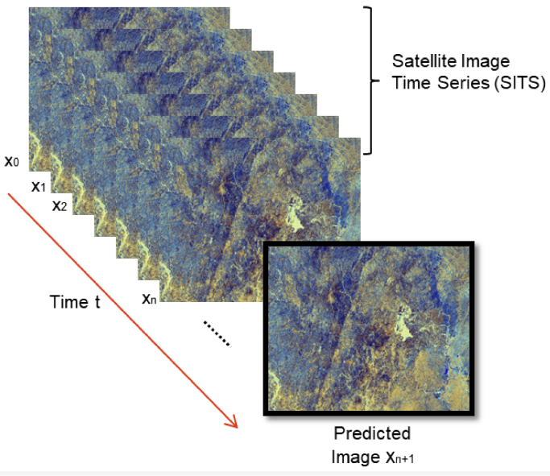
   
  <b>Prediction of the next image in a series.</b>

The analysis of time series observations in remote sensing data has numerous applications, including enhancing the accuracy of classification models and forecasting future patterns and events. [Image source](https://www.mdpi.com/2072-4292/13/23/4822). Note: since classifying crops and predicting crop yield are such prominent use case for time series data, these tasks have dedicated sections after this one.

- **[Landsat Time Series Analysis For Multi Temporal Land Cover Classification Using Random Forest](https://github.com/agr-ayush/Landsat-Time-Series-Analysis-for-Multi-Temporal-Land-Cover-Classification)**

- **[Temporalcnn](https://github.com/charlotte-pel/temporalCNN)** — *Temporal Convolutional Neural Network for the Classification of Satellite Image Time Series.*

- **[Pytorch Psetae](https://github.com/VSainteuf/pytorch-psetae)** — *Satellite Image Time Series Classification with Pixel-Set Encoders and Temporal Self-Attention.*

- **[Satflow](https://github.com/openclimatefix/satflow)** — *Optical flow models for predicting future satellite images from current and past ones.*

- **[Esa Superresolution Forecasting](https://github.com/PiSchool/esa-superresolution-forecasting)** — *Forecasting air pollution using ESA Sentinel-5p data, and an encoder-decoder convolutional LSTM neural network architecture.*

- **[Lightweight Temporal Attention Pytorch](https://github.com/VSainteuf/lightweight-temporal-attention-pytorch)** — *Light Temporal Attention Encoder (L-TAE) for satellite image time series.*

- **[Dtwsat](https://github.com/vwmaus/dtwSat)** — *Time-Weighted Dynamic Time Warping for satellite image time series analysis.*

- **[Mtlcc](https://github.com/MarcCoru/MTLCC)** — *Multitemporal Land Cover Classification Network. A recurrent neural network approach to encode multi-temporal data for land cover classification.*

- **[Pwwb](https://github.com/PannuMuthu/PWWB)** — *Real-Time Spatiotemporal Air Pollution Prediction with Deep Convolutional LSTM through Satellite Image Analysis.*

- **[Spaceweather](https://github.com/sarttiso/spaceweather)** — *Predicting geomagnetic storms from satellite measurements of the solar wind and solar corona, uses LSTMs.*

- **[Convtimelstm](https://github.com/jdiaz4302/ConvTimeLSTM)** — *Extension of ConvLSTM and Time-LSTM for irregularly spaced images, appropriate for Remote Sensing.*

- **[Convlstm](https://github.com/Zewen-Shang/ConvLstm/tree/master)** — *A PyTorch implementation of convolutional LSTM networks for precipitation nowcasting.*

- **[Dl Time Series](https://github.com/NexGenMap/dl-time-series)** — *Deep Learning algorithms applied to characterization of Remote Sensing time-series.*

- **[Tpe](https://github.com/jnyborg/tpe)** — *Generalized Classification of Satellite Image Time Series With Thermal Positional Encoding.*

- **[Wildfire Forecasting](https://github.com/Orion-AI-Lab/wildfire_forecasting)** — *Deep Learning Methods for Daily Wildfire Danger Forecasting. Uses ConvLSTM.*

- **[Satellite Image Forecasting](https://github.com/rudolfwilliam/satellite_image_forecasting)** — *Predict future satellite images from past ones using features such as precipitation and elevation maps. Entry for the [EarthNet2021](https://www.earthnet.tech/) challenge.*

- **[Deep Learning For Cloud Gap Filling On Normalized Difference Vegetation Index Using Sentinel Time Series](https://github.com/Agri-Hub/Deep-Learning-for-Cloud-Gap-Filling-on-Normalized-Difference-Vegetation-Index)** — *A CNN-RNN based model that identifies correlations between optical and SAR data and exports dense Normalized Difference Vegetation Index (NDVI) time-series of a static 6-day time resolution and can be used for Events Detection tasks.*

- **[Deepsatmodels](https://github.com/michaeltrs/DeepSatModels)** — *ViTs for SITS: Vision Transformers for Satellite Image Time Series.*

- **[Presto](https://github.com/nasaharvest/presto)** — *Lightweight, Pre-trained Transformers for Remote Sensing Timeseries.*

- **[Lulc Mapping Using Time Series Data & Spectral Bands](https://github.com/developmentseed/time-series-for-lulc)** — *Uses 1D convolutions that learn from time-series data. Accompanies blog post: [Time-Traveling Pixels: A Journey into Land Use Modeling](https://developmentseed.org/blog/2023-06-29-time-travel-pixels).*

- **[Hurricane Net](https://github.com/hammad93/hurricane-net)** — *A deep learning framework for forecasting Atlantic hurricane trajectory and intensity.*

- **[Capes](https://github.com/twin22jw/CAPES/tree/main)** — *Construction changes are detected using the U-net model and satellite time series.*

- **[Exchanger4sits](https://github.com/TotalVariation/Exchanger4SITS)** — *Rethinking the Encoding of Satellite Image Time Series.*

- **[Rapid Wildfire Hotspot Detection Using Self Supervised Learning On Temporal Remote Sensing Data](https://github.com/links-ads/igarss-multi-temporal-hotspot-detection)**

- **[Stenn Pytorch](https://github.com/ThinkPak/stenn-pytorch)** — *A Spatio-temporal Encoding Neural Network for Semantic Segmentation of Satellite Image Time Series.*

- **[Rqunet Dpc](https://github.com/trile83/RQUNet-DPC)** — *Dense Predictive Coding and UNet framework for satellite image time series segmentation.*

- **[Encroaching Species Cerrado](https://github.com/osmarluiz/encroaching-species-cerrado)** — *Detecting Encroaching Species in the Cerrado Using Deep Learning Time-Series Classification.*

- **[Sits Former](https://github.com/linlei1214/SITS-Former)** — *SITS-Former: A Pre-Trained Spatio-Spectral-Temporal Representation Model for Sentinel-2 Time Series Classification.*

- **[Graph Dynamic Earth Net](https://github.com/corentin-dfg/graph-dynamic-earth-net)** — *Graph Dynamic Earth Net: Spatio-Temporal Graph Benchmark for Satellite Image Time Series [paper](https://ieeexplore.ieee.org/abstract/document/10281458).*

- **[Multi Stage Convstar Network](https://github.com/0zgur0/multi-stage-convSTAR-network)** — *Pytorch implementation for hierarchical time series classification with multi-stage convolutional RNN.*

- **[Restore Dit](https://github.com/SQD1/RESTORE-DiT)** — *Reliable satellite image time series reconstruction by multimodal sequential diffusion transformer.*

- **[Canadafiresat](https://github.com/eceo-epfl/CanadaFireSat-Model)** — *CNN-based using ResNet encoders and Transformer-based using ViT encoders.*

- **[Mmnet](https://github.com/YXu556/MMNet)** — *Integration of Snapshot and Time Series Data for Improving SMAP Soil Moisture Downscaling.*

- **[Cnn Lstm For Dsm](https://github.com/leizhang-geo/CNN-LSTM_for_DSM)** — *A CNN-LSTM model for soil organic carbon content prediction with long time series of MODIS-based phenological variables.*

- **[S Tsvit](https://github.com/hukaiems/Spiking_Temporo-Spatial_Vision_Transformer)** — *Spiking Temporo-Spatial Vision Transformer for satellite image time series analysis.*

- **[Rice Irrigation Mapping S1s2](https://github.com/microsoft/rice-irrigation-mapping-s1s2)** — *Mapping rice irrigation using Sentinel-1 and Sentinel-2 data.*

#

---

### Crop classification

  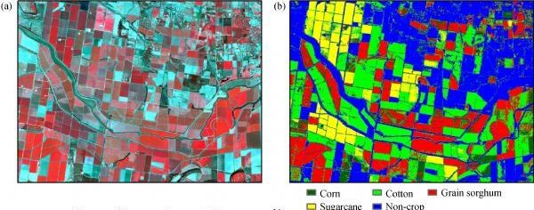
   
  <b>(left) false colour image and (right) the crop map.</b>

Crop classification in remote sensing is the identification and mapping of different crops in images or sequences of images. It aims to provide insight into the distribution and composition of crops in a specific area, with applications that include monitoring crop growth and evaluating crop damage. Both traditional machine learning methods, such as decision trees and support vector machines, and deep learning techniques, such as convolutional neural networks (CNNs), can be used to perform crop classification. The optimal method depends on the size and complexity of the dataset, the desired accuracy, and the available computational resources. However, the success of crop classification relies heavily on the quality and resolution of the input data, as well as the availability of labeled training data. Image source: High resolution satellite imaging sensors for precision agriculture by Chenghai Yang

- **[Classification Of Crop Fields Through Satellite Image Time Series](https://medium.com/dida-machine-learning/classification-of-crop-fields-through-satellite-image-time-serie-dida-machine-learning-9b64ce2b8c10)** — *Using a [pytorch-psetae](https://github.com/VSainteuf/pytorch-psetae) & Sentinel-2 data.*

- **[Cropdetectiondl](https://github.com/karimmamer/CropDetectionDL)** — *Using GRU-net, First place solution for Crop Detection from Satellite Imagery competition organized by CV4A workshop at ICLR 2020.*

- **[Radiant Earth Spot The Crop Challenge](https://github.com/DariusTheGeek/Radiant-Earth-Spot-the-Crop-Challenge)** — *The main objective of this challenge was to use time-series of Sentinel-2 multi-spectral data to classify crops in the Western Cape of South Africa. The challenge was to build a machine learning model to predict crop type classes for the test dataset.*

- **[Crop Classification](https://github.com/bhavesh907/Crop-Classification)** — *Crop classification using multi temporal satellite images.*

- **[Deepcropmapping](https://github.com/Lab-IDEAS/DeepCropMapping)** — *A multi-temporal deep learning approach with improved spatial generalizability for dynamic corn and soybean mapping, uses LSTM.*

- **[Cropmappinginterpretation](https://github.com/Lab-IDEAS/CropMappingInterpretation)** — *An interpretation pipeline towards understanding multi-temporal deep learning approaches for crop mapping.*

- **[Timematch](https://github.com/jnyborg/timematch)** — *A method to perform unsupervised cross-region adaptation of crop classifiers trained with satellite image time series. We also introduce an open-access dataset for cross-region adaptation with SITS from four different regions in Europe.*

- **[Elects](https://github.com/MarcCoru/elects)** — *End-to-End Learned Early Classification of Time Series for In-Season Crop Type Mapping.*

- **[3d Fpn And Time Domain](https://gitlab.com/ignazio.gallo/sentinel-2-time-series-with-3d-fpn-and-time-domain-cai)** — *Sentinel 2 Time Series Analysis with 3D Feature Pyramid Network and Time Domain Class Activation Intervals for Crop Mapping.*

- **[In Season And Dynamic Crop Mapping](https://gitlab.com/artelabsuper/in-season-and-dynamic-crop-mapping)** — *In-season and dynamic crop mapping using 3D convolution neural networks and sentinel-2 time series, uses the Lombardy crop dataset.*

- **[Multiviewcropclassification](https://github.com/fmenat/MultiviewCropClassification)** — *A COMPARATIVE ASSESSMENT OF MULTI-VIEW FUSION LEARNING FOR CROP CLASSIFICATION.*

- **[Detection Of Manure Application On Crop Fields Leveraging Satellite Data And Machine Learning](https://github.com/Amatofrancesco99/master-thesis)**

- **[Stressnet: A Spatial Spectral Temporal Deformable Attention Based Framework For Water Stress Classification In Maize](https://github.com/tejasri19/Stressnet)** — *Water Stress Classification on Multispectral data of Maize captured by UAV.*

- **[Model Ecaas Agrifieldnet Gold](https://github.com/radiantearth/model_ecaas_agrifieldnet_gold)** — *AgriFieldNet Model for Crop Types Detection. First place solution of the of the [Zindi AgriFieldNet India Challenge](https://zindi.africa/competitions/agrifieldnet-india-challenge) for Crop Types Detection from Satellite Imagery.*

- **[H2crop](https://github.com/flyakon/H2Crop)** — *Fine-grained Hierarchical Crop Type Classification from Integrated Hyperspectral EnMAP Data and Multispectral Sentinel-2 Time Series: A Large-scale Dataset and Dual-stream Transformer Method.*

- **[Mask Pstin](https://github.com/BruceKai/Mask-PSTIN)** — *Improving crop type mapping by integrating LSTM with temporal random masking and pixel-set spatial information.*

- **[Self Attention For Raw Optical Satellite Time Series Classification](https://github.com/MarcCoru/crop-type-mapping)** — *And [Explaining Attention with Domain Knowledge](https://github.com/IvicaObadic/crop-type-classification-explainability).*

#

---

### Crop yield & vegetation forecasting

  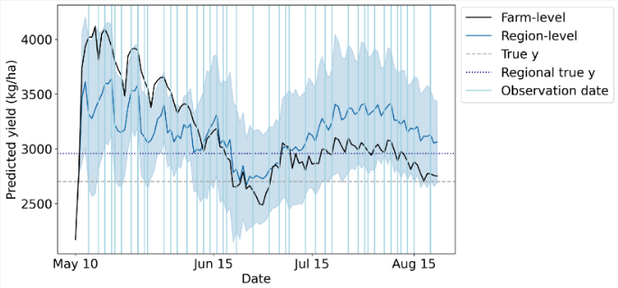
   
  <b>Wheat yield data. Blue vertical lines denote observation dates.</b>

Crop yield is a crucial metric in agriculture, as it determines the productivity and profitability of a farm. It is defined as the amount of crops produced per unit area of land and is influenced by a range of factors including soil fertility, weather conditions, the type of crop grown, and pest and disease control. By utilizing time series of satellite images, it is possible to perform accurate crop type classification and take advantage of the seasonal variations specific to certain crops. This information can be used to optimize crop management practices and ultimately improve crop yield. However, to achieve accurate results, it is essential to consider the quality and resolution of the input data, as well as the availability of labeled training data. Appropriate pre-processing and feature extraction techniques must also be employed. [Image source](https://www.mdpi.com/2072-4292/14/17/4193).

- **[Crop Yield Prediction With Deep Learning](https://github.com/JiaxuanYou/crop_yield_prediction)** — *Deep Gaussian Process for Crop Yield Prediction Based on Remote Sensing Data. [PyTorch implementation](https://github.com/gabrieltseng/pycrop-yield-prediction) and [an extension for soybean crop forecasting in Argentina](https://github.com/alvin-in/PyCropYieldPrediction-withTransfer).*

- **[Deep Transfer Learning Crop Yield Prediction](https://github.com/sustainlab-group/Deep-Transfer-Learning-Crop-Yield-Prediction)**

- **[Spacy](https://github.com/rlee360/PLaTYPI)** — *Satellite Prediction of Aggregate Corn Yield.*

- **[Cnn Rnn Yield Prediction](https://github.com/saeedkhaki92/CNN-RNN-Yield-Prediction)** — *A CNN-RNN Framework for Crop Yield Prediction.*

- **[Mmst Vit](https://github.com/fudong03/MMST-ViT)** — *Climate Change-aware Crop Yield Prediction via Multi-Modal Spatial-Temporal Vision Transformer. This paper utilizes the Tiny CropNet dataset of county-level crop yield predictions.*

- **[Greenearthnet](https://github.com/vitusbenson/greenearthnet)** — *Multi-modal learning for geospatial vegetation forecasting.*

- **[Crop Forecasting](https://github.com/association-rosia/crop-forecasting)** — *Predicting rice field yields.*

- **[Sickle](https://github.com/Depanshu-Sani/SICKLE)** — *A Multi-Sensor Satellite Imagery Dataset Annotated with Multiple Key Cropping Parameters. Basline solutions: U-TAE, U-Net3D and ConvLSTM.*

- **[Yieldcnn](https://github.com/waldnerf/yieldCNN)** — *Training temporal Convolution Neural Networks (CNNs) on satellite image time series for yield forecasting.*

- **[Pixel Based Yield Mapping And Prediction From Sentinel 2 Using Spectral Indices And Neural Networks](https://www.research-collection.ethz.ch/entities/researchdata/9e080be5-b995-4f47-aa82-44c0d22203a7)**

- **[Predicting Crop Yield Lows Through Highs Via Binned Deep Imbalanced Regression](https://github.com/plant-ai-biophysics-lab/imbalance_deep_regression_yield_forecasting)**

- **[List Of Cnns In Agriculture](https://github.com/MohammadElSakka/CNN_in_AGRI)**

- **[Deepyield](https://github.com/kgavahi/DeepYield)** — *A combined convolutional neural network with long short-term memory for crop yield forecasting.*

- **[Cropmosaiks Crop Modeling](https://github.com/cropmosaiks/crop-modeling)** — *Predicting crop yields in Zambia using MOSAIKS.*

- **[Unicrop](https://github.com/CoDIS-Lab/UniCrop)** — *A configuration-driven, universal data pipeline designed to automate the construction of analysis-ready environmental datasets for crop yield modelling.*

- **[Rs Spatiotemporal Vineyard Yield Forecasting](https://github.com/plant-ai-biophysics-lab/rs-spatiotemporal-vineyard-yield-forecasting)** — *Spatiotemporal vineyard yield forecasting using satellite imagery (Sentinel 2) and management practice data.*

- **[Agriguard: Multi Modal Crop Disease Detection System](https://github.com/debanjan06/Agriguard)** — *Multi-spectral satellite data analysis system combining Sentinel-2 imagery with deep learning for early crop disease detection in precision agriculture applications.*

- **[Cleanrfield](https://github.com/filipematias23/cleanRfield)** — *A compilation of functions to clean and filter observations from yield monitors or other agricultural spatial point data.*

- **[Yield Loss](https://github.com/mmiranda-l/Yield-Loss)** — *Informed Learning for Estimating Drought Stress at Fine-Scale Resolution Enables Accurate Yield Prediction.*

- **[Vita](https://github.com/neehan/VITA)** — *Variational Pretraining of Transformers for Climate-Robust Crop Yield Forecasting.*

- **[Bayesian Posterior Based Enkf](https://github.com/paperoses/Bayesian-posterior-based-EnKF)** — *The improved winter wheat yield estimation by assimilating GLASS LAI into a crop growth model with the proposed Bayesian posterior-based ensemble Kalman filter.*

- **[Pbcnn](https://github.com/rssiuiuc/PBCNN)** — *A Phenology-guided Bayesian-CNN (PB-CNN) framework for soybean yield estimation and uncertainty analysis.*

- **[Imbalance Deep Regression Yield Forecasting](https://github.com/plant-ai-biophysics-lab/imbalance_deep_regression_yield_forecasting)** — *Predicting Crop Yield Lows Through Highs via Binned Deep Imbalanced Regression.*

- **[Yieldsat](https://yieldsat.github.io/)** — *A Multimodal Benchmark Dataset for High-Resolution Crop Yield Prediction.*

- **[Yield Africa](https://github.com/yoadjei/yield-africa)** — *Do Foundation Model Embeddings Improve Cross-Country Crop Yield Generalisation? A Leave-One-Country-Out Evaluation in Sub-Saharan Africa.*

- **[Transfer Learning For Cross Regional Soybean Yield Prediction](https://github.com/rssiuiuc/soybean-yield-domain-shift)**

- **[Sentinel Yield](https://github.com/sanatladkat/sentinel-yield)** — *Unsupervised agricultural anomaly detection using satellite foundation model embeddings.*

- **[Cotton Yield Forecast 2025](https://github.com/Feanor1021/Cotton-Yield-Forecast-2025)** — *LSTM for Multi-Source Cotton Yield Estimation and Temporal Interpretability Across Agro-Ecological Regions in Türkiye.*

- **[Omniterra: Global Yield Intelligence](https://github.com/Aghawafaabbass/OmniTerra-Global-M)** — *A Multi-Modal Spatio-Temporal Transformer (ST-Transformer) framework for global crop yield intelligence and carbon sequestration modelling.*

- **[Harvestsight](https://github.com/Alex0420W/HarvestSight)** — *Geospatial-AI corn yield forecasting for the U.S. Corn Belt. Fine-tuning NASA/IBM Prithvi-EO-2.0-600M with LoRA, fused with weather/soil/drought features and calibrated uncertainty cones.*

#

---

### Wealth and economic activity

  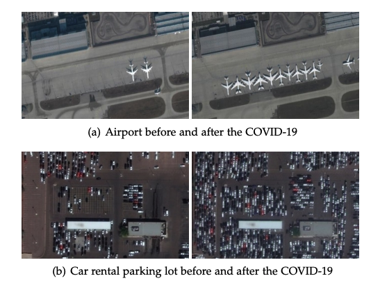
   
  <b>COVID-19 impacts on human and economic activities.</b>

The traditional approach of collecting economic data through ground surveys is a time-consuming and resource-intensive process. However, advancements in satellite technology and machine learning offer an alternative solution. By utilizing satellite imagery and applying machine learning algorithms, it is possible to obtain accurate and current information on economic activity with greater efficiency. This shift towards satellite imagery-based forecasting not only provides cost savings but also offers a wider and more comprehensive perspective of economic activity. As a result, it is poised to become a valuable asset for both policymakers and businesses. [Image source](https://arxiv.org/abs/2004.07438).

- **[Using Publicly Available Satellite Imagery And Deep Learning To Understand Economic Well Being In Africa, Nature Comms 22 May 2020](https://www.nature.com/articles/s41467-020-16185-w)** — *Used CNN on Ladsat imagery (night & day) to predict asset wealth of African villages.*

- **[Satellite Led Liverpool](https://github.com/darribas/satellite_led_liverpool)** — *Remote Sensing-Based Measurement of Living Environment Deprivation - Improving Classical Approaches with Machine Learning.*

- **[Predicting Energy Consumption With Convolutional Neural Networks](https://github.com/healdz/Predicting_Energy_Consumption_With_Convolutional_Neural_Networks)**

- **[Sustainbench](https://github.com/sustainlab-group/sustainbench/)** — *Benchmarks for Monitoring the Sustainable Development Goals with Machine Learning.*

- **[Measuring The Impacts Of Poverty Alleviation Programs With Satellite Imagery And Deep Learning](https://github.com/luna983/beyond-nightlight)**

- **[Deeppop](https://deeppop.github.io/)** — *Deep Learning Approach for Population Estimation from Satellite Imagery, also [on Github](https://github.com/deeppop).*

- **[Estimating Telecoms Demand In Areas Of Poor Data Availability](https://github.com/edwardoughton/taddle)**

- **[Satimage](https://github.com/mani-shailesh/satimage)** — *Code and models for the manuscript "Predicting Poverty and Developmental Statistics from Satellite Images using Multi-task Deep Learning". Predict the main material of a roof, source of lighting and source of drinking water for properties, from satellite imagery.*

- **[Africa Poverty](https://github.com/sustainlab-group/africa_poverty)** — *Using publicly available satellite imagery and deep learning to understand economic well-being in Africa.*

- **[Predicting Poverty](https://github.com/jmathur25/predicting-poverty-replication)** — *Combining satellite imagery and machine learning to predict poverty, in PyTorch.*

- **[Income Prediction](https://github.com/tnarayanan/income-prediction)** — *Predicting average yearly income based on satellite imagery using CNNs, uses pytorch.*

- **[Urban Score](https://github.com/Sungwon-Han/urban_score)** — *Learning to score economic development from satellite imagery.*

- **[Read](https://github.com/Sungwon-Han/READ)** — *Lightweight and robust representation of economic scales from satellite imagery.*

 - **[Slum Classification](https://github.com/Jesse-DE/Slum-classification)** — *Binary classification on a very high-resolution satellite image in case of mapping informal settlements using unet.*

 - **[Predicting Poverty](https://github.com/cyuancheng/Predicting_Poverty)** — *Uses daytime & luminosity of nighttime satellite images.*

- **[Cancer Prevalence Satellite Images](https://github.com/theJamesChen/Cancer-Prevalence-Satellite-Images)** — *Predict Health Outcomes from Features of Satellite Images.*

- **[Mapping Poverty In Bangladesh With Satellite Images And Deep Learning](https://github.com/huydang90/Mapping-Poverty-With-Satellite-Images)** — *Combines health data with OpenStreetMaps Data & night and daytime satellite imagery.*

 - **[Population Estimation From Satellite Imagery](https://github.com/ManuelSerranoR/Population-Estimation-from-Satellite-Imagery-using-Deep-Learning)**

- **[Deep Learning Satellite Imd](https://github.com/surendran-berkeley/Deep_Learning_Satellite_Imd)** — *Using Deep Learning on Satellite Imagery to predict population and economic indicators.*

- **[Gram](https://github.com/DS4H-GIS/GRAM)** — *A test-time adaptation framework for robust slum segmentation.*

- **[Poverty Cnn](https://github.com/OnurHaniffa/poverty-cnn)** — *Predicting village-level asset wealth across 23 African countries from publicly-available Landsat satellite imagery.*

#

---

### Disaster response

  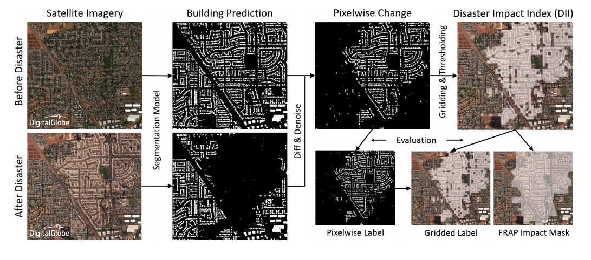
   
  <b>Detecting buildings destroyed in a disaster.</b>

Remote sensing images are used in disaster response to identify and assess damage to an area. This imagery can be used to detect buildings that are damaged or destroyed, identify roads and road networks that are blocked, determine the size and shape of a disaster area, and identify areas that are at risk of flooding. Remote sensing images can also be used to detect and monitor the spread of forest fires and monitor vegetation health. Also checkout the sections on change detection and water/fire/building segmentation. [Image source](https://developer.nvidia.com/blog/ai-helps-detect-disaster-damage-from-satellite-imagery/).

- **[Disavu](https://github.com/SrzStephen/DisaVu)** — *Combines building & damage detection and provides an app for viewing predictions.*

- **[Soteria](https://github.com/Soteria-ai/Soteria)** — *Uses machine learning with satellite imagery to map natural disaster impacts for faster emergency response.*

- **[Disasterhack](https://github.com/MarjorieRWillner/DisasterHack)** — *Wildfire Mitigation: Computer Vision Identification of Hazard Fuels Using Landsat.*

- **[Forestcasting](https://github.com/ivanzvonkov/forestcasting)** — *Forest fire prediction powered by analytics.*

- **[Machine Learning Based Damage Assessment For Disaster Relief On Google Ai Blog](https://ai.googleblog.com/2020/06/machine-learning-based-damage.html)** — *Uses object detection to locate buildings, then a classifier to determine if a building is damaged. Challenge of generalising due to small dataset.*

- **[Hurricane Damage](https://github.com/allankapoor/hurricane_damage)** — *Post-hurricane structure damage assessment based on aerial imagery with CNN.*

- **[Rescue](https://github.com/dbdmg/rescue)** — *Code of the paper: Attention to fires: multi-channel deep-learning models for wildfire severity prediction.*

- **[Disaster Classification](https://github.com/bostankhan6/Disaster-Classification)** — *A disaster classification model to predict the type of disaster given an input image.*

- **[Coarse To Fine Weakly Supervised Learning Method For Green Plastic Cover Segmentation](https://github.com/lauraset/Coarse-to-fine-weakly-supervised-GPC-segmentation)**

- **[Detection Of Destruction In Satellite Imagery](https://github.com/usmanali414/Destruction-Detection-in-Satellite-Imagery)**

- **[Bdd Net](https://github.com/jinyuan30/Recognize-damaged-buildings)** — *A General Protocol for Mapping Buildings Damaged by a Wide Range of Disasters Based on Satellite Imagery.*

- **[Building Segmentation Disaster Resilience](https://github.com/kbrodt/building-segmentation-disaster-resilience)** — *2nd place solution in the Open Cities AI Challenge: Segmenting Buildings for Disaster Resilience.*

- **[Flooding Damage Detection From Post Hurricane Satellite Imagery Based On Convolutional Neural Networks](https://github.com/weining20000/Flooding-Damage-Detection-from-Post-Hurricane-Satellite-Imagery-Based-on-CNN)**

- **[Ibm Disaster Response Hack](https://github.com/NicoDeshler/IBM-Disaster-Response-Hack)** — *Identifying optimal terrestrial routes through calamity-stricken areas. Satellite image data informs road condition assessment and obstruction detection.*

- **[Automatic Damage Annotation On Post Hurricane Satellite Imagery](https://dds-lab.github.io/disaster-damage-detection/)** — *Detect damaged buildings using tensorflow object detection API. With repos [here](https://github.com/DDS-Lab/disaster-image-processing) and [here](https://github.com/annieyan/PreprocessSatelliteImagery-ObjectDetection).*

- **[Hurricane Damage Detection](https://github.com/Ryan-Awad/Hurricane-Damage-Detection)** — *Waterloo's Hack the North 2020++ submission. A convolutional neural network model used to detect hurricane damage in RGB satellite images.*

- **[Wildfire Forecasting](https://github.com/Orion-AI-Lab/wildfire_forecasting)** — *Deep Learning Methods for Daily Wildfire Danger Forecasting. Uses ConvLSTM.*

- **[Satellite Image Analysis With Fast.ai For Disaster Recovery](https://appsilon.com/satellite-image-analysis-with-fast-ai-for-disaster-recovery/)**

- **[Shackleton](https://github.com/avanetten/shackleton)** — *Leverages remote sensing imagery and machine learning techniques to provide insights into various transportation and evacuation scenarios in an interactive dashboard that conducts real-time computation.*

- **[Ai Helps Detect Disaster Damage From Satellite Imagery](https://developer.nvidia.com/blog/ai-helps-detect-disaster-damage-from-satellite-imagery/)** — *NVIDIA blog post.*

- **[Ms4d Net Building Damage Assessment](https://github.com/YJ-He/MS4D-Net-Building-Damage-Assessment)** — *MS4D-Net: Multitask-Based Semi-Supervised Semantic Segmentation Framework with Perturbed Dual Mean Teachers for Building Damage Assessment from High-Resolution Remote Sensing Imagery.*

- **[Dahitra](https://github.com/nka77/DAHiTra)** — *Large-scale Building Damage Assessment using a Novel Hierarchical Transformer Architecture on Satellite Images. Uses xView2 xBD dataset.*

- **[Skai](https://github.com/google-research/skai)** — *A machine learning based tool from Goolge for performing automatic building damage assessments on aerial imagery of disaster sites.*

- **[Building Damage Assessment](https://github.com/microsoft/building-damage-assessment)** — *A toolkit that enables building damage assessments from remotely sensed imagery.*

- **[Building Damage Assessment Cnn Siamese](https://github.com/microsoft/building-damage-assessment-cnn-siamese)** — *From the Microsoft Ai for Good lab.*

#

---

### Image registration

Image registration is the process of registering one or more images onto another (typically well georeferenced) image. Traditionally this is performed manually by identifying control points (tie-points) in the images, for example using QGIS. This section lists approaches which mostly aim to automate this manual process. There is some overlap with the data fusion section but the distinction I make is that image registration is performed as a prerequisite to downstream processes which will use the registered data as an input.

- **[Wikipedia Article On Registration](https://en.wikipedia.org/wiki/Image_registration)** — *Register for change detection or [image stitching](https://mono.software/2018/03/14/Image-stitching/).*

- **[Phase Correlation](https://en.wikipedia.org/wiki/Phase_correlation)** — *Is used to estimate the XY translation between two images with sub-pixel accuracy. Can be used for accurate registration of low resolution imagery onto high resolution imagery, or to register a [sub-image on a full image](https://www.mathworks.com/help/images/registering-an-image-using-normalized-cross-correlation.html) -> Unlike many spatial-domain algorithms, the phase correlation method is resilient to noise, occlusions, and other defects. With [additional pre-processing](https://scikit-image.org/docs/dev/auto_examples/registration/plot_register_rotation.html) image rotation and scale changes can also be calculated.*

- **[How To Co Register Temporal Stacks Of Satellite Images](https://medium.com/sentinel-hub/how-to-co-register-temporal-stacks-of-satellite-images-5167713b3e0b)**

- **[Image Matching Models](https://github.com/gmberton/image-matching-models)** — *Easily try 23 different image matching methods.*

- **[Imageregistration](https://github.com/jandremarais/ImageRegistration)** — *Interview assignment for multimodal image registration using SIFT.*

- **[Imreg Dft](https://github.com/matejak/imreg_dft)** — *Image registration using discrete Fourier transform. Given two images it can calculate the difference between scale, rotation and position of imaged features.*

- **[Subpixelalignment](https://github.com/vldkhramtsov/SubpixelAlignment)** — *Implementation of tiff image alignment through phase correlation for pixel- and subpixel-bias.*

- **[Siamese Shiftnet](https://github.com/simon-donike/Siamese_ShiftNet)** — *NN predicting spatial coregistration shift of remote sensing imagery. Adapted from HighRes-net.*

- **[Imagecoregistration](https://github.com/ily-R/ImageCoregistration)** — *Image registration with openCV using sift and RANSAC.*

- **[Mapalignment](https://github.com/Lydorn/mapalignment)** — *Aligning and Updating Cadaster Maps with Remote Sensing Images.*

- **[Cvpr21 Deep Lucas Kanade Homography](https://github.com/placeforyiming/CVPR21-Deep-Lucas-Kanade-Homography)** — *Deep learning pipeline to accurately align challenging multimodality images. The method is based on traditional Lucas-Kanade algorithm with feature maps extracted by deep neural networks.*

- **[Eolearn](https://eo-learn.readthedocs.io/en/latest/_modules/eolearn/coregistration/coregistration.html)** — *Implements phase correlation, feature matching and [ECC](https://learnopencv.com/image-alignment-ecc-in-opencv-c-python/).*

- **[Reprojecting The Perseverance Landing Footage Onto Satellite Imagery](https://matthewearl.github.io/2021/03/06/mars2020-reproject/)**

- Kornia provides [image registration](https://kornia.readthedocs.io/en/latest/applications/image_registration.html)

- **[Loftr](https://github.com/zju3dv/LoFTR)** — *Detector-Free Local Feature Matching with Transformers. Good performance matching satellite image pairs, tryout the web demo on your data.*

- **[Image To Db Registration](https://gitlab.orfeo-toolbox.org/remote_modules/image-to-db-registration)** — *This remote module implements an algorithm for automated vector Database registration onto an Image. Implemented in the orfeo-toolbox.*

- **[Ms Hlmo Registration](https://github.com/MrPingQi/MS_HLMO_registration)** — *Multi-scale Histogram of Local Main Orientation for Remote Sensing Image Registration, with [paper](https://arxiv.org/abs/2204.00260).*

- **[Cnn Matching](https://github.com/lan-cz/cnn-matching)** — *Deep learning algorithm for feature matching of cross modality remote sensing images.*

- **[Imatch P](https://github.com/geoyee/Imatch-P)** — *A demo using SuperGlue and SuperPoint to do the image matching task based PaddlePaddle.*

- **[Nbr Net](https://github.com/xuyingxiao/NBR-Net)** — *A Non-rigid Bi-directional Registration Network for Multi-temporal Remote Sensing Images.*

- **[Mu Net](https://github.com/woshiybc/Multi-Scale-Unsupervised-Framework-MSUF)** — *A Multi-Scale Framework with Unsupervised Learning for Remote Sensing Image Registration.*

- **[Unsuperviseddeephomographyral2018](https://github.com/tynguyen/unsupervisedDeepHomographyRAL2018)** — *Unsupervised Deep Homography applied to aerial data.*

- **[Registration Cnn Ntg](https://github.com/zhangliukun/registration_cnn_ntg)** — *A Multispectral Image Registration Method Based on Unsupervised Learning.*

- **[Remote Sensing Images Registration Dataset](https://github.com/liliangzhi110/remote-sensing-images-registration-dataset)** — *At 0.23m, 3.75m & 30m resolution.*

- **[Semantic Template Matching](https://github.com/liliangzhi110/semantictemplatematching)** — *A deep learning semantic template matching framework for remote sensing image registration.*

- **[Gmn Generative Matching Network](https://github.com/ei1994/GMN-Generative-Matching-Network)** — *Deep Generative Matching Network for Optical and SAR Image Registration.*

- **[Somatch](https://github.com/system123/SOMatch)** — *A deep learning framework for matching of SAR and optical imagery.*

- **[Interspectral Image Registration Dataset](https://medium.com/dronehub/datasets-96fc4f9a92e5)** — *Including satellite and drone imagery.*

- **[Risg Image Matching](https://github.com/lan-cz/RISG-image-matching)** — *A rotation invariant SuperGlue image matching algorithm.*

- **[Deepaerialmatching Pytorch](https://github.com/jaehyunnn/DeepAerialMatching_pytorch)** — *A Two-Stream Symmetric Network with Bidirectional Ensemble for Aerial Image Matching.*

- **[Dpcn](https://github.com/ZJU-Robotics-Lab/DPCN)** — *Deep Phase Correlation for End-to-End Heterogeneous Sensor Measurements Matching.*

- **[Fsra](https://github.com/Dmmm1997/FSRA)** — *A Transformer-Based Feature Segmentation and Region Alignment Method For UAV-View Geo-Localization.*

- **[Ihn](https://github.com/imdumpl78/IHN)** — *Iterative Deep Homography Estimation.*

- **[Osmnet](https://github.com/zhanghan9718/OSMNet)** — *Explore Better Network Framework for High-Resolution Optical and SAR Image Matching.*

- **[L2 Siamese](https://github.com/TheKiteFlier/L2_Siamese)** — *Registration of Multiresolution Remote Sensing Images Based on L2-Siamese Model.*

- **[Multi Step Deformable Registration](https://github.com/mpapadomanolaki/Multi-Step-Deformable-Registration)** — *Unsupervised Multi-Step Deformable Registration of Remote Sensing Imagery based on Deep Learning.*

- **[A Deep Learning Approach To Satellite Image Time Series Coregistration Through Alignment Of Road Networks](https://github.com/afperezm/multi-temporal-coregistration)**

#

---

### Terrain mapping, Disparity Estimation, Lidar, DEMs & NeRF

Measure surface contours & locate 3D points in space from 2D images. NeRF stands for Neural Radiance Fields and is the term used in deep learning communities to describe a model that generates views of complex 3D scenes based on a partial set of 2D images

- **[Sat3dgen](https://github.com/qianmingduowan/Sat3DGen)** — *[ICLR 2026] Comprehensive Street-Level 3D Scene Generation from Single Satellite Image. Given a single satellite image, Sat3DGen generates a street-view-renderable NeRF-based 3D scene with strong geometry, enabling large-area meshing, multi-camera surround-view video, semantic-map-to-3D, and single-image DSM estimation. [Demo](https://huggingface.co/spaces/qian43/Sat3DGen) | [Code](https://github.com/qianmingduowan/Sat3DGen).*

- **[Wikipedia Dem Article](https://en.wikipedia.org/wiki/Digital_elevation_model)** — *And [phase correlation](https://en.wikipedia.org/wiki/Phase_correlation) article.*

- **[Intro To Depth From Stereo](https://github.com/IntelRealSense/librealsense/blob/master/doc/depth-from-stereo.md)**

- **[S2p](https://github.com/centreborelli/s2p)** — *S2P is a Python library and command line tool that implements a stereo pipeline which produces elevation models from images taken by high resolution optical satellites such as Pléiades, WorldView, QuickBird, Spot or Ikonos.*

- **[Predict The Fate Of Glaciers](https://github.com/geohackweek/glacierhack_2018)**

- **[Monodepth Unsupervised Single Image Depth Prediction With Cnns](https://github.com/mrharicot/monodepth)**

- **[Stereo Matching By Training A Convolutional Neural Network To Compare Image Patches](https://github.com/jzbontar/mc-cnn)**

- **[Terrain And Hydrological Analysis Based On Lidar Derived Digital Elevation Models (dem) Python Package](https://github.com/giswqs/lidar)**

- **[Phase Correlation In Scikit Image](https://scikit-image.org/docs/0.13.x/auto_examples/transform/plot_register_translation.html)**

- **[3dcd](https://github.com/VMarsocci/3DCD)** — *Inferring 3D change detection from bitemporal optical images.*

- **[Reconstructing 3d Buildings From Aerial Lidar With Mask R Cnn](https://medium.com/geoai/reconstructing-3d-buildings-from-aerial-lidar-with-ai-details-6a81cb3079c0)**

- **[Resdepth](https://github.com/stuckerc/ResDepth)** — *A Deep Prior For 3D Reconstruction From High-resolution Satellite Images.*

- **[Overhead Geopose Challenge](https://www.drivendata.org/competitions/78/overhead-geopose-challenge/)** — *Competition to build computer vision algorithms that can effectively model the height and pose of ground objects for monocular satellite images taken from oblique angles. Blog post [MEET THE WINNERS OF THE OVERHEAD GEOPOSE CHALLENGE](https://www.drivendata.co/blog/overhead-geopose-challenge-winners/).*

- **[Cars](https://github.com/CNES/cars)** — *A dedicated and open source 3D tool to produce Digital Surface Models from satellite imaging by photogrammetry. This Multiview stereo pipeline is intended for massive DSM production with a robust and performant design.*

- **[Imagetodem](https://github.com/Panagiotou/ImageToDEM)** — *Generating Elevation Surface from a Single RGB Remotely Sensed Image Using a U-Net for generator and a PatchGAN for the discriminator.*

- **[Imele](https://github.com/speed8928/IMELE)** — *Building Height Estimation from Single-View Aerial Imagery.*

- **[Ridges](https://github.com/mikeskaug/ridges)** — *Deep semantic segmentation model for identifying ridges in topography.*

- **[Planet Tools](https://github.com/disbr007/planet_tools)** — *Selection of imagery from Planet API for creation of stereo elevation models.*

- **[Satellitenerf](https://github.com/Kai-46/SatelliteNeRF)** — *PyTorch-based Neural Radiance Fields adapted to satellite domain.*

- **[Satellitesfm](https://github.com/Kai-46/SatelliteSfM)** — *A library for solving the satellite structure from motion problem.*

- **[Satellitesurfacereconstruction](https://github.com/SBCV/SatelliteSurfaceReconstruction)** — *3D Surface Reconstruction From Multi-Date Satellite Images, ISPRS, 2021.*

- **[Son2sat](https://github.com/giovgiac/son2sat)** — *A neural network coded in TensorFlow 1 that produces satellite images from acoustic images.*

- **[Aerial Mtl](https://github.com/marcelampc/aerial_mtl)** — *PyTorch implementation for multi-task learning with aerial images to learn both semantics and height from aerial image datasets; fuses RGB & lidar.*

- **[Reklasat 3d](https://github.com/MacOS/ReKlaSat-3D)** — *3D Reconstruction and Classification from Very High Resolution Satellite Imagery.*

- **[M3net](https://github.com/lauraset/BuildingHeightModel)** — *A deep learning method for building height estimation using high-resolution multi-view imagery over urban areas.*

- **[Hmsm Net](https://github.com/Sheng029/HMSM-Net)** — *Hierarchical multi-scale matching network for disparity estimation of high-resolution satellite stereo images.*

- **[Stereomatchingremotesensing](https://github.com/Sheng029/StereoMatchingRemoteSensing)** — *Dual-Scale Matching Network for Disparity Estimation of High-Resolution Remote Sensing Images.*

- **[Satnerf](https://centreborelli.github.io/satnerf/)** — *Learning Multi-View Satellite Photogrammetry With Transient Objects and Shadow Modeling Using RPC Cameras.*

- **[Satmvs](https://github.com/WHU-GPCV/SatMVS)** — *Rational Polynomial Camera Model Warping for Deep Learning Based Satellite Multi-View Stereo Matching.*

- **[Implicity](https://github.com/prs-eth/ImpliCity)** — *Reconstructs digital surface models (DSMs) from raw photogrammetric 3D point clouds and ortho-images with the help of an implicit neural 3D scene representation.*

- **[Whu Stereo](https://github.com/Sheng029/WHU-Stereo)** — *A large-scale dataset for stereo matching of high-resolution satellite imagery & several deep learning methods for stereo matching. Methods include StereoNet, Pyramid Stereo Matching Network & HMSM-Net.*

- **[Photogrammetry Guide](https://github.com/mikeroyal/Photogrammetry-Guide)** — *A guide covering Photogrammetry including the applications, libraries and tools that will make you a better and more efficient Photogrammetry development.*

- **[Dsm To Dtm](https://github.com/mdmeadows/DSM-to-DTM)** — *Exploring the use of machine learning to convert a Digital Surface Model (e.g. SRTM) to a Digital Terrain Model.*

- **[Gf 7 Stereo Matching](https://github.com/Sheng029/GF-7_Stereo_Matching)** — *Large Scene DSM Generation of Gaofen-7 Imagery Combined with Deep Learning.*

- **[Mapping Drainage Ditches In Forested Landscapes Using Deep Learning And Aerial Laser Scanning](https://github.com/williamlidberg/Mapping-drainage-ditches-in-forested-landscapes-using-deep-learning-and-aerial-laser-scanning)**

#

---

### Thermal Infrared

Thermal infrared remote sensing is a technique used to detect and measure thermal radiation emitted from the Earth’s surface. This technique can be used to measure the temperature of the ground and any objects on it and can detect the presence of different materials. Thermal infrared remote sensing is used to assess land cover, detect land-use changes, and monitor urban heat islands, as well as to measure the temperature of the ground during nighttime or in areas of limited visibility.

- **[Object Classification In Thermal Images](https://www.researchgate.net/publication/328400392_Object_Classification_in_Thermal_Images_using_Convolutional_Neural_Networks_for_Search_and_Rescue_Missions_with_Unmanned_Aerial_Systems)** — *Classification accuracy was improved by adding the object size as a feature directly within the CNN.*

- **[Thermal Imaging With Satellites](https://chrieke.medium.com/thermal-imaging-with-satellites-34f381856dd1)** — *Blog post by Christoph Rieke.*

#

---

### SAR

SAR (synthetic aperture radar) is used to detect and measure the properties of objects and surfaces on the Earth's surface. SAR can be used to detect changes in terrain, features, and objects over time, as well as to measure the size, shape, and composition of objects and surfaces. SAR can also be used to measure moisture levels in soil and vegetation, or to detect and monitor changes in land use.

- **[Awesome Sar](https://github.com/RadarCODE/awesome-sar)**

- **[Awesome Sar Deep Learning](https://github.com/neeraj3029/awesome-sar-deep-learning)**

- **[Merlin](https://gitlab.telecom-paris.fr/ring/MERLIN)** — *Self-supervised training of deep despeckling networks with MERLIN.*

- **[Pysar Insar (interferometric Synthetic Aperture Radar) Timeseries Analysis In Python](https://github.com/hfattahi/PySAR)**

- **[Synthetic Aperture Radar (sar) Analysis With Clarifai](https://www.clarifai.com/blog/synthetic-aperture-radar-sar-analysis-with-clarifai)**

- **[Implementing An Ensemble Convolutional Neural Network On Sentinel 1 Synthetic Aperture Radar Data And Sentinel 3 Radiometric Data For The Detecting Of Forest Fires](https://github.com/aalling93/ECNN-on-SAR-data-and-Radiometry-data)**

- **[S1 Parking Occupancy](https://github.com/sdrdis/s1_parking_occupancy)** — *PARKING OCCUPANCY ESTIMATION ON SENTINEL-1 IMAGES.*

- **[Experiments On Flood Segmentation On Sentinel 1 Sar Imagery With Cyclical Pseudo Labeling And Noisy Student Training](https://github.com/sidgan/ETCI-2021-Competition-on-Flood-Detection)**

- **[Spacenet Sar Buildings Solutions](https://github.com/SpaceNetChallenge/SpaceNet_SAR_Buildings_Solutions)** — *The winning solutions for the SpaceNet 6 Challenge.*

- **[Mapping And Monitoring Of Infrastructure In Desert Regions With Sentinel 1](https://github.com/ESA-PhiLab/infrastructure)**

- **[Xview3](https://iuu.xview.us/)** — *Is a competition to detect dark vessels using computer vision and global SAR satellite imagery. [First place solution](https://github.com/DIUx-xView/xView3_first_place) and [second place solution](https://github.com/DIUx-xView/xView3_second_place). Additional places up to fifth place are available at the [xView GitHub Organization page](https://github.com/DIUx-xView/).*

- **[Winners Of The Stac Overflow: Map Floodwater From Radar Imagery Competition](https://github.com/drivendataorg/stac-overflow)**

- **[Despecknet Tf Gee](https://github.com/adugnag/deSpeckNet-TF-GEE)** — *DeSpeckNet: Generalizing Deep Learning Based SAR Image Despeckling.*

- **[Cnn Sar Image Classification](https://github.com/diogosens/cnn_sar_image_classification)** — *CNN for classifying SAR images of the Amazon Rainforest.*

- **[S1 Icetype Cnn](https://github.com/nansencenter/s1_icetype_cnn)** — *Retrieve sea ice type from Sentinel-1 SAR with CNN.*

- **[Mp Resnet](https://github.com/ggsDing/SARSeg)** — *Multi-path Residual Network for the Semantic segmentation of PolSAR Images'.*

- **[Tgrs Disoptnet](https://github.com/jiankang1991/TGRS_DisOptNet)** — *Distilling Semantic Knowledge from Optical Images for Weather-independent Building Segmentation.*

- **[Sar Cd Ddnet](https://github.com/summitgao/SAR_CD_DDNet)** — *PyTorch implementation of Change Detection in Synthetic Aperture Radar Images Using a Dual Domain Network.*

- **[Sar Cd Ms Capsnet](https://github.com/summitgao/SAR_CD_MS_CapsNet)** — *Change Detection in SAR Images Based on Multiscale Capsule Network.*

- Toushka Waterbodies Segmentation from four different combinations of Sentinel-1 SAR imagery and Digital Elevation Model with Pytorch and U-net. -> [code](https://github.com/MuhammedM294/waterseg)

- **[Sar Transformer](https://github.com/malshaV/sar_transformer)** — *Transformer based SAR image despeckling, trained with synthetic imagery, with [paper](https://arxiv.org/abs/2201.09355).*

- **[Ssdd Ship Detection Dataset](https://github.com/TianwenZhang0825/Official-SSDD)**

- **[Semantic Segmentation Of Sar Images Using A Self Supervised Technique](https://github.com/cattale93/pytorch_self_supervised_learning)**

- **[Ship Detection On Remote Sensing Synthetic Aperture Radar Data](https://github.com/JasonManesis/Ship-Detection-on-Remote-Sensing-Synthetic-Aperture-Radar-Data)** — *Based on the architectures of the Faster-RCNN and YOLOv5 networks.*

- **[Target Recognition In Sar](https://github.com/NateDiR/sar_target_recognition_deep_learning)** — *Identify Military Vehicles in Satellite Imagery with TensorFlow, with [article](https://python.plainenglish.io/identifying-military-vehicles-in-satellite-imagery-with-tensorflow-96015634129d).*

- **[Dsn](https://github.com/Alien9427/DSN)** — *Deep SAR-Net: Learning objects from signals.*

- **[Sar Denoising](https://github.com/MathieuRita/SAR_denoising)** — *Project on application of FFDNet to SAR images.*

- **[Cnninsar](https://github.com/subhayanmukherjee/cnninsar)** — *CNN-Based InSAR Denoising and Coherence Metric.*

- **[Sar](https://github.com/GeomaticsAndRS/sar)** — *Despeckling Synthetic Aperture Radar Images using a Deep Residual CNN.*

- **[Gcbanet](https://github.com/TianwenZhang0825/GCBANet)** — *A Global Context Boundary-Aware Network for SAR Ship Instance Segmentation.*

- **[Sar Cd Gksnet](https://github.com/summitgao/SAR_CD_GKSNet)** — *Change Detection from Synthetic Aperture Radar Images via Graph-Based Knowledge Supplement Network.*

- **[Pixel Wise Segmentation Of Sar](https://github.com/flyingshan/pixel-wise-segmentation-of-sar-imagery-using-encoder-decoder-network-and-fully-connected-crf)** — *Pixel-Wise Segmentation of SAR Imagery Using Encoder-Decoder Network and Fully-Connected CRF.*

- **[Sar Ship Detection Cfar](https://github.com/Rc-W024/SAR_Ship_detection_CFAR)** — *An improved two-parameter CFAR algorithm based on Rayleigh distribution and Mathematical Morphology for SAR ship detection.*

- **[Sar Snow Melt Timing](https://github.com/egagli/sar_snow_melt_timing)** — *Notebooks and tools to identify snowmelt timing using timeseries analysis of backscatter of Sentinel-1 C-band SAR.*

- **[Denoising Radar Satellite Images Using Deep Learning In Python](https://medium.com/@petebch/denoising-radar-satellite-images-using-deep-learning-in-python-946daad31022)** — *Medium article on [deepdespeckling](https://github.com/hi-paris/deepdespeckling).*

- **[Random Wetlands](https://github.com/ekcomputer/random-wetlands)** — *Random forest classification for wetland vegetation from synthetic aperture radar dataset.*

- **[Agsdnet](https://github.com/RTSIR/AGSDNet)** — *AGSDNet: Attention and Gradient-Based SAR Denoising Network.*

- **[Lfg Net](https://github.com/Evarray/LFG-Net)** — *LFG-Net: Low-Level Feature Guided Network for Precise Ship Instance Segmentation in SAR Images.*

- **[Sar Sift](https://github.com/yishiliuhuasheng/sar_sift)** — *Image registration algorithm.*

- **[Sar Despeckling](https://github.com/ImageRestorationToolbox/SAR-Despeckling)** — *Toolbox.*

- **[Cogsima2022](https://github.com/galatolofederico/cogsima2022)** — *Enhancing land subsidence awareness via InSAR data and Deep Transformers.*

- **[Polsarformer](https://github.com/aj1365/PolSARFormer)** — *Local Window Attention Transformer for Polarimetric SAR Image Classification.*

- **[Dc4flood](https://github.com/Kasra2020/DC4Flood)** — *A deep clustering framework for rapid flood detection using Sentinel-1 SAR imagery.*

- **[Sentinel1 Flood Finder](https://github.com/cordmaur/Sentinel1-Flood-Finder)** — *Flood Finder Package from Sentinel 1 Imagery.*

- **[Bayes Forest Structure](https://github.com/prs-eth/bayes-forest-structure)** — *Country-wide Retrieval of Forest Structure From Optical and SAR Satellite Imagery With Bayesian Deep Learning.*

- **[Ai4g Flood](https://github.com/microsoft/ai4g-flood)** — *Toolkit for using Microsoft AI for Good team's flood detection model with SAR imagery.*

- **[Sam3sar: Ship Segmentation In Sar With Sam3‑unet](https://github.com/edwardarchaeology/SAR_Segmentation_with_SAM3_UNET)**

- **[Sarmssd](https://github.com/buyukkanber/SARMSSD)** — *Impact of Data Enhancement Methods on Ship Detection Using YOLO11 in SAR Imagery.*

#

---

### NDVI - vegetation index

Normalized Difference Vegetation Index (NDVI) is an index used to measure the amount of healthy vegetation in a given area. It is calculated by taking the difference between the near-infrared (NIR) and red (red) bands of a satellite image, and dividing by the sum of the two bands. NDVI can be used to identify areas of healthy vegetation and to assess the health of vegetation in a given area. `ndvi = np.true_divide((ir - r), (ir + r))`

- **[Example Notebook Local](http://nbviewer.jupyter.org/github/HyperionAnalytics/PyDataNYC2014/blob/master/ndvi_calculation.ipynb)**

- **[Landsat Data In Cloud Optimised (cog) Format Analysed For Ndvi](https://github.com/pangeo-data/pangeo-example-notebooks/blob/master/landsat8-cog-ndvi.ipynb)** — *With [medium article here](https://medium.com/pangeo/cloud-native-geoprocessing-of-earth-observation-satellite-data-with-pangeo-997692d91ca2).*

- **[Identifying Buildings In Satellite Images With Machine Learning And Quilt](https://github.com/jyamaoka/LandUse)** — *NDVI & edge detection via gaussian blur as features, fed to TPOT for training with labels from OpenStreetMap, modelled as a two class problem, “Buildings” and “Nature”.*

- **[Seeing Through The Clouds Predicting Vegetation Indices Using Sar](https://medium.com/descarteslabs-team/seeing-through-the-clouds-34a24f84b599)**

- **[Ndvi Net](https://github.com/HaoZhang1018/NDVI-Net)** — *NDVI-Net: A fusion network for generating high-resolution normalized difference vegetation index in remote sensing.*

- **[Awesome Vegetation Index](https://github.com/px39n/Awesome-Vegetation-Index)**

- **[Remote Sensing Indices Derivation Tool](https://github.com/rander38/Remote-Sensing-Indices-Derivation-Tool)** — *Calculate spectral remote sensing indices from satellite imagery.*

#

---

### General image quality

Image quality describes the degree of accuracy with which an image can represent the original object. Image quality is typically measured by the amount of detail, sharpness, and contrast that an image contains. Factors that contribute to image quality include the resolution, format, and compression of the image.

- **[Lvrnet](https://github.com/Achleshwar/lvrnet)** — *Lightweight Image Restoration for Aerial Images under Low Visibility.*

- **[Jitter Compensation](https://github.com/caiya55/jitter-compensation)** — *Remote Sensing Image Jitter Detection and Compensation Using CNN.*

- **[Deblurganv2](https://github.com/VITA-Group/DeblurGANv2)** — *Deblurring (Orders-of-Magnitude) Faster and Better.*

- **[Image Quality Assessment](https://github.com/idealo/image-quality-assessment)** — *CNN to predict the aesthetic and technical quality of images.*

- **[Dota C](https://github.com/hehaodong530/DOTA-C)** — *Evaluating the robustness of object detection models to 19 types of image quality degradation.*

- **[Piq](https://github.com/photosynthesis-team/piq)** — *A collection of measures and metrics for image quality assessment.*

- **[Ffa Net](https://github.com/zhilin007/FFA-Net)** — *Feature Fusion Attention Network for Single Image Dehazing.*

- **[Deepcalib](https://github.com/alexvbogdan/DeepCalib)** — *A Deep Learning Approach for Automatic Intrinsic Calibration of Wide Field-of-View Cameras.*

- **[Perceptualsimilarity](https://github.com/richzhang/PerceptualSimilarity)** — *LPIPS is a perceptual metric which aims to overcome the limitations of traditional metrics such as PSNR & SSIM, to better represent the features the human eye picks up on.*

- **[Optical Remotesensing Image Resolution](https://github.com/wenjiaXu/Optical-RemoteSensing-Image-Resolution)** — *Deep Memory Connected Neural Network for Optical Remote Sensing Image Restoration. Two applications: Gaussian image denoising and single image super-resolution.*

- **[Hyperspectral Deblurring And Destriping](https://github.com/ImageRestorationToolbox/Hyperspectral-Deblurring-and-Destriping)**

- **[Hyde](https://github.com/Helmholtz-AI-Energy/HyDe)** — *Hyperspectral Denoising algorithm toolbox in Python.*

- **[Hlf Dip](https://github.com/Keiv4n/HLF-DIP)** — *Unsupervised Hyperspectral Denoising Based on Deep Image Prior and Least Favorable Distribution.*

- **[Rqunetvae](https://github.com/trile83/RQUNetVAE)** — *Riesz-Quincunx-UNet Variational Auto-Encoder for Satellite Image Denoising.*

- **[Deep Hs Prior](https://github.com/acecreamu/deep-hs-prior)** — *Deep Hyperspectral Prior: Denoising, Inpainting, Super-Resolution.*

- **[Iquaflow](https://github.com/satellogic/iquaflow)** — *From Satellogic, an image quality framework that aims at providing a set of tools to assess image quality by using the performance of AI models trained on the images as a proxy.*

#

---

### Synthetic data

Training data can be hard to acquire, particularly for rare events such as change detection after disasters, or imagery of rare classes of objects. In these situations, generating synthetic training data might be the only option. This has become quite sophisticated, with 3D models being use with open source games engines such as [Unreal](https://www.unrealengine.com/en-US/).

- **[The Synthinel 1 Dataset: A Collection Of High Resolution Synthetic Overhead Imagery For Building Segmentation](https://github.com/timqqt/Synthinel)**

- **[Rareplanes](https://registry.opendata.aws/rareplanes/)** — *Incorporates both real and synthetically generated satellite imagery including aircraft. Read the [arxiv paper](https://arxiv.org/abs/2006.02963) and checkout [this repo](https://github.com/jdc08161063/RarePlanes). Note the dataset is available through the AWS Open-Data Program for free download.*

- Read [this article from NVIDIA](https://developer.nvidia.com/blog/preparing-models-for-object-detection-with-real-and-synthetic-data-and-tao-toolkit/) which discusses fine tuning a model pre-trained on synthetic data (Rareplanes) with 10% real data, then pruning the model to reduce its size, before quantizing the model to improve inference speed

- **[Blendergis](https://github.com/domlysz/BlenderGIS)** — *Could be used for synthetic data generation.*

- **[Bifrost.ai](https://www.bifrost.ai/)** — *Simulated data service with geospatial output data formats.*

- **[Rendered.ai](https://rendered.ai/)** — *The Platform as a Service for Creating Synthetic Data.*

- **[Synthetic Xview Airplanes](https://github.com/yangxu351/synthetic_xview_airplanes)** — *Creation of airplanes synthetic dataset using ArcGIS CityEngine.*

- **[Import Openstreetmap Data Into Unreal Engine 4](https://github.com/ue4plugins/StreetMap)**

- **[Deepfake Satellite Images](https://github.com/RijulGupta-DM/deepfake-satellite-images)** — *Dataset that includes over 1M images of synthetic aerial images.*

- **[Synthetic Disaster](https://github.com/JakeForsey/synthetic-disaster)** — *Generate synthetic satellite images of natural disasters using deep neural networks.*

- **[Stpls3d](https://github.com/meidachen/STPLS3D)** — *A Large-Scale Synthetic and Real Aerial Photogrammetry 3D Point Cloud Dataset.*

- **[Less](https://github.com/jianboqi/lessrt)** — *LargE-Scale remote sensing data and image Simulation framework over heterogeneous 3D scenes.*

- **[Synthesizing Robustness: Dataset Size Requirements And Geographic Insights](https://avanetten.medium.com/synthesizing-robustness-dataset-size-requirements-and-geographic-insights-a687192e8004)** — *Medium article, concludes that synthetic data is most beneficial to the rarest object classes and that extracting utility from synthetic data often takes significant effort and creativity.*

- **[Rs Img Synth](https://github.com/gbaier/rs_img_synth)** — *Synthesizing Optical and SAR Imagery From Land Cover Maps and Auxiliary Raster Data.*

- **[Onlyplanes](https://github.com/naivelogic/OnlyPlanes)** — *Dataset and pretrained models for the paper: OnlyPlanes - Incrementally Tuning Synthetic Training Datasets for Satellite Object Detection.*

- **[Using Stable Diffusion To Improve Image Segmentation Models](https://medium.com/edge-analytics/using-stable-diffusion-to-improve-image-segmentation-models-1e99c25acbf)** — *Augmenting Data with Stable Diffusion.*

- **[Synthetic Satellite Imagery](https://github.com/ms-synthetic-satellite-image/synthetic-satellite-imagery)** — *Label-conditional Synthetic Satellite Imagery - generating synthetic satellite images and conducting downstream experiments.*

- **[Adapting Vehicle Detectors For Aerial Imagery To Unseen Domains With Weak Supervision](https://github.com/humansensinglab/AGenDA)** — *Leverage synthetic data generated by Stable Diffusion to enhance cross-domain object detection in aerial imagery.*

- **[Vectorsynth](https://github.com/mvrl/VectorSynth)** — *A suite of models for synthesizing satellite images with global style and text-driven layout control.*

#

---

### Explainable Ai (XAI)

Explainable AI (XAI) is a field of artificial intelligence that focuses on developing methods and techniques to make the decision-making process of AI systems more transparent and understandable to humans. XAI aims to provide insights into how AI models arrive at their predictions or decisions, allowing users to trust and interpret the results effectively. This is particularly important in remote sensing applications where understanding the rationale behind AI-driven insights can be crucial for decision-making in areas such as environmental monitoring, disaster response, and land use planning.

- **[Mehak Transformer Lulc Xai](https://github.com/Ci2Lab/Mehak_Transformer_LULC_XAI)** — *Transformer-based Land Use and Land Cover Classification with Explainability using Satellite Imagery.*

- **[Xai4eo](https://github.com/adelabbs/XAI4EO)** — *Towards Explainable AI4EO: an explainable DL approach for crop type mapping using SITS.*

- **[Xai4sar Pgil](https://github.com/Alien9427/XAI4SAR-PGIL)** — *Physically Explainable CNN for SAR Image Classification.*

- **[Pytorch Lightning Uq Box](https://github.com/lightning-uq-box/lightning-uq-box)** — *A tool that enables experimentation with a variety of Uncertainty Quantification (UQ) techniques for neural networks.*

- **[Intrinsic Explainability Of Multimodal Learning For Crop Yield Prediction](https://github.com/hibanajjar998/intrinsic_xai_mml)**

- **[Explainable Geoai](https://github.com/ASUcicilab/explainable-geoai)** — *Performance assessment of deep learning model visualization techniques to understand AI learning processes with geospatial data.*

- **[Alphaearth Interpretability Experiments](https://github.com/FelipeBenavidesMz/AlphaEarth-Interpretability-Experiments)** — *Binary classification experiments to interpret Google AlphaEarth Foundation embeddings across ESA WorldCover land cover classes. Part of the study "What on Earth is AlphaEarth?".*

  #

---
